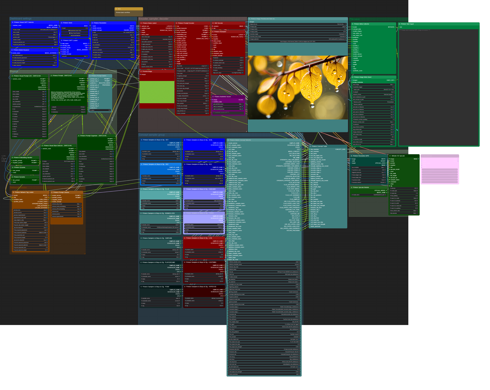
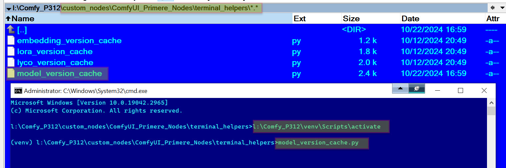
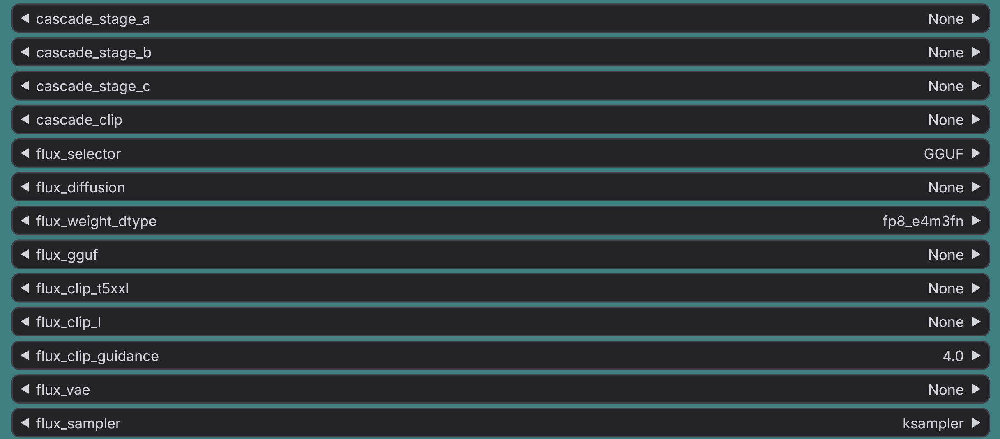
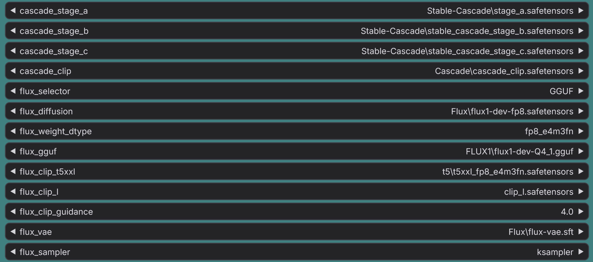

# Primere nodes for ComfyUI

Git link: https://github.com/CosmicLaca/ComfyUI_Primere_Nodes

Nodepack under development. Manual will be ready later. If you upgrade just check attached workflows or use git to downgrade to previous version if something failed.
All workflows in the `Workflow` folder of the node root.

## Minimal workflow:

### Included features:
 
- Prompt selector to any prompt sources
- `CSV` and `TOML` file source readers for saved prompts, automatically organized, saved prompt selection by preview image (if saved)
- Randomized latent noise for variations
- Prompt encoder with selectable custom clip model, long-clip mode with custom models, advanced encoding, injectable internal styles, last-layer options
- Sampler with `variation extender` and `Align Your Step`
- A1111 style network injection supported by text prompt (Lora, Lycorys, Hypernetwork, Embedding)
- Automatized and manual image saver. Manual image saver with optional preview saver for checkpoint selector and saved CSV prompts
- Upscaler (Ultimate SD and hiresFix)

**Examples:**

Visual `checkpopint` selection, automatized filtering by subdirectories (first row of buttons) and versions (second row of buttons):

Visual `saved prompt` selection `(csv source)`, automatized filtering by categories:

## Basic workflow:

### Included features:

#### Same as Minimal workflow plus:

- **Half-automatic concept selector:**
  - **Supported concepts:** SD1, SD2, SDXL, SD3, StableCascade, Turbo, Flux, KwaiKolors, Hunyuan, Playground, Pony, LCM, Lightning, Hyper
  - Custom sampler settings for all supported concepts
  - Auto detection of selected model type (if data already stored)
  - Auto download and apply HyperSD speed loras at first usage from here: https://huggingface.co/ByteDance/Hyper-SD/tree/main **check your SSD space before!**

- **Terminal helper to detect and store model concept data:**
  - Open `cmd` terminal window 
  - Activate your Comfy `venv`
  - Change to `[Your_comfy_folder]\custom_nodes\ComfyUI_Primere_Nodes\terminal_helpers\`
  - Enter `model_version_cache.py`

  - You will see like this when run:

  - Terminal helper cannot detect all your models correctly, specially your symlinks, because diffusers. You must check this file: `Nodes/.cache/.cache.json` and seek the word `symlink` and `unknown`
  - Manually replace these bad results on `.cache.json` to right value. If you don't use symlinks, the version info will much more correct.
  - Refresh your browser, and you will see version info on the top left badge of preview (instead of questionmark)

**When all data available, thse badges will visible in the preview:**

- **Top left:** model concept (Flux, SDXL, etc...)
- **Top right:** if symlinked, what type of diffuser
- **Botom:** the average aesthetic score. Have to use aesthetic scorer node before to store this data for checkpoints or saved prompts. The number is the average, but the percent depending on the checkpoint selector settings, where the `aescore_percent_min` and lower value mean 0%, `aescore_percent_max` and higher mean 100%.

**On the `Concept selector` node you will see `None` on all required fields, for example on Cascade files. You must install all required concept/version files manually to right path, then select correct models on these lists.**

When you open the workflow first time:

When downloaded required files set to:

