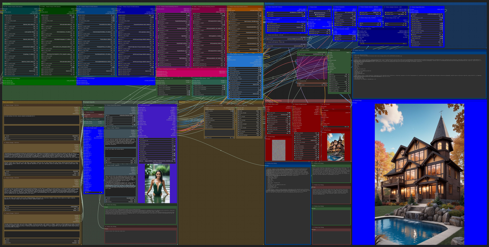
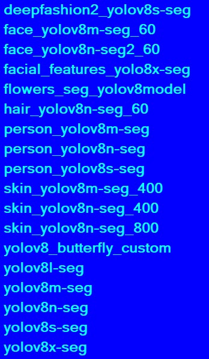
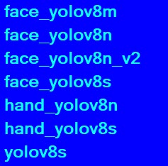

# Primere nodes for ComfyUI

Git link: https://github.com/CosmicLaca/ComfyUI_Primere_Nodes

## Do it before first run, or the example workflow will be failed in your environment:

**Always use only the latest 'Primere_latest_workflow.json' from the 'Workflow' folder, specially after git pull changes if the previous workflow failed becuae nodes changed by develpment.**

1; Install missing Python libraries if not start for first try. **Activate Comfy venv** and use 'pip install -r requirements.txt' at the root folder of Primere nodes (or check error messages and install missing libs manually).

2; If started, use the last workflow on the 'Workflow' folder for first try, all nodes visible under the 'Primere Nodes' submenu if you need nodes for custom workflow later. If some other nodes missing and red in workflow, download or delete unloaded 3rd party nodes.

3; The **Primere_latest_workflow.json** is the most complex workflow, using most of developed nodes. But the **Primere_basic_workflow.json** is a really basic workflow with less required nodes. If the complex latest workflow not start or failed, please test out the basic. If you save own workflow with older developed nodes, try 'Fix node (recreate)' menu on right-click after git pull. 

4; Set the right path for image saving in the node 'Primere Image Meta Saver' on 'output_path' input.

5; Rename 'styles.example.csv' on the 'stylecsv' folder to 'syles.csv' or copy here your own A1111 style .csv file if you want to use 'Primere Styles' node. If you keep or rename the original 'styles.example.csv', you will see image previews for example prompts included.

6; **Set existing values for all combos from your own environment.** Checkpoint, Lora, Lycoris, Style, Embedding, Upscale model, Detailer models, Primere Image Meta Saver and Hypernetwork selectors will be failed if not change right values on all input fields from your own environment.

7; Choose your own image from your machine to the 'Primere Exif Reader'.

8; **Update your Comfy to latest version** if workflow failed, I always do it before development, so my nodes and the workflow compatible with latest Comfy version.

9; I develop my nodes and workflow continously, so do git pull from master branch once a week, and refresh nodes in saved workflow if required.

10; Sometime the node development change existing nodes, so the previous workflow failed after pull. Then use right-click + **'Fix node (recreate)' menu** and maybe rewire changed nodes, or load the attached example workflows again.

11; Remove dynamic prompts from the filled prompt input nodes I used before the example workflow saved and pushed. Maybe you have missing wildcard files (https://civitai.com/tag/wildcard), and sometime the wildcard decoder sending error if source file not found. If you have wildcard files, just copy them to the 'wildcards' folder.

## Special features in attached complex workflow **Primere_latest_workflow.json**:
- Automatically detect if SD or SDXL checkpoint loaded, and control the whole process (e.g. resolution) by the result
- No need to switch nodes or workflow between SD and SDXL mode
- You can select model, subpath and orientation under the prompt input overwrite the system settings, same settings under the .csv Styles loader node
- You can randomize the image orientation if using batch mode
- One button LCM mode (see example workflow), the node download required SD and SDXL LCM models at first usage
- Save .json and/or .txt file with process details, but these details saved to image as EXIF too
- Read original A1111 style.csv file, handle dynamic prompts and additional networks from the prompts, example .csv included
- Random noise generator for latent image
- Additional and easy editable styles included in the text encoder as list
- Resolution selector by side ratios only, editable ratio source in external file, and auto detect checkpoint version for right final size
- Image size can be convert to "standard" (x16) values, fully customizable side ratios at the bottom of the resolution selector node
- Original image size multiplied to upscaler by two several ratios, one for SD and another one for SDXL models
- Remove previously included networks from prompts (Embedding, Lora, Lycoris and Hypernetwork), use it if the used model incompatible with them, or if you want to try your prompt without included additional networks or change to different networks by nodes, or using SDXL checkpoint and Loras have to be changed to SDXL compatible version 
- Embedding handler for A1111 compatible prompts (or .csv styles), this node convert A1111 Embeddings to ComfyUI
- Use more than one prompt or style inputs for testing, and select any by 'Prompt Switch' node
- Special image meta/EXIF reader, which handle model name and samplers from A1111/ComfyUI .png or .jpg, never was easier to recycle your older A1111 or ComfyUI images using same or different settings. With switches you can change/keep the original seed/model/size/etc... to workflow settings
- Check/debug generation details
- Workflow and nodes support Lycoris in dedicated node
- Detailers and refiners for face, eye, hands, mouth, fashion wear, etc...
- Visual (select element by preview image) loaders available for Checkpoints, Loras, Lycoris, Embedding, Hypernetworks, and saved Styles. You only have to create preview images to right name and path

# Nodes in the pack by submenus:

## Visuals:

### Before you save your own previews, just set 'show_modal' input to 'false'

Here are same functions similar like in **Inputs** submenu, but the selection (for example checkpoints, loras, lycoris, embeddings, styles from style.csv and hypernetworks) **possible by image previews on modal**. Very similar than in several themes of A1111, but you must create previews to right path.
You have to save images as previews to the right path and name, deails later. Preview can be **only .jpg** format with only .jpg extension. 
Don't use large files because the modal loading time. The preview height in visual selector modal is only 220px, so dont use upscaled or original images as preview. Downsize your previews height to 250-300 px, and set jpg image quality to ~50% for faster loading. ACDSee do it automatically at Tools->Batch->Resize menu i you already have large images, if you generate new, just set the upscaler under the 1 (0.4 for SD and 0.2 for SDXL is good enought, while set the jpeg quality to ~50-60 in the image saver node).
Checkpoint and additional networks files have a badge with SD or SDXL version. The version info is cached, so only one time needed to read and store. When you use your checkpoint or networks first time, the version info will be saved to the 'Nodes\.cache\.cache.json' file, next time just read back from cached jason file. About version caching read more later.

**If you need version info of all your files for visual modal badges, you can use helper files from the 'terminal_helpers' subdir:**
- Activate your comfy venv. This is the most important step before run command line helpers.
- In the terminal window you already activated your venv, just run included .py files:
- **lora_version_cache.py** will be read and store versions of all lora files
- **lyco_version_cache.py** will be read and store versions of all lycoris files
- **model_version_cache.py** will be read and store versions of all checkpoint files
- **embedding_version_cache.py** will be read and store versions of all textual embedding files

Unfortunately the result is not perfect :(. You must check the version labels on your models and network files. If failed or unknown, you can modify and correct the .cache.json manually. Git pull will keep your edited cache file.
**The embedding cache helper can't read the right version of embedding files**, so after first run all files will be marked as **SD** version. You must modify and replace SD to SDXL in the .cache.json manually.

### Primere Visual CKPT selector:
**Visual selector for checkpoints**. You must mirror your original checkpoint subdirs **(not the checkpoint files!)** to ComfyUI\custom_nodes\ComfyUI_Primere_Nodes\front_end\images\checkpoints\ path but only the preview images needed, same name as the checkpoint but with .jpg only extension.
As extra features you can enable/disable modal with 'show_modal' switch, and exclude files and paths from modal starts with . (point) character if show_hidden switch is off.

### Primere Visual Lora selector:
Same as than the 'Primere LORA' node, but with preview images of selection modal.  
You must mirror your original lora subdirs **(not your lora files!)** to ComfyUI\custom_nodes\ComfyUI_Primere_Nodes\front_end\images\loras\ path but only the preview images needed, same name as the lora files but with .jpg only extension.
As extra features you can enable/disable modal with 'show_modal' switch, and exclude files and paths from modal starts with . (point) character if show_hidden switch is off.

### Primere Visual Lycoris selector:
Same as than the 'Primere LYCORIS' node, but with preview images of selection modal.  
You must mirror your original lycoris subdirs **(not your lycoris files!)** to ComfyUI\custom_nodes\ComfyUI_Primere_Nodes\front_end\images\lycoris\ path but only the preview images needed, same name as the lyco files but with .jpg only extension.
As extra features you can enable/disable modal with 'show_modal' switch, and exclude files and paths from modal starts with . (point) character if show_hidden switch is off.

### Primere Visual Embedding selector:
Same as than the 'Primere Embedding' node, but with preview images of selection modal.  
You must copy your original embedding subdirs **(not your embedding files!)** to ComfyUI\custom_nodes\ComfyUI_Primere_Nodes\front_end\images\embeddings\ path but only the preview images needed, same name as the embedding file but with .jpg only extension.
As extra features you can enable/disable modal with 'show_modal' switch, and exclude files and paths from modal starts with . (point) character if show_hidden switch is off.

### Primere Visual Hypernetwork selector:
Same as than the 'Primere Hypernetwork' node, but with preview images of selection modal.  
You must copy your original hypernetwork subdirs **(not your hypernetwork files!)** to ComfyUI\custom_nodes\ComfyUI_Primere_Nodes\front_end\images\hypernetworks\ path but only the preview images needed, same name as the hypernetwork file but with .jpg only extension.
**If you have hypernetwork files from unknown source, set 'safe_load' switch to true.** With this settings sometime your hypernetwork settings will be ignored, but your computer stay safe.
As extra features you can enable/disable modal with 'show_modal' switch, and exclude files and paths from modal starts with . (point) character if show_hidden switch is off.

### Primere Visual Style selector:
Same as than the 'Primere Styles' node, but with preview images of selection modal.  
You must create .jpg images as preview with same name as the style name in the list, but **space characters must be changed to _.** For example if your style in the list is 'Architechture Exterior', you must save Architechture_Exterior.jpg to the path: ComfyUI\custom_nodes\ComfyUI_Primere_Nodes\front_end\images\styles\
Example style.csv included, if rename to style.csv you will see example previews.

## Segments:
Under this submenu you can found nodes for detailer/refiner nodes, and required one more **Primere Refiner Prompt** node from the Inputs menu. 
For these nodes you have to download ultralitics bbox and segmentation models from here: https://huggingface.co/Bingsu/adetailer/tree/main or use Comfy's internal model downloader (this is much easier).
Have to save these models to ComfyUI\models\ultralytics\segm\ and ComfyUI\models\ultralytics\bbox\ paths, the Comfy model manager save these models to right path automatically. For the included workflow these models required, but maybe you dont need if created your own custom workflow.

#### Download files manually from here:
- Universal segmentation model, useful labels included to node: https://huggingface.co/ultralyticsplus/yolov8s/tree/main
- Important and useful model set: https://huggingface.co/jags/yolov8_model_segmentation-set/tree/main
- Another link for example for deepfashion: https://huggingface.co/Bingsu/adetailer/tree/main
- Segmentation models for anime/cartoon: https://huggingface.co/RamRom/yolov8m_crop-anime-characters/tree/main, https://huggingface.co/AkitoP/Anime-yolov8-seg/tree/main
- But the best if you use Comfy's model manager to download required models, use manual download if you nees something else

### For segments:

### For bbox:

### Tips for use detailer nodes:
- For hands, faces, persons, hair and skins just use specific models without labels (keywords). 
- Another contents, for example cars or animals use universal model like **yolov8s** and don't forget to select right label from bottom list.
- Large faces don't need refiner or detailer because just change the good face to another one (or crerating new worst). If you create closeup portrait, just switch off (or trigger by size) the face detailer.
- On large faces, for example portrait, good idea to refine eyes and mouth only. These refiners can be on, while the face detailer off (or off automatically by trigger values).
- Finally you can use hand detailer. Depending on settings, this group will refine smaller hands too. 
- For cartoon/anime use anime segmentation models, what very different I use and recommend.  
- Check (and modify) refiners's prompts. That very important, and you can mix this prompt to original for several results.
- If you set **strength** of prompts to **0** on **Primere Refiner Prompt** node, the prompt input will be ignored. Not always good idea to mix detailer's prompt to the original, but you don't need to remove original connection, you can set strenght value to 0, same as disconnet.
- Not too easy to set really good refiner group, the result depending on source image and node stttings. All settings will drastically modify the result with same prompt and seed.
- You can use standard dynamic prompts within the Refiner prompt node.
- Try to use **trigger values** what automatically on/off the detailer by the segment area. Read later on the **Primere Image Segments** node.

#### For smaller faces you need face detailer, but don't need eye and mouth detailers:

#### For half-body or closeup partraits you don't need face detailer, but need eye and mouth detailers:

### Primere Image Segments:
This node is to select segs and bbox model, but for three models: **yolov8s**, **deepfashion2_yolov8s** and **facial_features_yolo8x** you can define label. When you use one of these models with right label selection, the segmentation result will folow your selected label.
Some models no need label. You can use these nodes for workflow by new prompts, but you can use if the input is image only. Load/test attached **civitai-[what]-refiner.json** workflows how to use these nodes if you want to refine your existing images.
You can On/Off this node anytime by switch and **triggers**, and you can play with parameters.

#### Triggers:
Two trigger input available on this node, **trigger_high_off** and **trigger_low_off**. These input fields are numerical inputs, with step 100. Both are designed to automatically switch on/off the node by the area of segmented image.
The good trigger value depending on the segment area. If you want to ignore segments what is smaller than 100 pixels (area, not side), add 100 to **trigger_low_off** input, and segemnts under the size W x H = 100 will be ignored. This is useful if the segment (for example mouth) too small to do correct refining.
The **trigger_high_off** switch off the node if the segmented area higher than this field value. For example if the face is always good if larger than 5000px (area), enter 5000 to the input, and the node will use segments only if the segment area less than 5000 px.
In the example workflow for face detailers I using trigger_high_off = 5200, because if the area of segmented face less than 5200 px, then I need the node for fix small faces. If larger than 5200, no need fixes because good enought. The right value depending on used model, prompt, and additional networks like Loras or controlnet settings.
For mouth I using trigger_low_off = 2000, because if the area of mouth less than 2000, no need to repair, only if bigger.
For hand fixer I set trigger_high_off to 30000 because if the hand's area is larger than 30000, no need to fix/detail. All settings depending in workflow and the input image.

### Primere Any Detailer:
This node create detailed/refined output by input image and segs. This node must be used together with Image Segments and Refiner Prompt. The output of this node can be upscaled or saved.
Detailer group exaple included to the **Primere_latest_workflow.json** you have to check it your own ideas and settings, or test only detailers in attached **civitai-[what]-refiner.json** files.

## Inputs:
### Primere Prompt:
2 input fileds within one node for positive and negative prompts. 3 additional fields appear under the text inputs:
- **Subpath**: the prefered subpath for final image saving. This can be use for example the subject of the generated image, like 'sci-fi' 'art' or 'interior'. This setting overwrite the subpath in 'Primere Image Meta Saver' node.
- **Use model**: the prefered checkpoint for image rendering. If your prompt need special checkpoint, for example because product design or architechture, here you can force apply this model to the prompt rendering process. This setting overwrite dashboard settings.
- **Use orientation**: if you prefer vertical or horizontal orientation depending on your prompt, your rendering process will be use this setting instead of global setting from 'Primere Resolution' node. Useful for example for portraits, what usually better in vertical orientation. Random settings available here, use with batch mode if you need several orientations for same prompt.

If you set these fields, (where 'None' mean not set and use dashboard settings) the workflow will use all of these settings for rendering your prompt instead of settings in 'Dashboard' group.

### Primere Styles:
Style (.csv) file reader, compatible with A1111 syle.csv, but little more than the original concept. The file must be copied/symlinked to the 'stylecsv' folder. Rename included 'style.example.csv' to 'style.csv' for first working example, and later edit this file manually.
- **A1111 compatible CSV headers required for this file**: 'name,prompt,negative_prompt'. But this version have more 3 required headers: 'prefered_subpath,prefered_model,prefered_orientation'. These new headers working like additional fields in the simple prompt input. 
- If you fill these 3 optional columns in the style.csv, the rendering process will use them. **These last 3 fields are optional**, if you leave empty the style will be rendering with system 'dashboard' settings, if fill and enable to use at the bottom switches of node, dashboard settings will be overwritten.
- You can enable/disable these additional settings by switches if already entered to csv but want to use system settings instead, no need to delete if you failed or want to try with dashboard settings instead.

### Primere Dynamic:
- This node render A1111 compatible dynamic prompts, including external wildcard files of A1111 dynamic prompt plugin. External files must be copied/symlinked to the 'wildcards' folder and use the '__filepath/of/file__' keyword within your prompt. Use this to decode all style.csv and double prompt inputs, because the output of prompt/style nodes not resolved by another comfy dynamic decoder/resolver.
- Check the included workflow how to use this node.

### Primere exif reader:
- This node read prompt-exif (called meta) from loaded image. Compatible with A1111 .jpg and .png, and usually with ComfyUI, but not with results of all other workflows.
- This is very important (the most important) node in the example workflow, it has a central settings distribution role, not just read the exif data.
- The reader is tested with A1111 'jpg' and 'png' and Comfy 'jpg' and 'png'. Another exif parsers will be included soon, but if you send me AI generated image contains exif/metadata what failed to read, I will do parser/debug for that.

This node output sending lot of data to the workflow from exif/meta or pnginfo if it's included to selected image, like model name, vae and sampler. Use this node to distribute settings, and simple off the 'use_exif' switch if you don't want to render image by this node, then you can use your own prompts and dashboard settings instead.

**Use several settings of switches what exif/meta data you want/don't want to use for new image rendering.** If switch off something, dashboard settings (this is why must be connected this node input) will be used instead of image exif/meta.
#### For this node inputs connect all of your dashboard settings, like in the example workflow. If you switch off the exif reader with 'use_exif' switch, or ignore specified data for example the model, the input values will be used instead of image meta. The example workflow help to analize how to use this node.

### Primere Embedding Handler:
This node convert A1111 embeddings to Comfy embeddings. Use after dynamically decoded prompts (booth text and style). **No need to modify manually styles.csv from A1111 if you use this node.**

### Primere Lora Stack Merger:
This node merge two different Lora stacks, SD and SDXL. The output is useful to store Lora settings to the image meta.

### Primere Lora Keyword Merger:
With Lora stackers you can read model keywords. This node merge all selected Lora keywords to one string, and send to prompt encoder.

### Primere Lycoris Stack Merger:
This node merge two different Lycoris stacks, SD and SDXL. The output is useful to store Lycoris settings to the image meta.

### Primere Lycoris Keyword Merger:
With Lycoris stackers you can read model keywords. This node merge all selected Lycoris keywords to one string, and send to prompt encoder.

### Primere Embedding Keyword Merger:
This node merge positive and negative SD and SDXL embedding tags, to send them to the prompt encoder.

### Primere Refiner Prompt:
Another dual prompt input, bur for refiners and detailers. You can connect original prompts too to this node, and set the weights of all inputs. Text and cond outputs are available.
For more info about usage see **"Segments"** submenu.

## Dashboard:
### Primere Sampler Selector:
Select sampler and scheduler in separated node, and wire outputs to the sampler (through exif reader input in the example workflow). This is useful to separate from other nodes, and for LCM mode you need two several sampler settings. (see the example workflow, and try to undestand LCM setting)

### Primere Steps & Cfg:
Use this separated node for sampler/meta reader inputs. If you use LCM mode, you need 2 settings of this node. See and test the attached example workflow.

### Primere LCM Selector:
Use this node to switch on/off LCM mode in whole rendering process. Wire two sampler and cfg/steps setting to the inputs (one of them must be compatible with LCM settings), and connect this node output to the sampler/exif reader, like in the example workflow. The 'IS_LCM' output important for CKPT loader and the Exif reader for correct rendering.

### Primere VAE Selector:
This node is a simple VAE selector. Use 2 nodes in workflow, 1 for SD, 1 for SDXL compatible VAE for autimatized selection. The checkpoint selector and loader get the loaded checkpoint version.

### Primere CKPT Selector:
Simple checkpoint selector, but with extras:
- This node automatically detect if the selected model SD or SDXL. Use this output for automatic VAE, additional networks or size selection and for prompt encoding, see example workflow for details. In Comfy SD2.x checkpoints not working well, use only SD1.x and SDXL.
- Check the "visual" version of this node, if you have previews for checkpoints, easier to select the best for your prompt. How to create preview for visual selection, read more this file.

### Primere VAE loader:
Use this node to convert VAE name to VAE.

### Primere CKPT Loader:
Use this node to convert checkpoint name to 'MODEL', 'CLIP' and 'VAE'. Use 'is_lcm' input for detect LCM mode, see the example workflow.
If you have downloaded .yaml file, and copied to the checkpoint directory with same filename, set 'use_yaml' to true, and the loader will use your config file. No need to swithc off if .yaml file missing. If you find some problem or error, simply set it to false.
Play with 'strength_lcm_model' and 'strength_lcm_clip' values if set LCM mode on.
This node have optional inputs if checkpoint already loaded by previous process. If 'loaded_clip', 'loaded_vae' and 'loaded_model' connected, this node will use these inputs instead of loading checkpoint again. 

### Primere Prompt Switch:
Use this node if you have more than one prompt input (for example several half-ready test prompts). Connect prompts/styles node outputs to this node inputs and set the right index at the bottom. To connect 'subpath', 'model', and 'orientation' inputs are optional, only the positive and negative prompt required.

**Very important:** don't remove the connected node from the middle or from the top of inputs. Connect nodes in right queue, and disconnect them only from the last to first. If you getting js error becuase disconnected inputs in wrong gueue, just reload your browser and use 'reload node' menu with right click on node.

### Primere Seed:
Use only one seed input for all. A1111 look node, connect this one node to all other seed inputs.

### Primere Noise Latent
This node generate 'empty' latent image, but with several noise settings. **You can randomize these setting between min. and max. values using switches**, this cause small difference between generated images for same seed and settings, but you can freeze your noise and image if you disable variations of random noise generation.

### Primere Prompt Encoder:
- This node compatible booth SD and SDXL models, important to use 'model_version' input for correct working. Try several settings, you will get several results. 
- Use included positive and negative styles, and check the best result in prompt and image outputs. 
- If you getting error if use SD basemodel, you must update (git pull) your ComfyUI.
- The style source of this node in external file at 'Toml/default_neg.toml' and 'Toml/default_pos.toml' files, what you can edit if you need changes.
- Connect here the additional network keywords like in the example workflow.

### Primere Resolution:
- Select image size by side ratios only, and use 'model_version' input for correct SD or SDXL size on the output.  
- You can calculate image size by really custom ratios at the bottom float inputs (and set 'calculate_by_custom' switch on), or just edit the external ratio source file.
- The ratios of this node stored in external file at 'Toml/resolution_ratios.toml', what you can edit if you need changes.
- Use 'round_to_standard' switch if you want to modify the exactly calculated size to the 'officially' recommended SD / SDXL values. This is usually very small modification and I think not too important.
- Not sure what orientation the best for your prompt and want to test in batch image generation? Just set batch value on the Comfy menu and switch 'rnd_orientation' to randomize vertical and horizontal images.
- Set the base model (SD1.x not SDXL) resolution to 512, 768, 1024, or 1280. The official setting is 512, but I like 768 instead.
- Open debug workflow from workflow folder: 'debug_resolution_nodes.json'

### Primere Resolution Multiplier:
Multiply the base image size for upscaling. Important to use 'model_version' if you want to use several multipliers for SD and SDXL models. Just switch off 'use_multiplier' on this node if you don't need to resize original image.
Open debug workflow from workflow folder: 'debug_resolution_nodes.json'

### Primere Prompt Cleaner:
This node remove Lora, Lycoris, Hypernetwork and Embedding (booth A1111 and Comfy) from the prompt and style inputs. Use switches what netowok(s) you want to remove or keep in the final prompt. Use 'remove_only_if_sdxl' if you want keep all of these networks for SD1.5 models, and remove only if SDXL checkpoint selected.
**Important notice:** for loras, lycoris and hypernetworks you don't need original tags in the prompt (for example: \<lora:your_lora_name>). If you keep original lora and hypernetwork tags in the prompt you cant sure your image result use the lora only, or use the tag string only (or booth) in the prompt. I recommend always to remove lora and hypernetwork tags, but you can try what happan if keep.
You must remove original tags after 'Primere Network Tag Loader', because after prompt cleaner no tags available for tag loader. The example workflow using 2 of this nodes, one for SD, one for SDXL workflow.

### Primere Network Tag Loader
This node loads addtional networks (Lora, Lycoris and Hypernetwork) to the CLIP and MODEL. You can read and use Lora (lora:[your model name]), Lycoris (lyco:[your model name]) and Hypernetwork (hypernetwork:[your model name]) keywords to send to prompt encoder or the keyword merger like in the example workflow.
**Hypernetwork is harmful, because can run any code on your computer, so set 'process_hypernetwork' to False on this node or download them from reliable source only**
**If you have hypernetwork files from unknown source, set 'safe_load' switch to true.** With this settings sometime your hypernetwork tags will be ignored, but your computer stay safe.

### Primere Model Keyword
This node loads model keyword. You can read and use model keywords to send directly to prompt encoder like in the example workflow. The idea based on A1111 plugin, but something different.

## Outputs:
### Primere Meta Saver:
This node save the image, but with/without metadata, and save meta to .json/.txt file if you want. Get metadata from the Exif reader node only, and use optional 'prefered_subpath' input if you want to overwrite the node settings by several prompt input nodes. Set 'output_path' input correctly, depending your system.

### Primere Any Debug:
Use this node to display 'any' output values of several nodes like prompts or metadata (**metadata is formatted**). See the example workflow for details.

### Primere Text Output
Use this node to diaplay simple text (not tuples or dict).

## Styles:
### Primere Style Pile:
Style collection for generated images. Set and connect this node to the 'Prompt Encoder'. No forget to set and play with style strenght. The source of this node is external file at 'Toml/stylepile.toml', what you can edit if you need changes.

## Networks:
### Primere LORA
Lora stack for 6 loras. Important to use 'stack_version' list. Here you can select how you want to load selected Lora-s, for SD models only, for SDXL models only or for booth (Any) what not recommended. Use 2 separated Lora stacks for SD/SDXL checkpoints, and wire 'model_version' input for correct use.
- You can switch on/off loras, no need to choose 'None' from the list.
- If you use 'use_only_model_weight', the model_weight input values will be copied to clip_weight.
- If you switch off 'use_only_model_weight', you can set model_weight and clip_weight to different values.
- You can load and send to Prompt Encoder the Lora keyword if available. This is similar but not exactly same function of "Model Keyword" plugin in the A1111.
- You can choose Lora keyword placement, which and how many keywords select if more than one available, how many keyword use if more than one available, select in queue or random, and set the keyword weight in the prompt.
- Lora keyword is much better than to keep lora tag in the prompt.

### Primere LYCORIS
Lycoris files have dedicated node, wirking similar than the LORA stack. See example workflow, or use as LORA.
If you already have downloaded LyCORIS files, you must simlynk or copy to the path **ComfyUI\models\lycoris\**. I remcommend simlynk the original source instead of copyying.

### Primere Embedding
Select textual inversion called Embedding for your prompt. You have to use 2 several versions of this one, one for SD, and another one for SDXL checkpoints. Important to use 'model_version' input and 'stack_version' list, working similar than in the Lora stack. 
You can choose embedding placement in the prompt.

### Primere Hypernetwork
Use hypernetwork if you already have by this node. **Hypernetwork is harmful, because can run any code on your computer, so ignore/delete this node or download them from reliable source only**
**If you have hypernetwork files from unknown source, set 'safe_load' switch to true.** With this settings sometime your hypernetwork settings will be ignored, but your computer stay safe.
Hypernetworks don't need seperated SD and SDXL sources, use only one stack for all, and set 'stack_version' to 'Any'. 

# Contact:
#### Discord name: primere -> ask email if you need or use git for fork and pull request

# Licence:
#### Use these nodes for your own risk