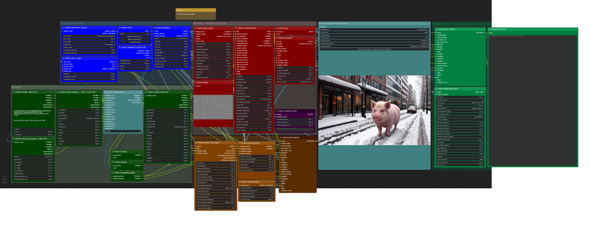

# Primere nodes for ComfyUI

Git link: https://github.com/CosmicLaca/ComfyUI_Primere_Nodes

Nodepack under development. Manual will be ready later. If you ugrade just check attached workflows or use git to downgrade to previous version.

All workflows in the `Workflow` folder of the node root.

## Minimal workflow ready

### Included features:
 
- Prompt selector
- `CSV` and `TOML` prompt source reader, automatically organized, saved prompt selection by preview image
- Randomized latent noise
- Prompt encoder with selectable custom clip model, long-clip mode, advanced encoding, injectable styles, internal styles, last-layer options
- Sampler with `variation extender` and `Align Your Step`
- A1111 style network injection supported by prompt (Lora, Lycorys, Hypernetwork, Embedding)
- Automatized and manual image saver. Manual image saver with optional preview saver for checkpoint selector and saved CSV prompts

**Examples:**

Visual checkpopint selection, automatized filtering by subdirectories (first row of buttons) and versions (second row of buttons):

Visual checkpopint selection `(csv source)`, automatized filtering by categories:

