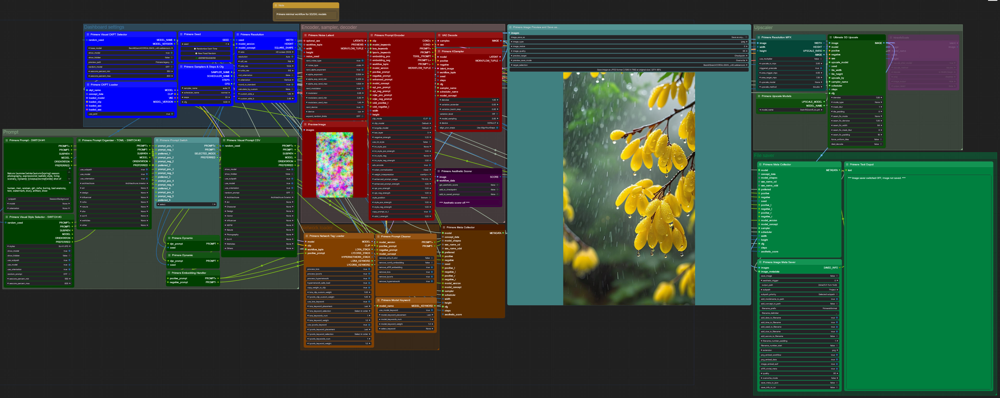
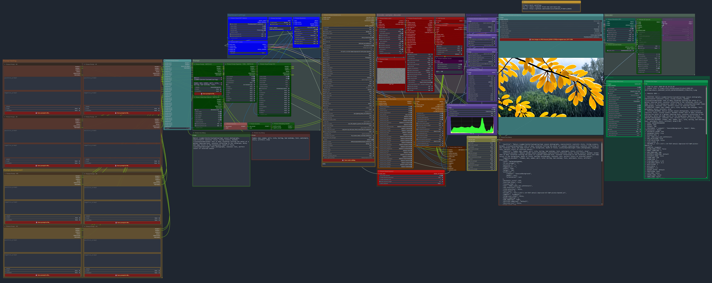
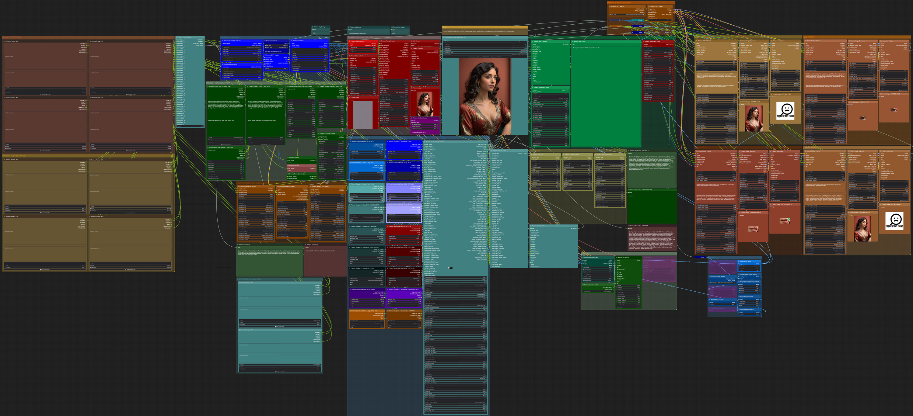

# Primere nodes for ComfyUI

**Git link:** https://github.com/CosmicLaca/ComfyUI_Primere_Nodes

**Primere Youtube channel:** https://www.youtube.com/@PrimereComfydev/videos

**Install required party nodepack depencency:** https://github.com/city96/ComfyUI_ExtraModels

Nodepack under development. Manual written by AI, please open issue if something wrong or missing. If you upgrade, just check attached new workflows or use git to downgrade to previous version if something failed.

After nodepack update of **12/3/2024 - v1.0.2** ComfyUI front-end must be updated to minimum **v1.4.13**. Please do `git pull` on comfy folder, the new nodepack not compatible with older Comfy versions. 

**All example workflows in the `Workflow` folder of the node root.**

## Minimal workflow: 

### <ins>[Detailed manual for included nodes](Workflow/Manual/nodes/minimal_workflow.md)</ins>

### Minimal workflow features:
 
- Prompt selector to any prompt sources
- Prompt can be saved to `CSV` file directly from the prompt input nodes 
- `CSV` and `TOML` file readers for saved prompts, automatically organized, saved prompt selection by preview image (if preview created)
- Randomized latent noise for variations
- Prompt encoder with selectable custom clip model, long-clip mode with custom models, advanced encoding, injectable internal styles, last-layer options
- Sampler with `variation extender` and `Align Your Step` features
- A1111 style network injection supported by text prompt (Lora, Lycorys, Hypernetwork, Embedding)
- Automatized and manual image saver. Manual image saver with optional **preview saver** for checkpoint (Lora, Lycoris, Embedding) selectors and saved .csv prompts
- Upscaler (selectable Ultimate SD and hiresFix)
- Dynamic prompt support
- Auto clean incompatible network tags from prompt by model arhitechture

## Basic workflow:

The main difference between **minimal** and **basic** workflows, that **basic** workflow automatically detect and support several model concepts. The main difference between workflows the large node group `Concept sampler group` with lot of samplers (1 sampler / concept) and the main `Model concept selector` node. 

### <ins>[Detailed manual for included nodes](Workflow/Manual/nodes/basic_workflow.md)</ins>

### Basic workflow features:

#### Same as Minimal workflow plus:

- **Half-automatic model concept selector:**
  - **Supported concepts:** SD1, SD2, SDXL, SD3, StableCascade, Turbo, Flux, KwaiKolors, Hunyuan DiT (image only), Playground, Pony, LCM, Lightning, Hyper, PixartSigma, Sana (both 1024 and 512)
  - Custom (and different) sampler settings for all concepts. The main idea is set sampler nodes only one time (`sampler`, `scheduler`, `step`, `cfg`) then just select model only what will use right sampler, vae, clip settings by `Model concept selector`. 
  - Auto detection of selected model type (if data already stored on external .json file, see longer [manual](Workflow/Manual/nodes/basic_workflow.md))
  - Auto **download** and apply Hyper, Lightning, and Turbo speed loras at first usage from here: https://huggingface.co/ByteDance/Hyper-SD/tree/main **check your SSD space before!**

**On the `Concept selector` node you will see `None` on all required fields, for example on Cascade and Flux files. You must install all required additional files manually to right path, then select correct model/clip/vae on lists.**

## Basic production workflow:

The main difference between **basic production** and **basic** workflows, that **basic production** workflow can use LLM prompt refiner (LLM models have to be installed locally) and face, eye, mouth, and hand refiner available. 4 prompt input for test, 4 prompt input for dev attached to prompt switcher. 

### <ins>[Detailed manual for included nodes](Workflow/Manual/nodes/basic_production_workflow.md)</ins>

### Basic production workflow features:

#### Same as Basic workflow plus:

- Added 4 test and 4 development prompt inputs, easy to switch
- Local LLM models can help refine/repair prompts. Refined prompts can be added to original, replace original, or keep original as L prompt but send refined to T5-XXL clip is avalable in clip encoder node 
- Customizable refiner blocks for face, eye, mouth, and hand refining. Auto segmentation model downloads deleted, manual model download required
- Refiner blocks using [DeepFace analyzer](https://github.com/serengil/deepface) if needed, detect age, race, gender and mood

## Basic production+ workflow:

The main difference between **basic production plus** and **basic production** workflows, that **basic production plus** workflow contains style nodes and post-precess nodes. 

### <ins>[Detailed manual for included nodes](Workflow/Manual/nodes/basic_production_plus_workflow.md)</ins>

### Basic production plus workflow features:

#### Same as Basic production workflow plus:

- Post-processing nodes, have to install [Image magick](https://imagemagick.org/index.php) and [MagickWand nodepack](https://github.com/Fannovel16/ComfyUI-MagickWand)
- Several style nodes including `Midjourney style`, `Camera lenses`, `Style pile`, and `Emotions` at `Style block` group
- 2 prompt inputs for DailyChallenges of AI image communities
- Several refinements on nodes