# Primere nodes for ComfyUI

Git link: https://github.com/CosmicLaca/ComfyUI_Primere_Nodes

<a href="./Workflow/readme_images/latest_workflow.png" target="_blank">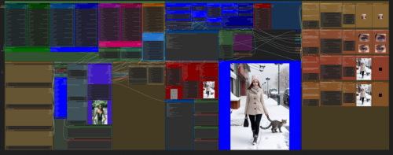</a>

## Features of attached complex workflow **Primere_full_workflow.json**:
- Automatically detect if SD or SDXL checkpoint loaded, and control the whole process (e.g. resolution) by the model version
- No need to set/switch any nodes or workflow between SD and SDXL checkpoints. Not just checkpoints, but change between model concepts only 1 click like Normal (SD/SDXL), LCM (SD/SDXL), Turbo, Cascade, Playground and Lightning. Test workflow: **civitai-modelconcepts.json**
- You can select preferred model, subpath and orientation on the prompt input to overwrite the system settings by prompt, same features under the .csv prompt loader node and the automatic Prompt organizer
- You can randomize the image orientation if using Comfy's batch queue mode
- Auto save the final image and .json and/or .txt file with workflow details, but these details saved to image as EXIF/PNGINFO (otherworldly meta) too
- Custom image saver on the image preview (image type (jpg, png, webp), resolution (max side in pixels), and quality (for jpg and webp). Open standard save as dialog on Image preview node, and semi-automatic 1 click image saver feature for visual selectors
- Handle dynamic prompts and additional networks (Embedding, Lora, Lycoris, Hypernetwork) directly from prompts, example styles.csv included for testing
- Not just .csv useful as prompt source, automatically organize your prompts from .toml file and use the file content on dedicated Prompt organizer node. Example .toml file included, customize after renamed
- Random noise generator for latent image, with special function to generate different but consistent images with locked seed using adjustable difference between min and max values 
- Resolution selector by side ratios only, editable ratio source in external file, auto detect checkpoint version for right final size
- Image size can be convert to "standard" (x16) values, fully customizable side ratios by float numbers at the bottom of the resolution selector node, different base resolution settings for several model concepts
- Multiply original resolution by integer, but can be define the final resolution by target megapixels from any image sizes. Image resolution multiplier can solve low memory error problem if using Ultimate SD Upscaler 
- Remove previously included networks from the content of prompts (Embedding, Lora, Lycoris and Hypernetwork), use network remover if the selected model incompatible with them or if you want to try your prompt without included networks or want to change to different, or using SDXL checkpoint and SD Loras have to be changed to SDXL compatible version 
- Use more than one prompt or style input nodes for testing and developing prompts, select any by 1 click at the 'Prompt Switch' node
- Special image META/EXIF/PNGINFO reader, which handle model name and samplers from A1111 and ComfyUI .png or .jpg. Never was easier to recycle your older A1111 and ComfyUI images and re-using them with same or different workflow settings. With switches you can change or keep the original meta seed/model/size/etc... to workflow settings. Test workflow: **civitai-image-recycler.json** 
- Workflow and nodes support Lycoris in dedicated node, no need to copy Lycoris files to Loras path
- Adjustable detailers and refiners for face, eye, hands, mouth, fashion wear, etc..., separated prompt input for detailers can be mixed to original for better result, included test workflow: **civitai-all-refiner.json**
- Visual (select element by preview image instead of long list) loaders available for Checkpoints, Loras, Lycoris, Embedding, Hypernetworks and .csv prompts. You only have to create preview images to right name and path, see readme details under "Visual", or use 1 click preview creator
- Midjourney art-style can be attached to the original prompt, Emotions as style in separated node
- Aesthetic scorer automatically decide about the refiner's result can be changed to the image or not

## Do it before first run, or the example workflows / nodes will be failed in your local environment:

**Try load 'Primere_full_workflow.json' from the 'Workflow' folder, specially after git pull if the previous workflow failed because nodes changed by development. This workflow contains most of fresh developed nodes, but some 3rd party nodes and models used**

1; Install missing Python libraries if nodepack not start for first try. **Activate Comfy venv** and use 'pip install -r requirements.txt' at the root folder of Primere nodes (or check error messages and install missing Python libs manually).

2; If node-pack started, load Primere_minimal_workflow and Primere_basic_workflow from the 'Workflow' folder for first test. All nodes visible under the 'Primere Nodes' submenu if you need for custom workflow. If some other nodes missing and red in loaded workflow, download or delete unloaded 3rd party nodes.

3; The **Primere_full_workflow.json** is the most complex workflow, using most of developed nodes. But the **Primere_minimal_workflow.json** is the simplest workflow with less required nodes. If the complex latest workflow not start or failed, please test out the basic or minimal instead. If you save own workflow with older developed nodes, try 'Fix node (recreate)' menu on right-click after git pull. 

4; Rename 'styles.example.csv' on the 'stylecsv' folder to 'syles.csv' if you want to use 'Primere Styles' node with your own prompts. If you keep or rename the original 'styles.example.csv', you will see image previews for included example prompts.

5; Sometime the node development changes existing nodes, so the previous workflows may failed after git pull, usually by invalid/deprecated/missing input values. Then use right-click + **'Fix node (recreate)' menu** and maybe need to rewire changed nodes, or load the attached example workflows again if updated from **Workflow** folder.

6; Maybe you have missing wildcard files (https://civitai.com/tag/wildcard), and sometime the wildcard decoder sending error if source file not found. If you have your own or downloaded custom wildcard files, just copy/symlink all to the 'wildcards' folder.

7; Don't overwrite attached example workflows, because the git pull will write back them to the original. If you modify them, save as... to another name and path. 

## Last changes:
#### Usually after node changes have to reload/re-wire nodes within existing workflow, or open the latest workflows from the nodepack's **Workflow** folder.
- **Segmented refiners** will mesure the aesthetic score of results, and if the original segment is better, changes will be ignored. Only in **Primere_full_workflow.json** workflow. Feature can switch off.
- Friendly response icons in **segment refiners** if the detailer off or not found segment in the source image.
- **Aesthetic scorer** included to all attached workflows. 
- **Long-clip** concept implemented to the Primere prompt encoder. Primary useful for SD1.x models (but working with SDXL too), if you  have long and difficult prompts. Read more: https://github.com/beichenzbc/Long-CLIP  
- **Model trigger words** selector in the Primere model keyword node. When you load the checkpoint, node will collect trigger words to the combo list, and you can include one to the end or beginning of your prompt (with weight).

## Future changes:
- The eye and the mouth color will be read from the original image and the refiner/detailer will detail segment with same color
- Aesthetic average values will be displayed on the preview images of visual selectors like checkpoints and saved prompts (visual style selector) as badge. Visual modal will be sorted by aesthetic average.
- Aesthetic trigger for image saver will ingnore low scored images.
- Image rating (small stars on images within galleries) will be saved to the image by aesthetic score.
- Refiner nodes will be suport all new model concepts, like LCM, Lightning, Turbo, Cascade and Playload.
- Trigger words will be listed for Lora-s and Lycoris stacks like listed for models.
- Used loras and other network settings will be saved to image meta (for image recycler).
- Finish Emotion styles node (sorry but the copypaste little boring).
- Test to read preview images directly from the model / networks folders. If the reading speed of thousands of larger images not bad, I will include this solution to all Visual nodes (excluding Visual styles).
- Youtube "how to use Primere nodepack" videos. I don't really like it, but I will start soon.

# Nodes in the pack grouped by submenus:

## Submenu :: Visuals:

### Before you save your own previews, just set 'show_modal' input to 'false'

**Visual** submenu contains similar functions like within **Inputs** and **Networks** submenu, but the selection (for example checkpoints, loras, lycoris, embeddings, styles from style.csv and hypernetworks) **possible by image previews on modal**. Very similar than in several themes of A1111, but you must create/save previews to right path.
Create and save images as previews to the right path and name, details later. **Supported previews formats: .jpg, .preview.jpg, .jpeg, .preview.jpeg, .png, .preview.png.** 
**Don't use downloaded generated large files because the long modal loading time.** The preview height in visual selector is only 220px, so don't use upscaled or original/downloaded images as preview. Dowscale your previews height to max 250-300 px, and set .jpg image quality to ~50% for faster loading. ACDSee do it automatically at Tools->Batch->Resize menu if you already have large images. **Semi-automatic preview saver node available, read details later.**
Checkpoint and additional networks files have a badge with SD or SDXL version. The version info is cached, only one time needed to read and store, so the very first loading time little longer. When you use your checkpoint or networks first time, the version info will be saved to the 'Nodes\\.cache\\.cache.json' file, next time will be read back. About automatic mass version caching read more later.

**If you need version info of all your files for visual modal badges, you can use terminal helper files from the 'terminal_helpers' subdir:**
- Open terminal/command window, and activate your comfy venv. This is the most important step before run command line helpers.
- In the terminal window you already activated your venv, just run included .py files:
- **lora_version_cache.py** will be read and store versions of all lora files
- **lyco_version_cache.py** will be read and store versions of all lycoris files
- **model_version_cache.py** will be read and store versions of all checkpoint files
- **embedding_version_cache.py** will be read and store versions of all textual embedding files

Unfortunately the result is not perfect :(. You must check and maybe modify the version labels on your models and network files. If the result failed or unknown, you can modify and correct the .cache.json manually. Git pull will keep your edited cache file.
**The embedding cache helper can't read the right version of embedding files**, after first run all files will be marked to **SD** version. You must modify and replace failed SD embeddings to SDXL in the .cache.json manually.

Example of visual checkpoint selector if preview available:

<a href="./Workflow/readme_images/pvisualmodal.jpg" target="_blank">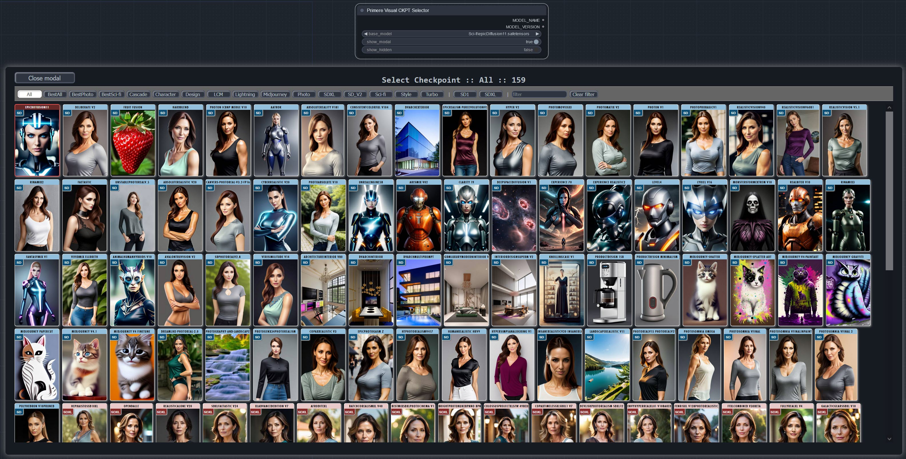</a>

### Use one click automatic helper to save your generated image for modal:

<a href="./Workflow/readme_images/pimgsaveas.jpg" target="_blank">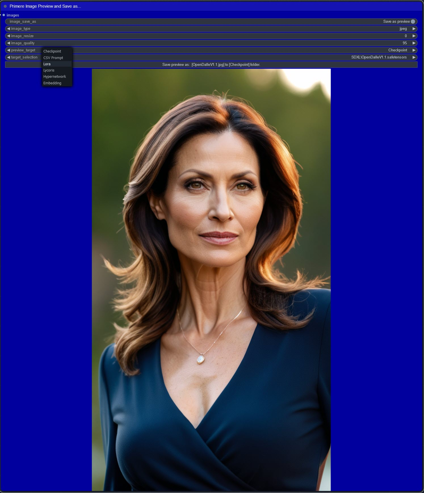</a>

#### This node look like a simple image preview, but with **Save as...** feature
- With **image_save_as** switch you can select **Save as preview** mode, what is the 1 click feature to create preview for visual selectors.
- Wait while the node contains your generated image.
- Set **preview_target** by your requirements (Checkpoints, Styles, Loras, Lycoris, Embedding and Hypernetworks). This is depending on the node names what using visual modals for selections. You must use these nodes in the workflow if you use 1 click preview saver.
- Set **target_selection** from the several values of upper selected **preview_target**. These values read from whole workflow when the node contains image.
- Set **preview_save_mode** to overwrite, keep, concat horizontal, concat vertical to your existing preview. Concat mean that you can create montages of more than one images.   
- Check the last characters on the button between **[?]**. C mean button push will create new preview, O overwrite existing, K keep existing and ignore save, JV join vertically new image to existing, JH join horizontally new image to existing preview. Join image mean you will create image montage (collage).
- Push the button if no error messages in the upper combos and in the button. Wait for the response dialog and if all right your image saved as modal preview at right format and size. Maybe you must shift+reload browser to see the result if the previous session cached. 

### Primere Visual CKPT selector:
**Visual selector for checkpoints**. You must mirror (replicate) your original checkpoint subdirs **(not the checkpoint files!)** to ComfyUI\web\extensions\PrimerePreviews\images\checkpoints\ path but only the preview images needed, same name as the checkpoint.
Much easier if you use **Primere Image Preview and Save as...** node for automatic preview creation from your generated image.
As extra features you can enable/disable modal with 'show_modal' switch, and exclude files and folders from modal starts with . (point) character if show_hidden switch is off. 

<a href="./Workflow/readme_images/pvmodal.jpg" target="_blank">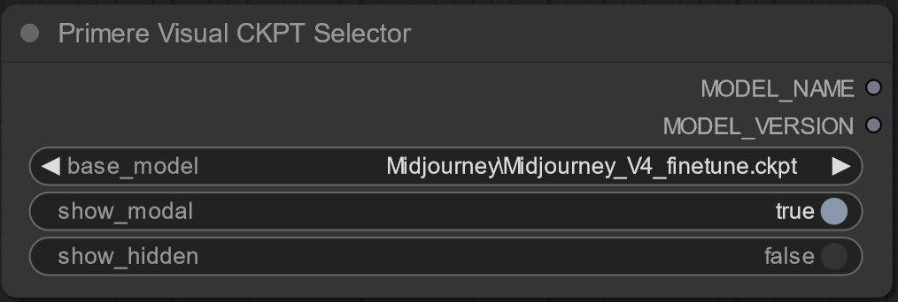</a>

### Primere Visual Lora selector:
Same as than the 'Primere LORA' node, but with preview images of selection modal.  
You must mirror your original lora subdirs **(not your lora files!)** to ComfyUI\web\extensions\PrimerePreviews\images\loras\ folder but only the preview images needed, same name as the lora files.
Much easier if you use **Primere Image Preview and Save as...** node for automatic preview creation from your generated image.
As extra features you can enable/disable modal with 'show_modal' switch, and exclude files and folders from modal starts with . (point) character if show_hidden switch is off.

<a href="./Workflow/readme_images/pvlora.jpg" target="_blank">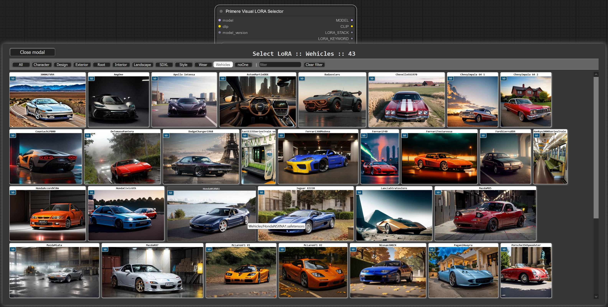</a>

### Primere Visual Lycoris selector:
Same as than the 'Primere LYCORIS' node, but with preview images of selection modal.  
You must mirror your original lycoris subdirs **(not your lycoris files!)** to ComfyUI\web\extensions\PrimerePreviews\images\lycoris\ path but only the preview images needed, same name as the lyco files.
Much easier if you use **Primere Image Preview and Save as...** node for automatic preview creation from your generated image.
As extra features you can enable/disable modal with 'show_modal' switch, and exclude files and folders from modal starts with . (point) character if show_hidden switch is off.

<a href="./Workflow/readme_images/pvlyco.jpg" target="_blank">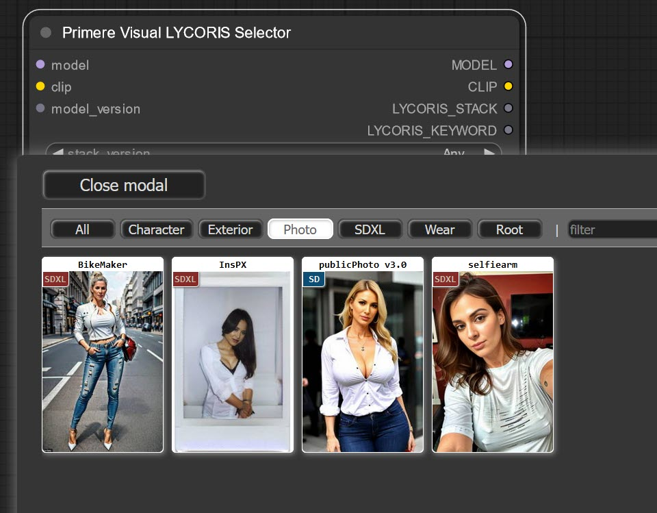</a>

### Primere Visual Embedding selector:
Same as than the 'Primere Embedding' node, but with preview images of selection modal.  
You must copy your original embedding subdirs **(not your embedding files!)** to ComfyUI\web\extensions\PrimerePreviews\images\embeddings\ path but only the preview images needed, same name as the embedding file.
Much easier if you use **Primere Image Preview and Save as...** node for automatic preview creation from your generated image.
As extra features you can enable/disable modal with 'show_modal' switch, and exclude files and folders from modal starts with . (point) character if show_hidden switch is off.

<a href="./Workflow/readme_images/pvembedd.jpg" target="_blank">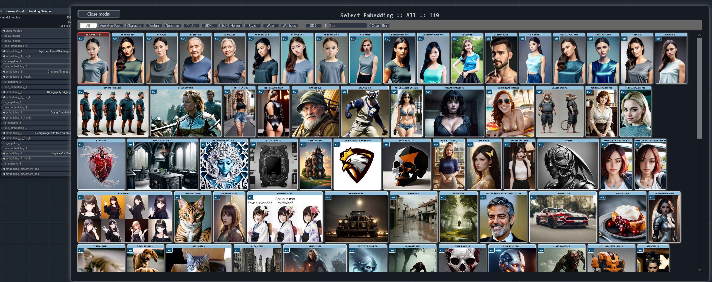</a>

### Primere Visual Hypernetwork selector:
Same as than the 'Primere Hypernetwork' node, but with preview images of selection modal.  
You must copy your original hypernetwork subdirs **(not your hypernetwork files!)** to ComfyUI\web\extensions\PrimerePreviews\images\hypernetworks\ path but only the preview images needed, same name as the hypernetwork file.
Much easier if you use **Primere Image Preview and Save as...** node for automatic preview creation from your generated image.
**If you have hypernetwork files from unknown source, set 'safe_load' switch to true.** With this settings sometime your hypernetwork settings will be ignored, but your computer stay safe.
As extra features you can enable/disable modal with 'show_modal' switch, and exclude files and folders from modal starts with . (point) character if show_hidden switch is off.

<a href="./Workflow/readme_images/pvhyper.jpg" target="_blank">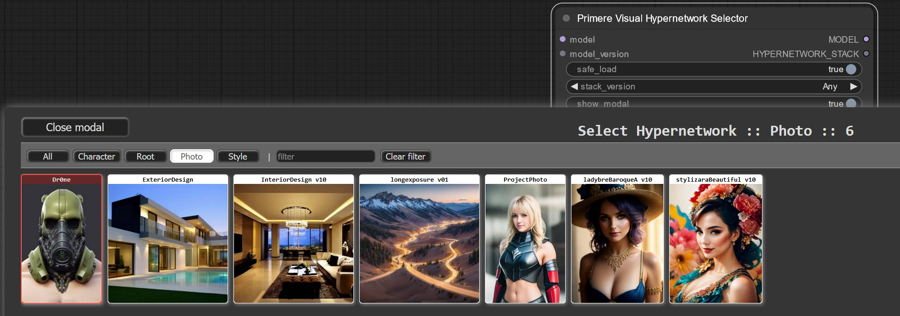</a>

### Primere Visual Style selector:
Same as than the 'Primere Styles' node, but with preview images of selection modal.  
You must create .jpg images as preview with same name as the style name in the list, but **space characters must be changed to _.** For example if your style in the list is 'Architecture Exterior', you must save Architecture_Exterior.jpg to the path: ComfyUI\web\extensions\PrimerePreviews\images\styles\
Much easier if you use **Primere Image Preview and Save as...** node for automatic preview creation from your generated image.
The styles.example.csv included, if you rename to styles.csv you will see example previews, and you can insert your own custom prompts to styles.csv.

<a href="./Workflow/readme_images/pvstyles.jpg" target="_blank">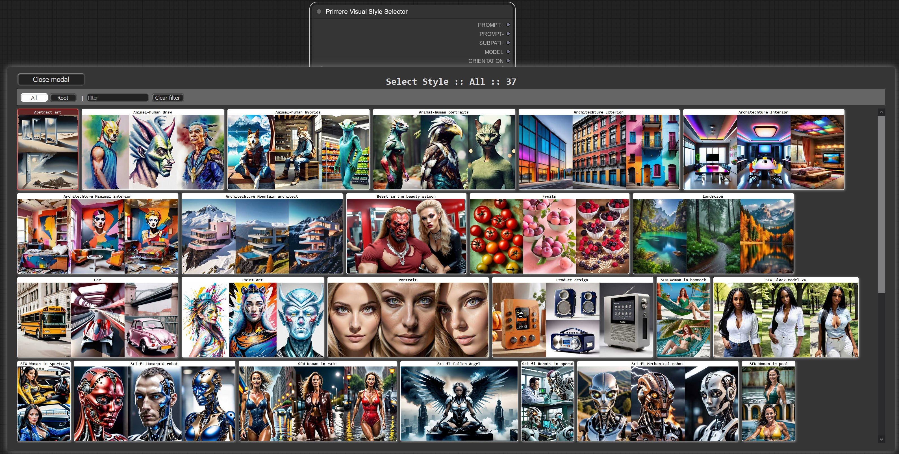</a>

## Submenu :: Segments:
Under this submenu you can found nodes for detailer/refiner nodes, and required one more **Primere Refiner Prompt** node from the Inputs menu. 
For these nodes you have to download ultralitics bbox and segmentation models from here: https://huggingface.co/Bingsu/adetailer/tree/main or use Comfy's internal model downloader (this is much easier).
Have to save these models to ComfyUI\models\ultralytics\segm\ and ComfyUI\models\ultralytics\bbox\ paths, the Comfy model manager save these models to right path automatically. For the included workflow these models required, but maybe you don't need all models if created your own custom workflow.

#### Download files manually from here:
- Universal segmentation model, useful labels included to node: https://huggingface.co/ultralyticsplus/yolov8s/tree/main
- Important and useful model set: https://huggingface.co/jags/yolov8_model_segmentation-set/tree/main
- Another link for example for deepfashion: https://huggingface.co/Bingsu/adetailer/tree/main
- Segmentation models for anime/cartoon: https://huggingface.co/RamRom/yolov8m_crop-anime-characters/tree/main, https://huggingface.co/AkitoP/Anime-yolov8-seg/tree/main
- Segment anything: https://huggingface.co/ybelkada/segment-anything/tree/main/checkpoints
- But the best if you use Comfy's model manager to download required models, use manual download if you nees something else

### WARNING: The "Image Segments" node will download all required segmentation models to the right path if not exist. This cause long loading time at first start (about ~10 minutes) depending on network speed, and required ~6.5 GB of disk space

### Tips for use detailer nodes:
- Check the example workflows: **civitai-all-refiner.json**, civitai-face-refiner.json, civitai-hair-refiner.json, civitai-hand-refiner.json, civitai-rewear-refiner.json, civitai-rewear-rehair-refiner.json
- For hands, faces, persons, hair and skins just use specific models without labels (keywords). 
- Another contents, for example cars or animals use universal model like **yolov8s** and don't forget to select right label from bottom list.
- Large faces don't need refiner or detailer because just change the good face to another one (or creating new worst). If you create closeup portrait, just switch off (or trigger by size) the face detailer.
- On large faces, for example portrait, good idea to refine eyes and mouth only. These refiners can be on, while the face detailer off (or off automatically by trigger values).
- Finally you can use hand detailer. Depending on settings, this group will refine smaller hands too. 
- For cartoon/anime use anime segmentation models, what very different I use and recommended.  
- Check (and modify) refiner's prompts. That very important, and you can mix this prompt to original for several results.
- If you set **strength** of prompts to **0** on **Primere Refiner Prompt** node, the prompt input will be ignored. Not always good idea to mix detailer's prompt to the original, but you don't need to remove original connection, you can set strength value to 0, same as disconnect.
- Not too easy to set really good refiner group, the result depending on source image and node settings. All settings will drastically modify the result with same prompt and seed.
- You can use standard dynamic prompts within the Refiner prompt node.
- Try to use **trigger values** to automatically on/off the detailer by the segmented area. Read later on the **Primere Image Segments** node.

#### For smaller faces you need face detailer, but don't need eye and mouth detailers:
<a href="./Workflow/readme_images/pdetsmallfaces.jpg" target="_blank">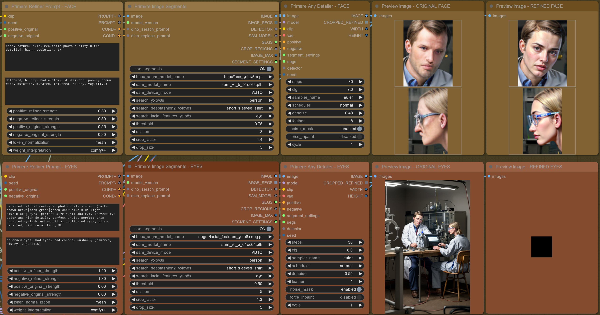</a>

#### For half-body or closeup portraits you don't need face detailer, but need eye and mouth detailers:
<a href="./Workflow/readme_images/pdetlargefaces.jpg" target="_blank">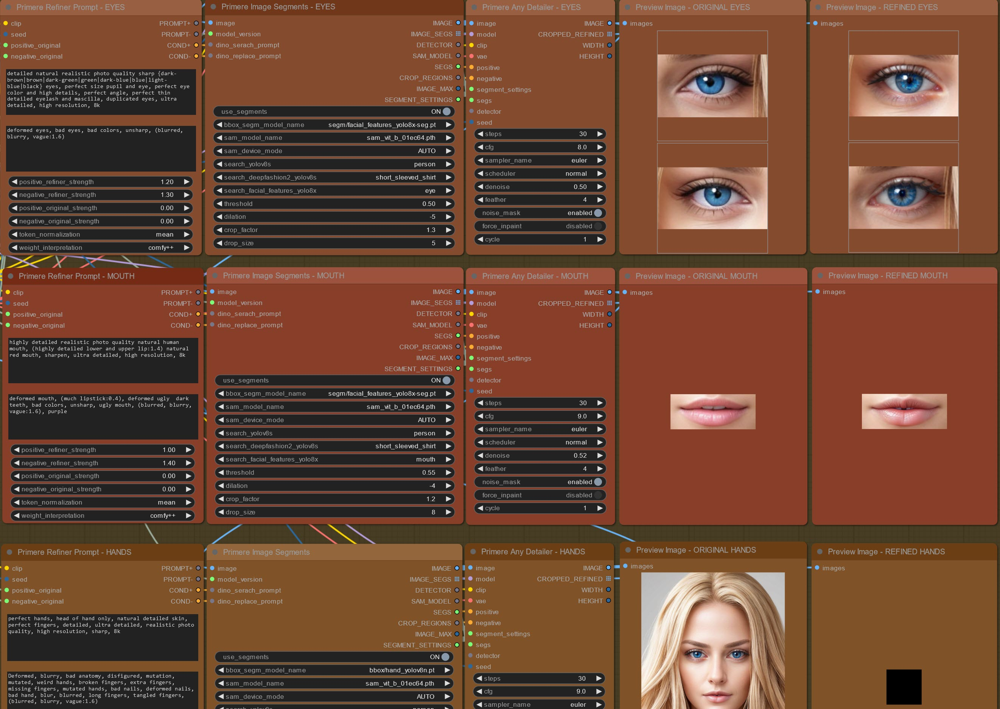</a>

### Primere Image Segments:
This node select segs and bbox model, but for three models: **yolov8s**, **deepfashion2_yolov8s** and **facial_features_yolo8x** you must select keyword label too. When you use one of these models with right label selection, the segmentation result will follow your selected label.
Another models no need label. You can use these nodes for workflow result by new prompts, but you can use if the input is existing image only. Load/test attached **civitai-[what]-refiner.json** workflows how to use these nodes if you want to refine your existing images.
You can On/Off this node anytime by switch and **triggers**, and you can play with available parameters.

#### Triggers:
Two trigger input available on this node, **trigger_high_off** and **trigger_low_off**. These input fields are numerical inputs, mean the percentage of original image area. For example 10 in trigger mean, the segmented area is the 10 percent of original image. Both are designed to automatically switch on/off the node by the area of segmented image.
The good trigger value depending on the segmented area compare to the source image. If you want to ignore segments smaller than 5% of input image, add 5 to **trigger_low_off** input, and segments under 5% of original pixels will be ignored. This is useful if the segment (for example mouth) too small to do correct refining.
The **trigger_high_off** switch off the node if the segmented area higher percent than this field value. For example if the face is always good if larger than 10 percent of original image area, enter 10 to the **trigger_high_off** input, and the node will process segments only if the segmented area less than 10% of original.
In the example workflow for face detailers I using trigger_high_off = 1, because if the area of segmented face less than 1%, then I need the node for fix small faces. If larger than 1%, no need fixes because usually good enough. The right value depending on used model, prompt, and additional networks like Loras or controlnet settings.
For mouth I using trigger_low_off = 0.25, because if the area of mouth less than 0.25%, no need to repair, only if larger.
For hand fixer I set trigger_high_off to 5, because if the hand's area is larger than 5%, usually no need to fix/detail. All settings depending in workflow settings and the input image.

<a href="./Workflow/readme_images/pimgsegments.jpg" target="_blank">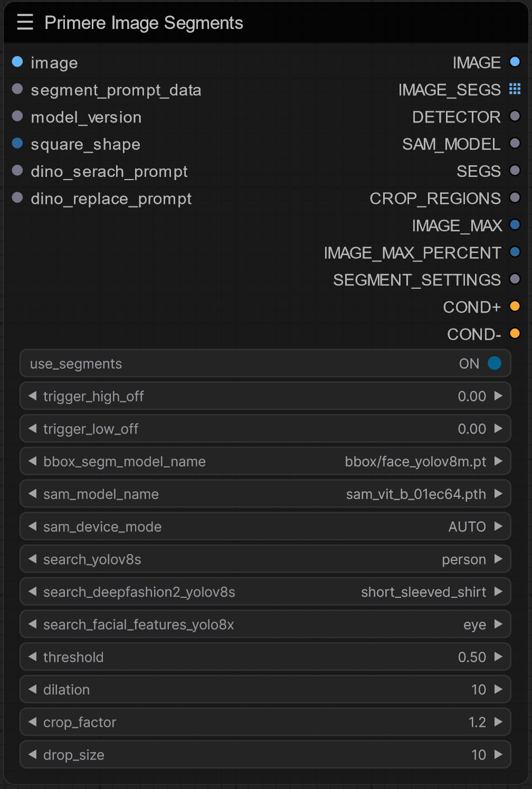</a>

### This node will download all required segmentation models to the right path, if models not exist. This is long loading time (about ~10 minutes), and required ~6.5 GB of disk space  

### Primere Any Detailer:
This node create detailed/refined output by input image and segments. Node must be used together with Image Segments and Refiner Prompt. The output of this node can be upscaled or saved, maybe connected to the next refiner.
Detailer group example included to the **Primere_full_workflow.json** you can check it for your own ideas and settings, or test only detailers in attached **civitai-[what]-refiner.json** files.

#### Detailer automatically handle Normal, LCM and Turbo model concepts if the 'model_concept' and 'concept_*' nodes used. Check the Primere_full_workflow how to automatically control this node for all 3 concepts. For normal mode, you can set samples to anything else, different from the original image creation settings.

<a href="./Workflow/readme_images/panydetailer.jpg" target="_blank">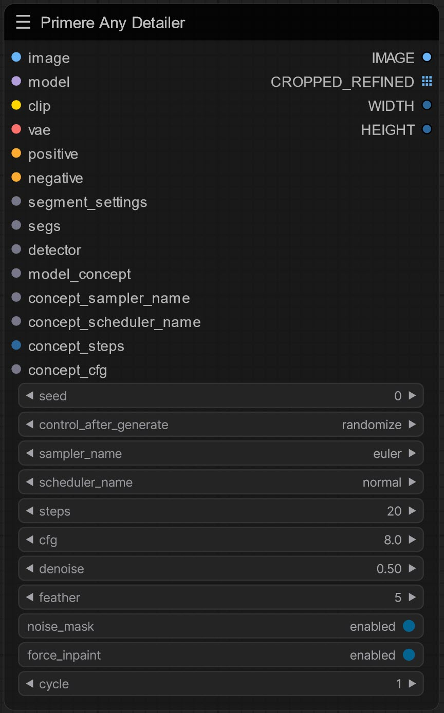</a>

The node using aesthetic scorer to measure the quality of the detailed segment. If the **use_aesthetic_scorer** on (ignore_if_worse) the result will be ignored if the aesthetic score is lower than the original segment's score. The a-scorer model sometime failed, this is why the feature can be off (always_refine) so you can ignore this feature.
If the score metered (ignore_if_worse), and the detailed segment's score is better than than the original, green badge show in the top-right corner, that the refined segment accepted. If the a-score of result lower than the original, red badge show in the corner, and the segmented part of image not changed to refined.

<a href="./Workflow/readme_images/padetailer_example.jpg" target="_blank">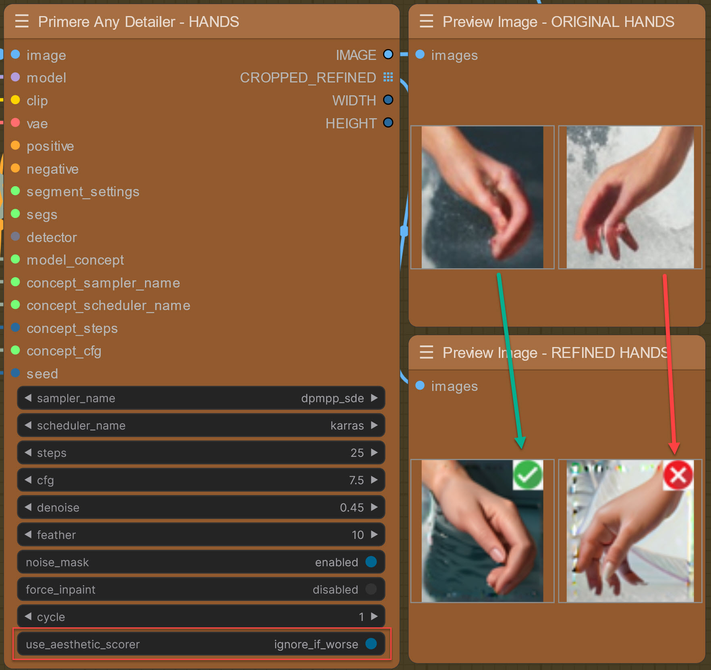</a>

## Submenu :: Inputs:

### Primere Prompt:
2 input fields within one node for positive and negative prompts. 3 additional fields appear under the text inputs:
- **Subpath**: the preferred subpath for final image saving. This can be use for example the subject of the generated image, like 'sci-fi' 'art' or 'interior'. This setting overwrite the subpath setting in 'Primere Image Meta Saver' node.
- **Use model**: the preferred checkpoint for image rendering. If your prompt need special checkpoint, for example because product design or architecture, here you can force apply this model to the prompt rendering process. This setting overwrite dashboard settings.
- **Use orientation**: if you prefer vertical or horizontal orientation depending on your prompt, your rendering process will be use this setting instead of global setting from 'Primere Resolution' node. Useful for example for portraits, what usually better in vertical orientation. Random settings available here, use with batch mode if you need several orientations for same prompt.

If you set these fields, (where 'None' mean not set and use dashboard settings) the workflow will use all of these settings for rendering your prompt instead of settings in 'Dashboard' group.

<a href="./Workflow/readme_images/pprompt.jpg" target="_blank">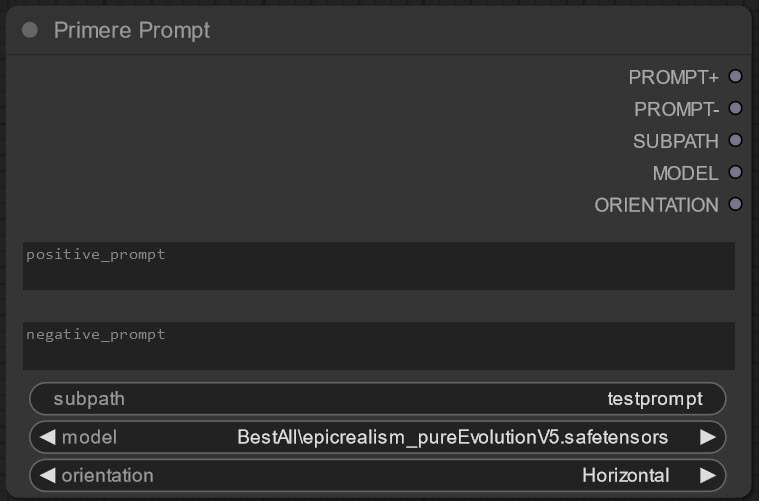</a>

### Primere Styles:
Style (.csv) file reader, compatible with A1111 syles.csv, but little more than the original concept. The file must be copied/symlinked to the 'stylecsv' folder. Rename included 'style.example.csv' to 'style.csv' for first working example, and later edit this file manually.
- **A1111 compatible CSV headers required for this file**: 'name,prompt,negative_prompt'. But this version have more 3 required headers: 'preferred_subpath, preferred_model, preferred_orientation'. These new headers working like additional fields in the simple prompt input. 
- If you fill these 3 optional columns in the style.csv, the rendering process will use them. **These last 3 fields are optional**, if you leave empty the style will be rendering with system 'dashboard' settings, if fill and enable to use at the bottom switches of node, dashboard settings will be overwritten.
- You can enable/disable these additional settings by switches if already entered to csv but want to use system settings instead, no need to delete if you failed or want to try with dashboard settings instead.

<a href="./Workflow/readme_images/pstyles.jpg" target="_blank">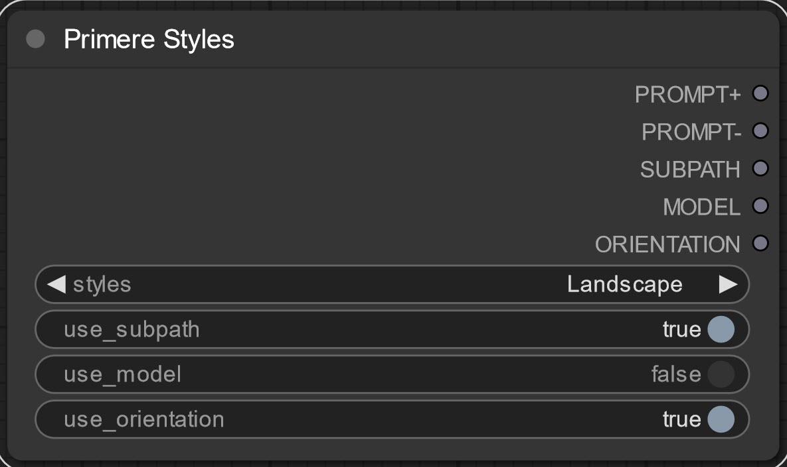</a>

### Primere Prompt Organizer
Prompts and additional data must be stored in the .toml file. This node dynamically read and organize the custom file content. The example file with data schema is on the path **Toml/prompts.example.toml**, just rename to the **prompts.toml** end edit/include your own prompt.
- [HEADER_NAME] is the main header.
- [HEADER_NAME.N_x] it the second level header. The string after dor 'N_x' is not important, but must be unique under same first level header, where the 'x' is an unique number.
- **preferred_subpath** optional data, if 'use_subpath' is true on the node, the image saver will use this string as subdirectory.
- **Name** required data for prompt list combo.
- **preferred_model** optional data, if you have 'must use' model for the prompt.
- **preferred_orientation** optional data, if you prefer vertical or horizontal orientation for your prompt.
- **Positive** required, the positive prompt.
- **Negative** optional, the negative prompt.

Follow the file schema for your own prompts but don't forget to rename the attached example file to prompts.toml.

<a href="./Workflow/readme_images/ppromptorganizer.jpg" target="_blank">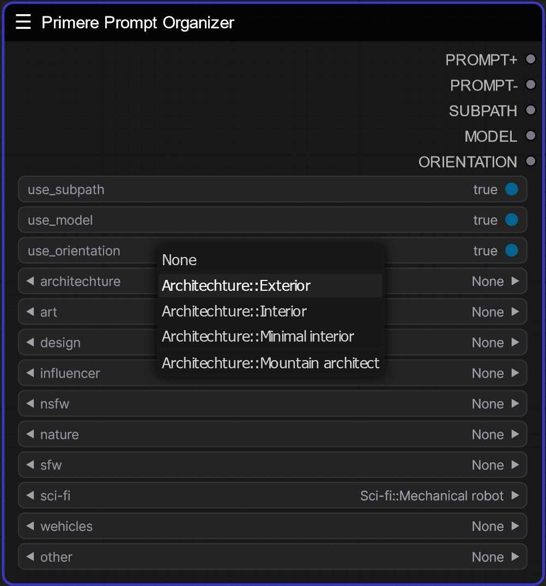</a>

### Primere Dynamic:
- This node render A1111 compatible dynamic prompts, including external wildcard files of A1111 dynamic prompt plugin. External files must be copied/symlinked to the 'wildcards' folder and use the '__filepath/of/file__' keyword within your prompt. Use this to decode all style.csv and double prompt inputs, because the output of prompt/style nodes not resolved by another comfy dynamic decoder/resolver.
- Check the included workflow how to use this node.

<a href="./Workflow/readme_images/pdynamic.jpg" target="_blank">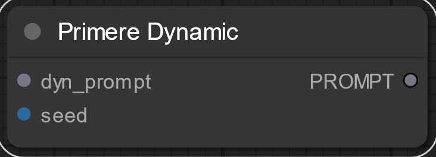</a>

### Primere image recycler:
- This node read prompt-exif (called meta) from loaded image. Compatible with A1111 .jpg and .png, and usually with ComfyUI, but not with results of all other custom workflows.

<a href="./Workflow/readme_images/pimgrecycler.jpg" target="_blank">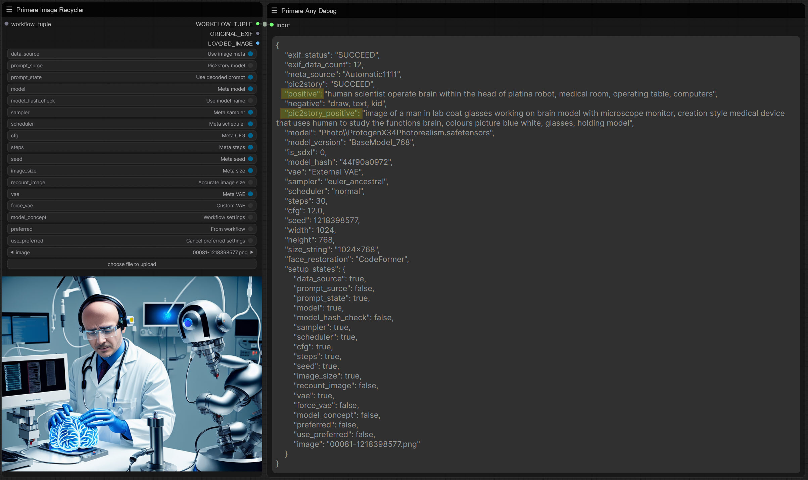</a>

- The node input needed 2 anther node. One is 'Primere meta collector'. Connect your workflow settings to the inputs of this node, the output must be connected to the image recycler node.
- The second helper node is 'Primere meta distributor'. Connect this node input to the output of image recycler, then you will get back the workflow settings.
- These 2 additional nodes helps to use switches on image recycler to choose you want to use workflow settings or image meta for new generation process.
- Check example workflow: **civitai-image-recycler.json**

<a href="./Workflow/readme_images/pmetadistribitions.jpg" target="_blank">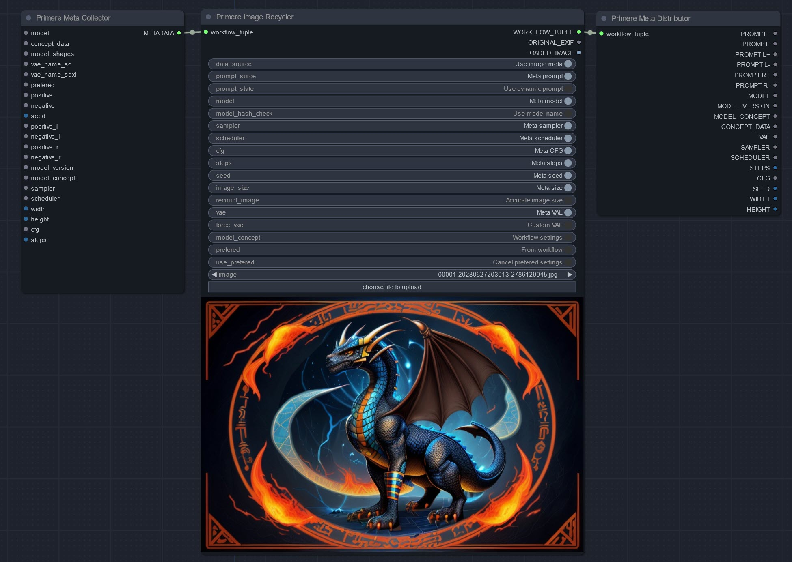</a>

### Primere exif reader:
- This node read prompt-exif (called meta) from loaded image. Compatible with A1111 .jpg and .png, and usually with ComfyUI, but not with results of all other custom workflows.
- This node is the alternate version of Primere image recycler.

This node output sending lot of data to the workflow from exif/meta or pnginfo if it's included to selected image, like model name, vae and sampler name or settings. Use this node to distribute settings, and simple off the 'use_exif' switch if you don't want to render image by this node, then you can use your own prompts and dashboard settings instead.

**Use several settings of switches what exif/meta data you want/don't want to use for new image rendering.** If switch off something, dashboard settings (this is why must be connected this node input) will be used instead of image included exif/meta.
#### For this node inputs connect all of your dashboard settings, like in the example workflow. If you switch off the exif reader with 'use_exif' switch, or ignore specified data for example the model, the input values will be used instead of image meta. The example workflow help to analyze how to use this node.

<a href="./Workflow/readme_images/pexif.jpg" target="_blank">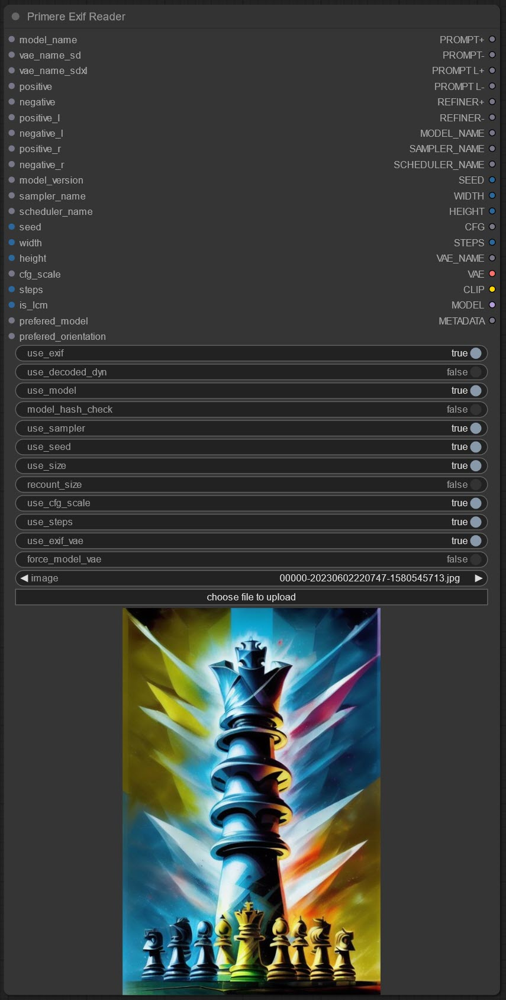</a>

### Primere Embedding Handler:
This node convert A1111 embeddings to Comfy embeddings. Use after dynamically decoded prompts (booth text and style). **No need to modify manually styles.csv from A1111 if you use this node.**

<a href="./Workflow/readme_images/pemhandler.jpg" target="_blank">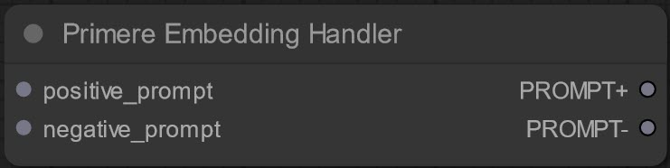</a>

### Primere Lora Stack Merger:
This node merge two different Lora stacks, SD and SDXL. The output is useful to store Lora settings to the image meta.

### Primere Lora Keyword Merger:
With Lora stackers you can read model keywords. This node merge all selected Lora keywords to one string, and send to prompt encoder.

### Primere Lycoris Stack Merger:
This node merge two different Lycoris stacks, SD and SDXL. The output is useful to store Lycoris settings to the image meta.

### Primere Lycoris Keyword Merger:
With Lycoris stackers you can read model keywords. This node merge all selected Lycoris keywords to one string, and send to prompt encoder.

### Primere Embedding Keyword Merger:
This node merge positive and negative SD and SDXL embedding tags, to send them to the prompt encoder.

### Primere VAE selector:
This node select between SD and SDXL VAE if model_version input is correct.

<a href="./Workflow/readme_images/pvaeselector.jpg" target="_blank">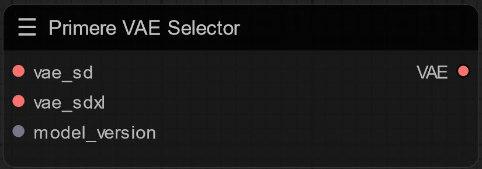</a>

### Primere Refiner Prompt:
Another dual prompt input, bur for refiners and detailers. You can connect original prompts too to this node, and set the weights of all inputs. Text and cond outputs are available.
For more info about usage see **"Segments"** submenu.

<a href="./Workflow/readme_images/prefprompt.jpg" target="_blank">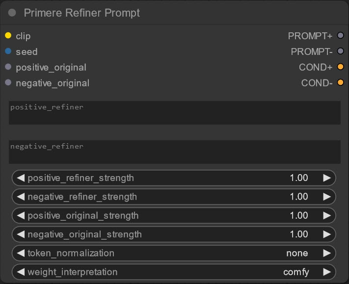</a>

## Submenu :: Dashboard:
### Primere Sampler Selector:
Select sampler and scheduler in separated node, and wire outputs to the sampler (through exif reader input in the example workflow). This is useful to separate from other nodes, and for LCM and Turbo modes you need three several sampler settings. (see the example workflow, and try to understand LCM and Turbo setting)

<a href="./Workflow/readme_images/psampler.jpg" target="_blank">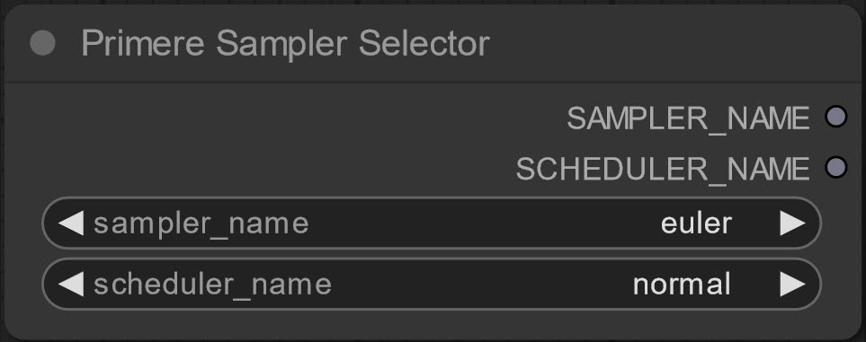</a>

### Primere Steps & Cfg:
Use this separated node for sampler/meta reader inputs. If you use LCM and Turbo modes, you need 3 with several settings of this node. See and test the attached example workflow.

<a href="./Workflow/readme_images/psteps.jpg" target="_blank">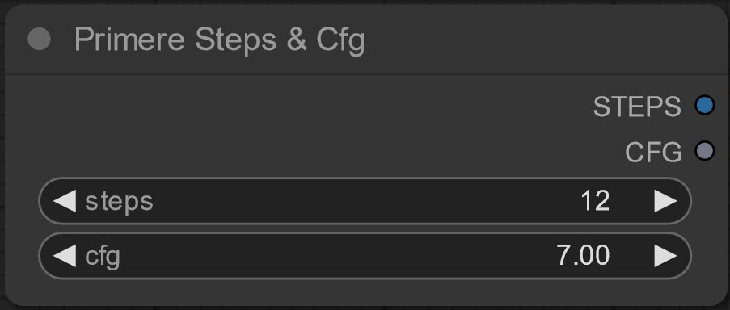</a>

### Primere Samplers & Steps & Cfg:
Use this separated node for sampler/meta reader inputs. If you use LCM and Turbo modes, you need 3 with different settings of this node. See and test the attached example workflow.
This node the merged version of previous two: 'Primere Sampler Selector' and 'Primere Steps & Cfg'

<a href="./Workflow/readme_images/psamcfgsel.jpg" target="_blank">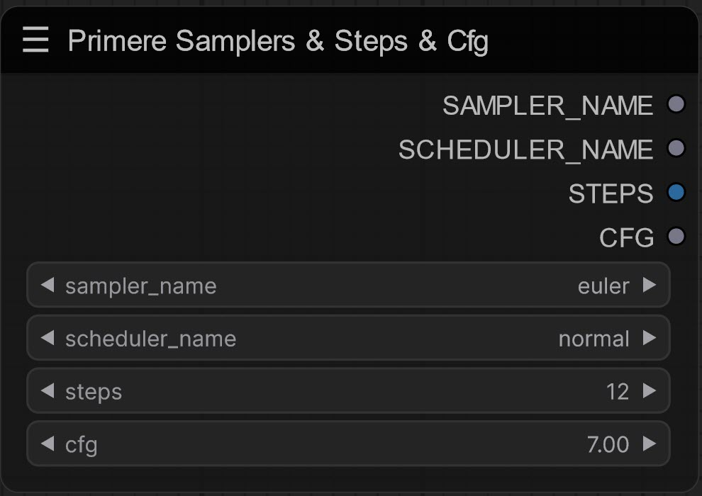</a>

### Primere LCM Selector:
Use this node to switch on/off LCM mode in whole rendering process. Wire two sampler and cfg/steps settings to the inputs (one of them must be compatible with LCM settings), and connect this node output to the sampler/exif reader, like in the example workflow. The 'IS_LCM' output important for CKPT loader and the Exif reader for correct rendering.

<a href="./Workflow/readme_images/plcm.jpg" target="_blank">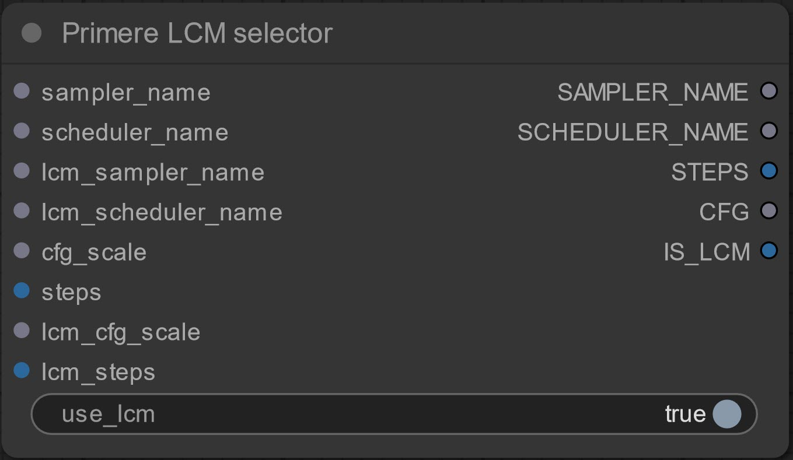</a>

### Primere Model Concept Selector:
Use this node to switch between Normal, LCM, Cascade, Lightning, Playground and Turbo modes in whole rendering process. Use several sampler and cfg/steps settings to the inputs (one of them must be compatible with LCM settings, another must flow Turbo, Lightning, Playground and Cascade rules), and connect this node output to the sampler/exif reader, like in the example workflow. The 'MODEL_CONCEPT' output important for CKPT loader, Image refiners, and the Exif reader for correct rendering.

<a href="./Workflow/readme_images/pmodelconcept.jpg" target="_blank">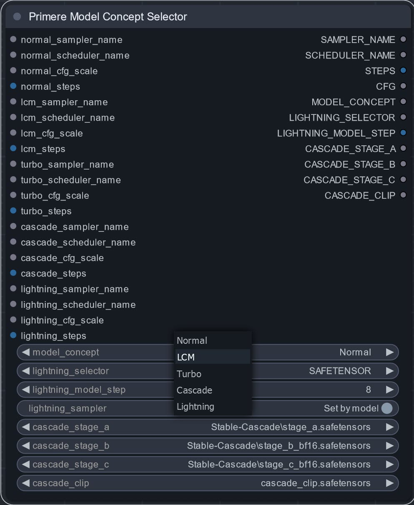</a>

### Primere VAE Selector:
This node is a simple VAE file selector. Use 2 nodes in workflow, 1 for SD, 1 for SDXL compatible VAE for automatized selection.

### Primere CKPT Selector:
Simple checkpoint selector, but with extras:
- This node automatically detect if the selected model SD or SDXL. Use this output for automatic VAE, additional networks or size selection and for prompt encoding, see example workflow for details.
- Check the "visual" version of this node, if you already have previews for checkpoints, easier to select the best for your prompt. How to create preview for visual selection, read later on this readme.

<a href="./Workflow/readme_images/pckptselect.jpg" target="_blank">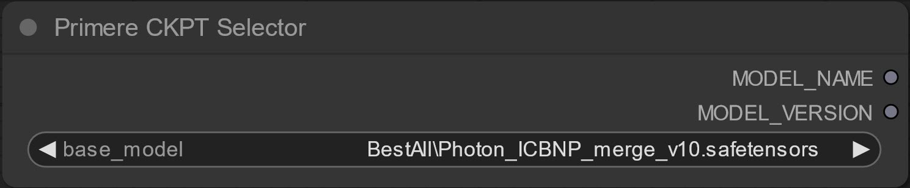</a>

### Primere VAE loader:
Use this node to convert VAE name to VAE.

### Primere CKPT Loader:
Use this node to convert checkpoint name to 'MODEL', 'CLIP' and 'VAE'. Use 'model_concept' input for detect LCM and Turbo modes, see the example workflow.
If you have downloaded .yaml file, and copied to the checkpoint's directory with same filename, set 'use_yaml' to true, and the loader will use read and use the config file. No need to switch off if .yaml file missing. If you find some problem or error, simply set it to false.
Play with 'strength_lcm_model' and 'strength_lcm_clip' values if set LCM mode on whole workflow.
This node have optional inputs if checkpoint already loaded by previous process. If 'loaded_clip', 'loaded_vae' and 'loaded_model' connected, this node will use these inputs instead of loading checkpoint again. 

### Primere Prompt Switch:
Use this node if you have more than one prompt input (for example several half-ready test or development prompts). Connect prompts/styles node outputs to this node inputs and set the right index at the bottom. To connect 'subpath', 'model', and 'orientation' inputs are optional, only the positive and negative prompt required.

**Very important:** don't remove the connected node from the middle or from the top of inputs. Connect nodes in right queue, and disconnect them only from the last to first. If you getting js error because disconnected inputs in wrong queue, just reload your browser and use 'reload node' menu with right click on node.

<a href="./Workflow/readme_images/prpmptswitch.jpg" target="_blank">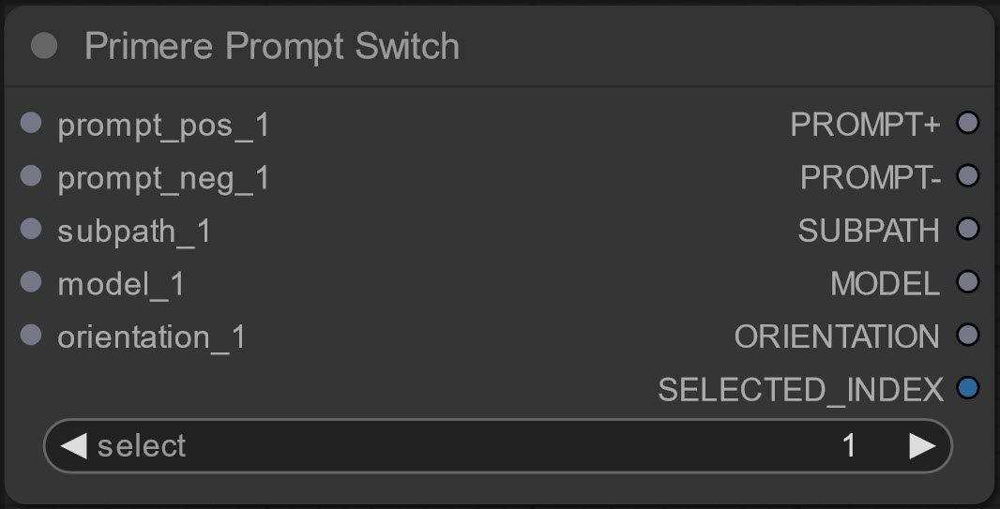</a>

### Primere Seed:
Use only one seed input for all. A1111 look node, connect this one node to all other seed inputs.

### Primere Noise Latent:
This node generate 'empty' latent image, but with several noise settings, what control the final images. **You can randomize these setting between min. and max. values using switches**, this cause small difference between generated images for same seed and settings, but you can freeze your noise and latent image if you disable variations of random noise generation.
- You can generate several images with large difference with randomized dashboard seed
- If you freeze seed (on the dashboard group) and set the min and max values of generation details on this node, you will get small differences by your noise values (primary by alpha_exponent and modulator if randomized)
- If the difference not big enough switch on 'extra_variation' and set 'control_after_generate' to 'randomize' or 'increment' or 'decrement'. You can get different but consistent images with these settings **if the dashboard seed locked** 

<a href="./Workflow/readme_images/platent.jpg" target="_blank">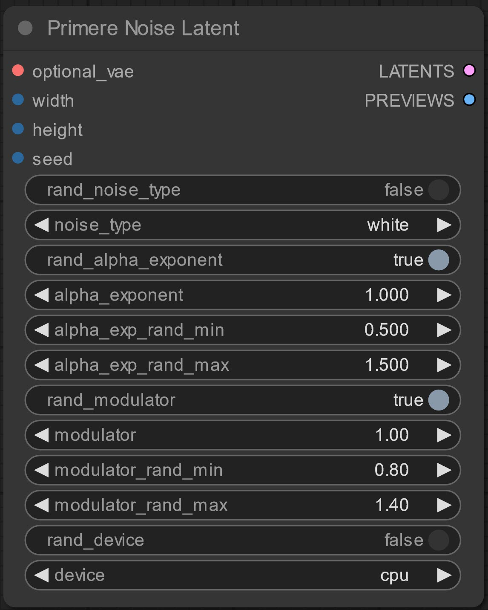</a>

### Primere Prompt Encoder:
- This node compatible booth SD and SDXL models, important to use 'model_version' (SD, SDXL) and 'model_concept' (Normal, LCM, Turbo, Cascade, Lightning, Playground) inputs for correct working. Try several settings, you will get several results. 
- Use positive and negative styles, and check the best result in prompt debugger and image outputs. 
- If you getting error if use SD basemodel, you must update (git pull) your ComfyUI.
- The style source of this node in external file at 'Toml/default_neg.toml' and 'Toml/default_pos.toml' files, what you can edit if you need changes.
- Connect here additional network and checkpoint keywords (triggerwords) like in the example workflow.
- Try out 'use_long_clip' switch to handle longer prompts better. Useful for SD1.x but working with SDXL checkpoints. Inform about the original concept from here: https://github.com/beichenzbc/Long-CLIP and found required clip model here: https://huggingface.co/BeichenZhang/LongCLIP-L/tree/main. The node will download this clip model (~1.7GB) to right path at very first usage.

<a href="./Workflow/readme_images/pencoder.jpg" target="_blank">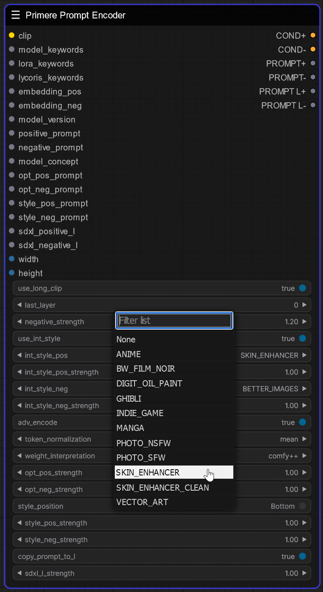</a>

### Primere Resolution:
- Select image size by side ratios only, and use 'model_version' and 'model_concept' inputs for correct SD, SDXL - Normal - Turbo size on the output.  
- You can calculate image size by custom ratios at the bottom float inputs (and set 'calculate_by_custom' switch on), or just edit the external ratio source file.
- The ratios of this node stored in external file at 'Toml/resolution_ratios.toml', what you can edit if you need changes.
- Use 'round_to_standard' switch if you want to modify the exactly calculated size to the 'officially' recommended SD / SDXL values. This is usually very small modification and I think not too important, but some 3rd party nodes failed if the side not divisible by 16.
- Not sure what orientation the best for your prompt and want to test in batch image generation? Just set batch value on the Comfy menu and switch 'rnd_orientation' to randomize vertical and horizontal images.
- Set the model base resolution to 512, 768, 1024, 1280, 1600, or 2048, both SD, SDXL and Turbo, but in separated inputs. The official setting is 512 SD, but I like 768 instead, and 1024 for SDXL. The Turbo resolution depending on your use model.

<a href="./Workflow/readme_images/pres.jpg" target="_blank">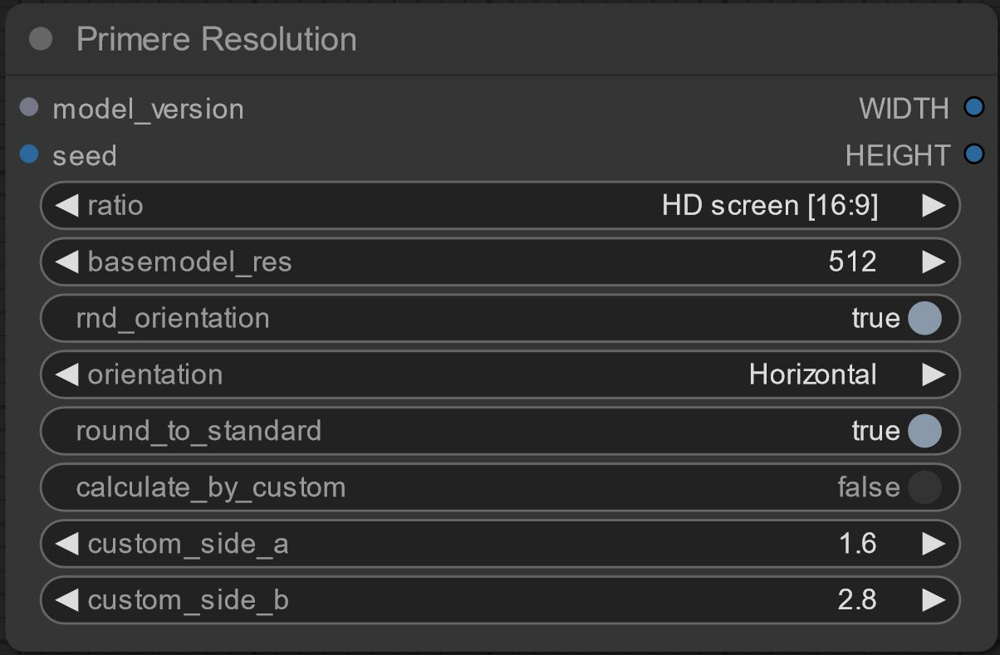</a>

### Primere Resolution Multiplier:
Multiply the base image size for upscaling. Important to use 'model_version' and 'model_concept' if you want to use several multipliers for Turbo, SD and SDXL models. Just switch off 'use_multiplier' on this node if you don't need to resize the original image.

If your upscaler failed because low memory error, try to switch on 'triggered_prescale' and set right values to the input fields under this switch. This function resize the source image before upscaling to right size:

- **area_trigger_mpx:** the value of the image area in megapixels when the 'pre-scale' process run. For example if your original image based on 512px, the source image area in megapixels = 0.26. If you set this value to 0.55, your 512 based images will be processed, but 768 (0.58 mpx) and larger pictures will be ignored.
- **area_target_mpx:** the value to resize the source image before sending to the upscaler in megapixels. If you use this function, and for example want to upscale your 512 based image to 6-8 times larger but the upscaler failed, resize the source to 2mpx (or 3mpx) before upscaling.
- **upscale_model:** set the upscale model instead of interpolation (upscale_method input). **Warning: the selected upscale model will resize your source image by fix ratio. For example '4x-UltraSharp' will resize you image by ratio 4 to 4 times larger.**
- **upscale_method:** if you don't want to use upscale_model, what mean set the previous combo to 'None', here you can select the interpolation method, the source image will be resize to the value of 'area_target_mpx' input.

<a href="./Workflow/readme_images/presmul.jpg" target="_blank">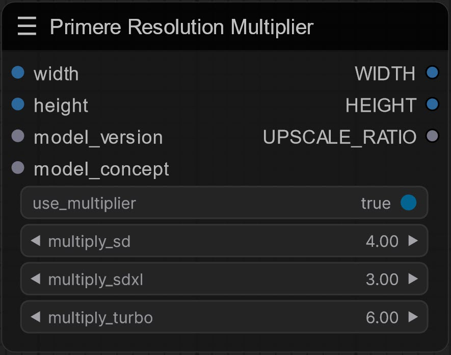</a>

### Primere Resolution MPX:
Multiply the base image size for upscaling. This node upscale original images to the value of megapixels (upscale_to_mpx). No need to use model concepts or versions, just the original image size needed. Just switch off 'use_multiplier' on this node if you don't need to resize the original image.

If your upscaler failed because low memory error, try to switch on 'triggered_prescale' and set right values to the input fields under this switch. This function resize the source image before upscaling to right size:

- **area_trigger_mpx:** the value of the image area in megapixels when the 'pre-scale' process run. For example if your original image based on 512px, the source image area in megapixels = 0.26. If you set this value to 0.55, your 512 based images will be processed, but 768 (0.58 mpx) and larger pictures will be ignored.
- **area_target_mpx:** the value to resize the source image before sending to the upscaler in megapixels. If you use this function, and for example want to upscale your 512 based image to 10-12 megapixels or larger but the upscaler failed, resize the source to 2 mpx (or 3-4 mpx) before upscaling.
- **upscale_model:** set the upscale model instead of interpolation (upscale_method input). **Warning: the selected upscale model will resize your source image by fix ratio. For example '4x-UltraSharp' will resize you image by ratio 4 to 4 times larger.**
- **upscale_method:** if you don't want to use upscale_model, what mean set the previous combo to 'None', here you can select the interpolation method, the source image will be resize to the value of 'area_target_mpx' input.

<a href="./Workflow/readme_images/presmulmpx.jpg" target="_blank">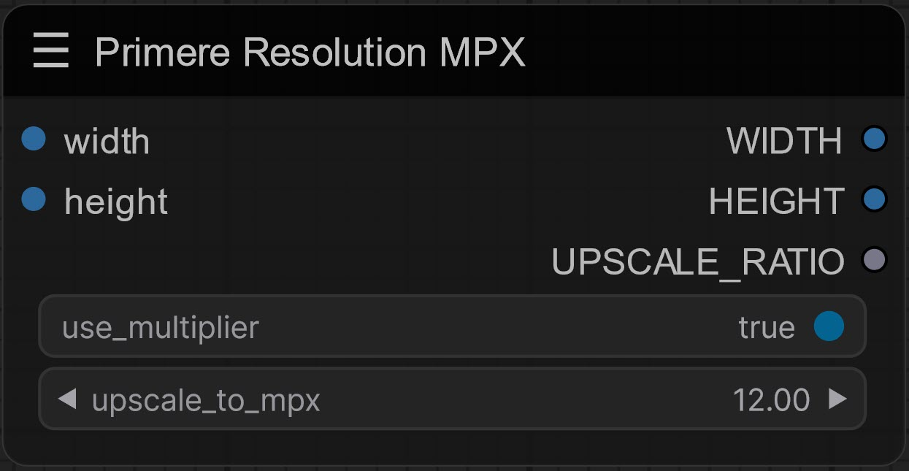</a>

### Primere Prompt Cleaner:
This node remove Lora, Lycoris, Hypernetwork and Embedding (booth A1111 and Comfy) from the prompt and style inputs. Use switches what network(s) you want to remove or keep in the final prompt. Use 'remove_only_if_sdxl' if you want keep all of these networks for SD1.5 models, and remove only if SDXL checkpoint selected.
**Important notice:** for loras, lycoris and hypernetworks you don't need original tags in the prompt (for example: \<lora:your_lora_name>). If you keep original lora and hypernetwork tags in the prompt you cant sure your image result use the lora only, or use the tag string only (or booth) in the prompt. I recommend always to remove lora and hypernetwork tags, but you can try what happen if keep.
You must remove original tags after 'Primere Network Tag Loader', because after prompt cleaner no tags available for tag loader. The example workflow using 2 of this nodes, one for SD, one for SDXL workflow.

<a href="./Workflow/readme_images/ppcleaner.jpg" target="_blank">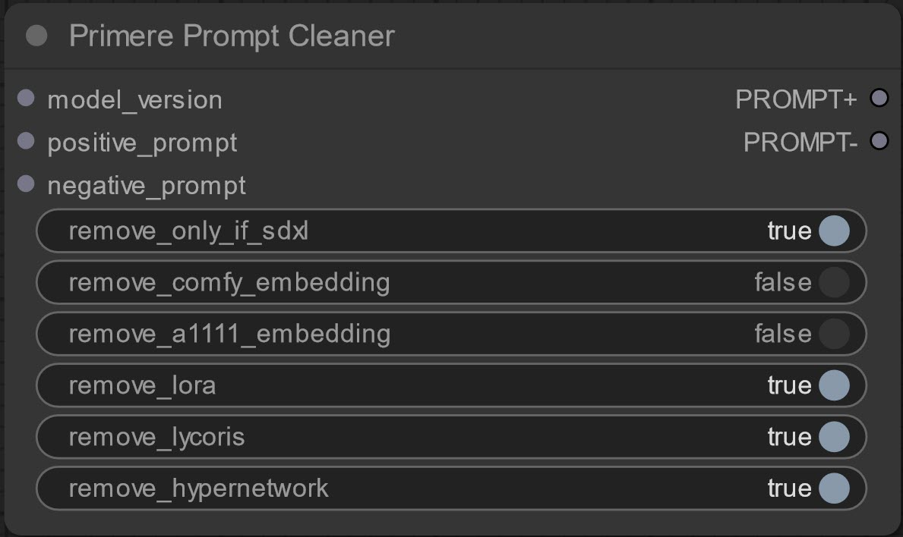</a>

### Primere Network Tag Loader
This node loads additional networks (Lora, Lycoris and Hypernetwork) to the CLIP and MODEL. You can read and use Lora (lora:[your model name]), Lycoris (lyco:[your model name]) and Hypernetwork (hypernetwork:[your model name]) keywords to send to prompt encoder or the keyword merger like in the example workflow.
**Hypernetwork is harmful, because can run any code on your computer, so set 'process_hypernetwork' to False on this node or download them from reliable source only**
**If you have hypernetwork files from unknown source, set 'safe_load' switch to true.** With this settings sometime your hypernetwork tags will be ignored, but your computer stay safe.

<a href="./Workflow/readme_images/pnettagload.jpg" target="_blank">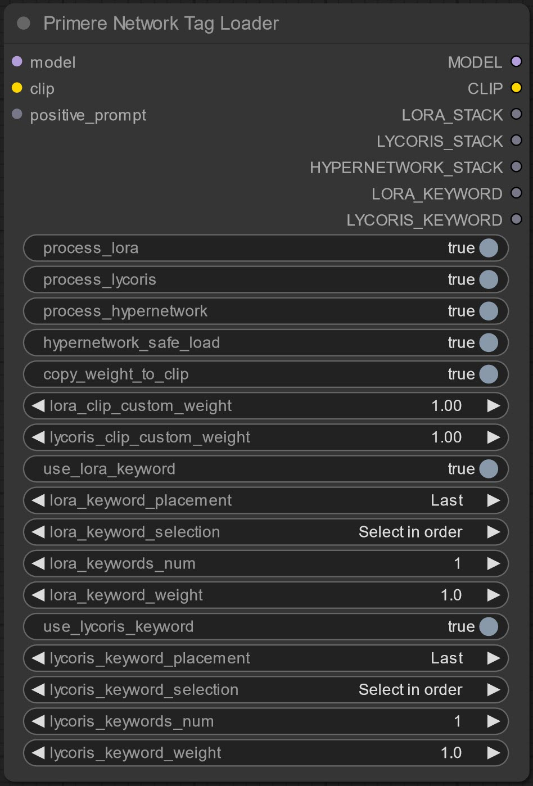</a>

### Primere Model Keyword
This node loads model keyword. You can read and use model keywords to send directly to prompt encoder like in the example workflow. The idea based on A1111 plugin, but something different.
- You can get one or more keywords in queue or ranadomize with 'model_keyword_num'
- You can place keyword to the start or end of your prompt
- You can set model keyword weight
- You can choose only one keyword from the list. If the model keyword available, the list value set to the very first keyword automatically
- The nude working only with Primere checkpoint selector nodes, both simple and visual

<a href="./Workflow/readme_images/pmodkeyw.jpg" target="_blank">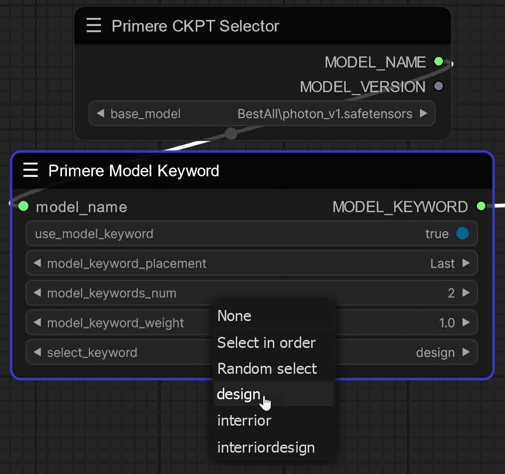</a>

## Submenu :: Outputs:

### Primere Image Preview and Save as...
This node is image preview, but with save as feature.
- The node must contains generated image.
- **image_save_as:** [Save as any...] will give you standard save to... dialog for image saving. Then you can choose target folder and name for the file. [Save as preview] setting mean 1 click preview saver for nodes using visual selection modals.
- **image_type:** Usable for [Save as any...] setting, choose image type like jpeg, png, and webp
- **image_resize:** Set the larges value is image side in pixel. The image will keep the original side ratios. **0** mean no change the original size.
- **image_quality:** Image quality in percent for jpeg and webp images if choose [Save as any...] at the top
- **preview_target:** If use [Save as preview] feature on the top, you can choose node with visual selection modal. Checkpoint, CSV Prompt, Lora, Lycoris, Hypernetwork and Embedding available. Selected visual node **must be used** in workflow.
- **preview_save_mode** If preview already available, you can set Overwrite, Keep (cancel save and keep original), Join horizontal or Join vertical mode to existing preview. If no preview available Creating mode will save your first image.
- **target_selection:** if [preview_target] selected, and the node available, here you can select node values.
- Check the end of button text. [C] mean create new preview, [0] mean overwrite existing, [K] mean keep existing and cancel save, [JH] mean join horizontal, [JV] mean join vertical new image to existing one. 
- The button will open save as dialog if [Save as any...] selected, or will save preview for visual modal automatically renamed and resized to right value for **preview_target** and **target_selection** settings. **This feature overwrite previous image if available without question.**   

<a href="./Workflow/readme_images/pimgsaveas2.jpg" target="_blank">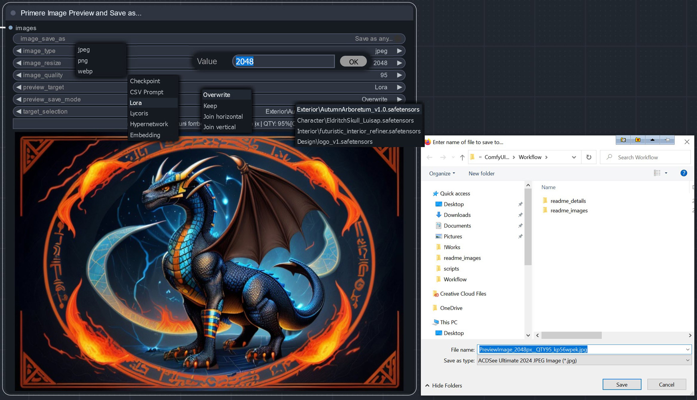</a>

### Primere Meta Saver:
This node save the image, but with/without metadata, and save meta to .json/.txt file if you want. Get metadata from the Exif reader node only, and use optional 'preferred_subpath' input if you want to overwrite the node settings by several prompt input nodes. Set 'output_path' input correctly, depending your system.

<a href="./Workflow/readme_images/pimgsaver.jpg" target="_blank">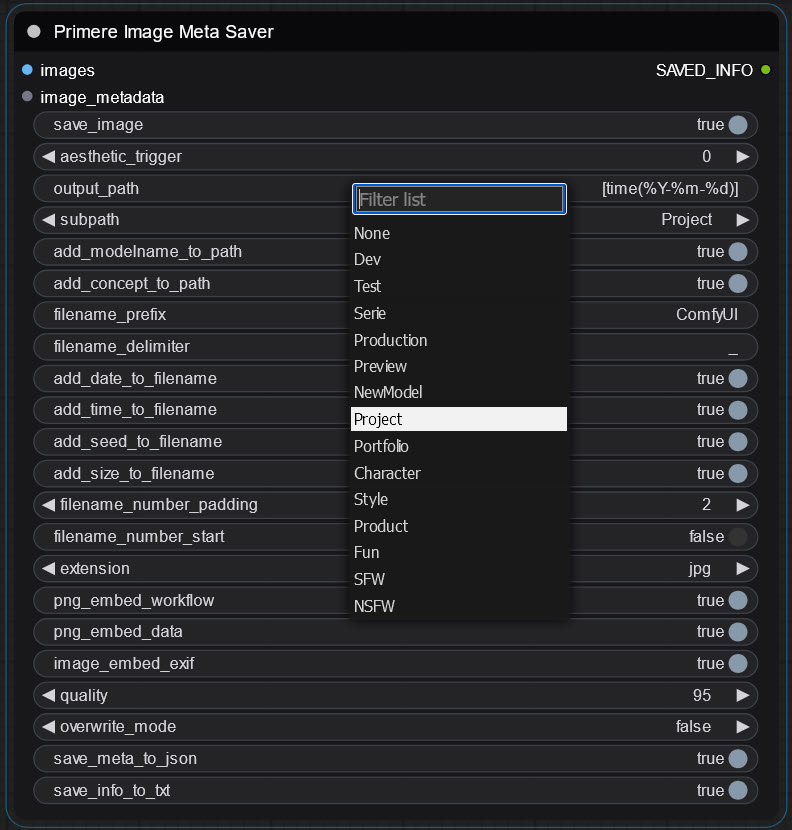</a>

### Primere Any Debug:
Use this node to display 'any' output values of several nodes like prompts or metadata (**metadata is formatted**). See the example workflow for details.

### Primere Text Output:
Use this node to display simple text (not tuples or dict).

### Primere Meta Collector:
Use this node in the workflow if you don't need Primere Meta Reader node. This node collect required metadata for Primere Meta Saver, the data will be stored to .jpg exif or .png pnginfo, then you can read back and recycle your previous prompts and settings by Primere Meta Reader. Check 'Primere_advanced_workflow.json' how to use this node.

### Primere Aesthetic Scorer:
Get the aesthetic score of your generated image.
- **get_aesthetic_score**: on/off switch for the node. At very first usage the node download required model to right path (3.5MB).
- **add_to_checkpoint**: add score value to the checkpoint. Workflow data required for this function. If this switch is True, value will be saved to checkpoint name, and if using **visual checkpoint selector** the badge will show the average scores and sort the preview by score values. 
- **add_to_saved_prompt**: add score value to the saved csv prompts. Workflow data required for this function. If this switch is True, value will be saved to prompt name, and if using **visual style loader** the badge will show the average scores and sort the preview by score values. 

<a href="./Workflow/readme_images/pascorer.jpg" target="_blank">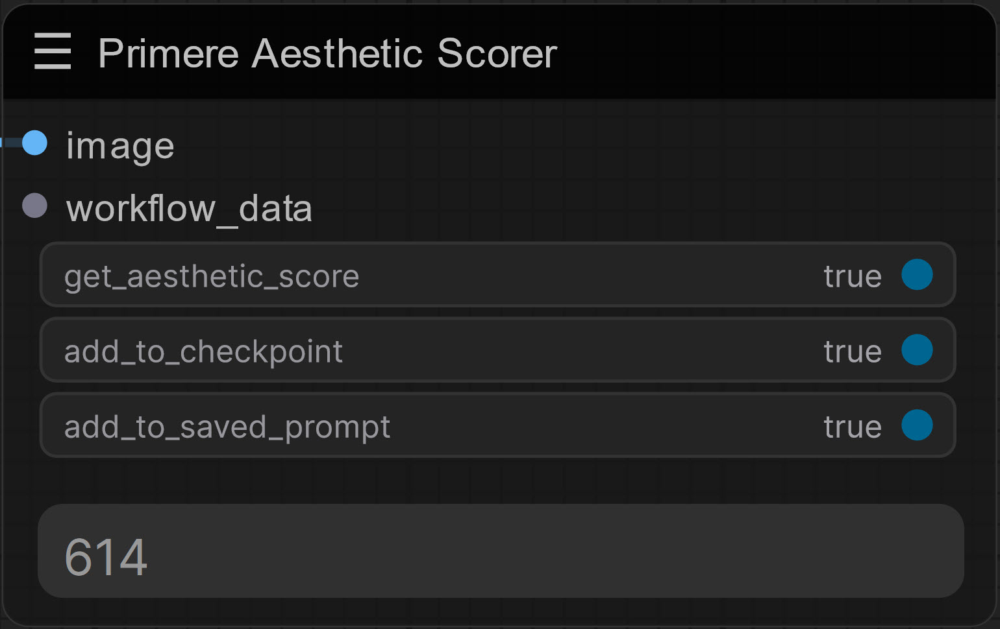</a>

### Primere KSampler:
Sampler using the 'model_concept' input this node automatically handle Turbo and Cascade modes, no need another workflow or extra node. You can select device (CPU or GPU), and use 'variation_extender' input for new image with very less (adjustable) difference from previous one (if seed and other details freezed). This settings can be used in queued workflow.

<a href="./Workflow/readme_images/pksampler.jpg" target="_blank">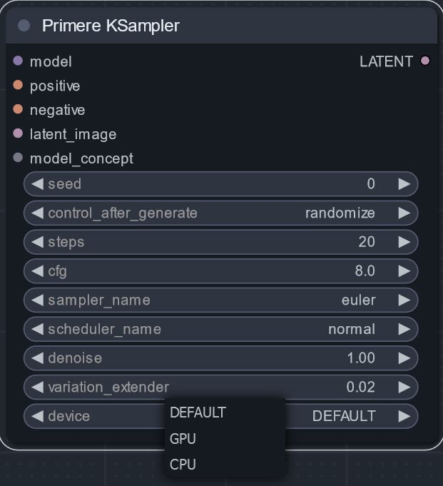</a>

## Submenu :: Styles:
### Primere Style Pile:
Style collection for generated images. Set and connect this node to the 'Prompt Encoder'. No forget to set and play with style strength. The source of this node is external file at 'Toml/stylepile.toml', what you can edit if you need changes.

<a href="./Workflow/readme_images/pstylepile.jpg" target="_blank">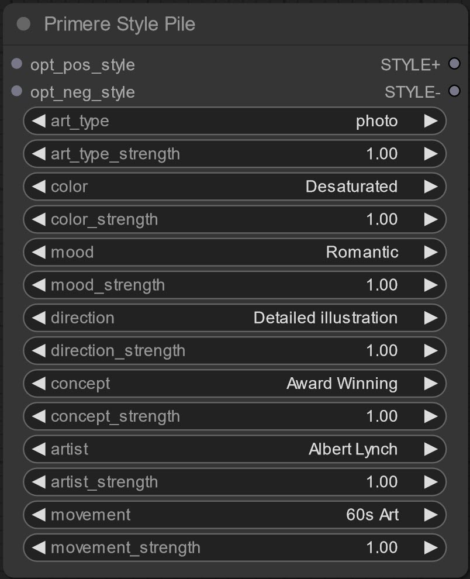</a>

### Primere Midjourney Styles:
Style collection from Midjourney. You can attach art-style prompt to your original prompt, and get your result in several artistic style.

<a href="./Workflow/readme_images/pmidjourney.jpg" target="_blank">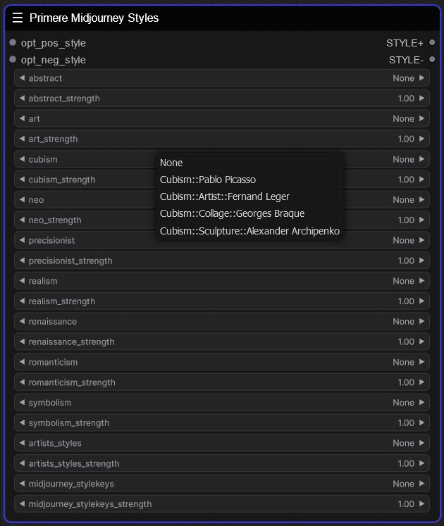</a>

Example images about the result of this style node. The left-top image is the original without any style, all others styled by this one, using SD1.5 model, same seed, same prompt:

### Primere Emotions Styles:
Style collection of emotions. You can attach emotion-style to your original prompt, and get your result in several emotion style. The source content will be update frequently to more emotions.

<a href="./Workflow/readme_images/pstyleemo.jpg" target="_blank">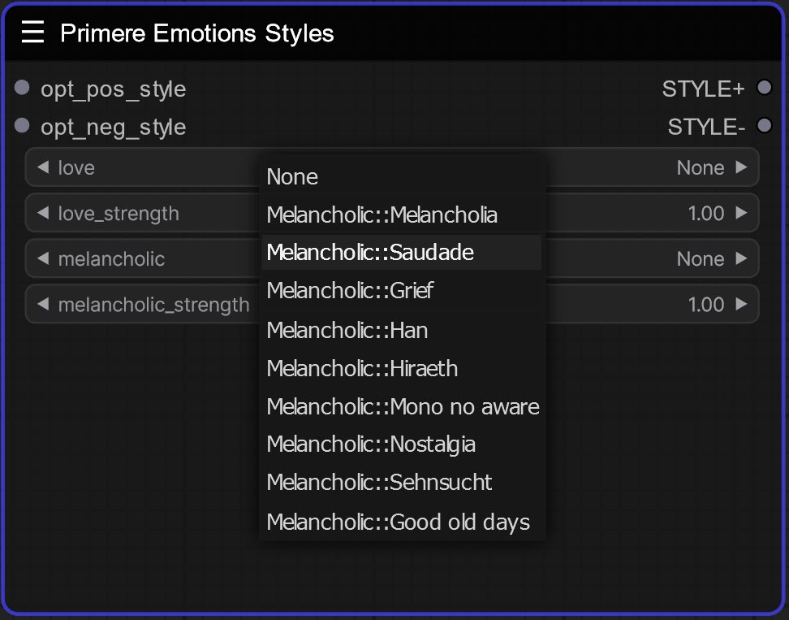</a>

Example images about the result of this style node. The left-top image is the original without any style, all others styled by this one, using SDXL model, same seed, same prompt:

## Submenu :: Networks:
### Primere LORA
Lora stack for 6 loras. Important to use 'stack_version' list. Here you can select how you want to load selected Lora-s, for SD models only, for SDXL models only or for booth (Any) what not recommended. Use 2 separated Lora stacks for SD/SDXL checkpoints, and wire 'model_version' input for correct use.
- You can switch on/off loras, no need to choose 'None' from the list.
- If you use 'use_only_model_weight', the model_weight input values will be copied to clip_weight.
- If you switch off 'use_only_model_weight', you can set model_weight and clip_weight to different values.
- You can load and send to Prompt Encoder the Lora keyword if available. This is similar but not exactly same function of "Model Keyword" plugin in the A1111.
- You can choose Lora keyword placement, which and how many keywords select if more than one available, how many keyword use if more than one available, select in queue or random, and set the keyword weight in the prompt.
- Lora keyword is much better than to keep lora tag in the prompt.

<a href="./Workflow/readme_images/plora.jpg" target="_blank">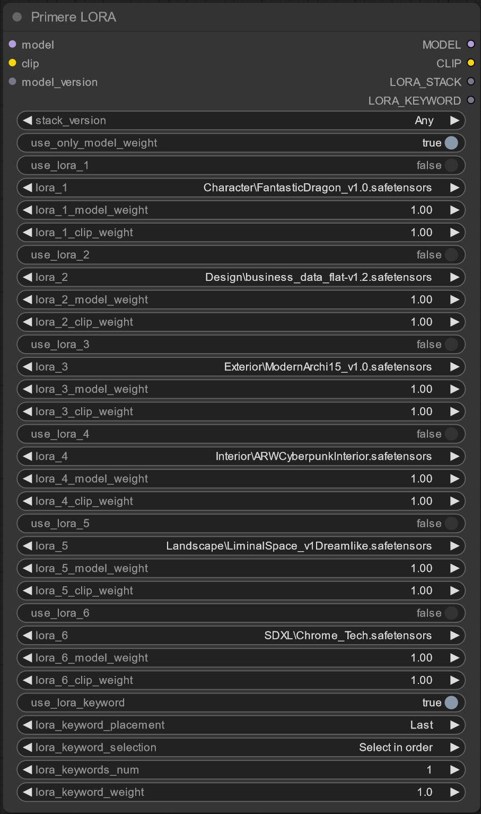</a>

### Primere LYCORIS
Lycoris files have dedicated node, working similar than the LORA stack. See example workflow, or use as LORA.
If you already have downloaded LyCORIS files, you must symlink or copy to the path **ComfyUI\models\lycoris\**. I recommend symlink the original source instead of copying.

<a href="./Workflow/readme_images/plyco.jpg" target="_blank">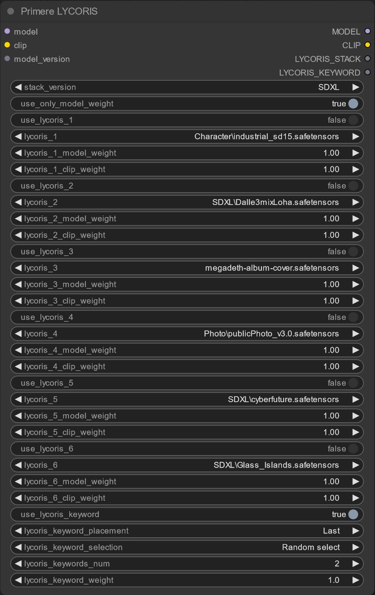</a>

### Primere Embedding
Select textual inversion called Embedding for your prompt. You have to use 2 several versions of this one, one for SD, and another one for SDXL checkpoints. Important to use 'model_version' input and 'stack_version' list, working similar than in the Lora stack. 
You can choose embedding placement in the prompt.

<a href="./Workflow/readme_images/pembed.jpg" target="_blank">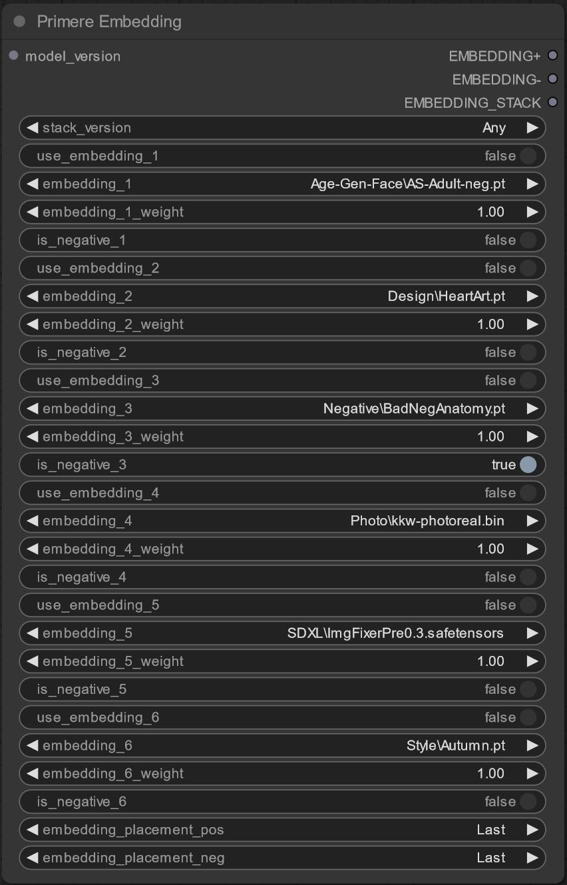</a>

### Primere Hypernetwork
Use hypernetwork if you already have by this node. **Hypernetwork is harmful, because can run any code on your computer, so ignore/delete this node or download them from reliable source only**
**If you have hypernetwork files from unknown source, set 'safe_load' switch to true.** With this settings sometime your hypernetwork settings will be ignored, but your computer stay safe.
Hypernetworks don't need seperated SD and SDXL sources, use only one stack for all, and set 'stack_version' to 'Any'. 

<a href="./Workflow/readme_images/phyper.jpg" target="_blank">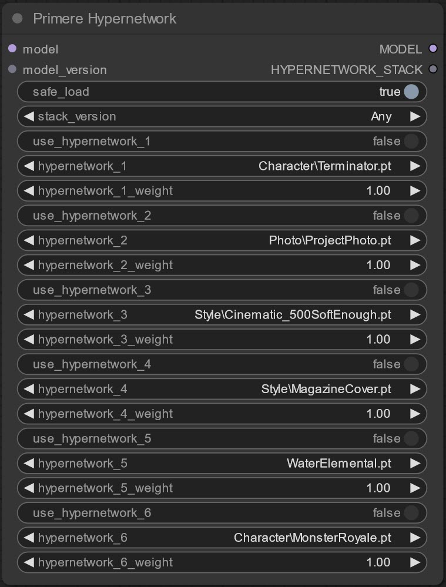</a>

# Contact:
#### Discord name: primere -> ask email if you need or use git for fork and pull request

# Licence:
#### Use these nodes for your own risk