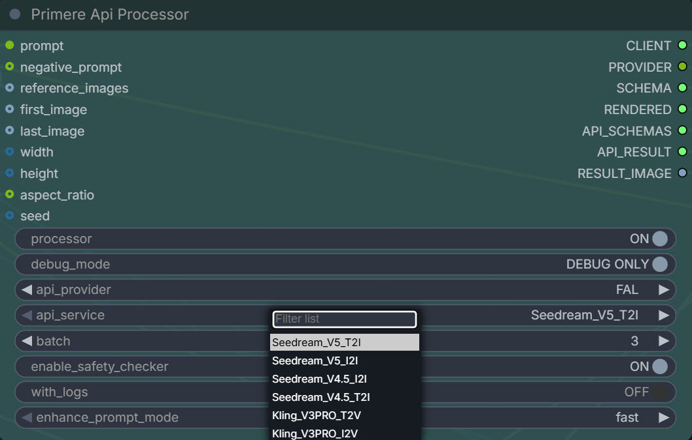
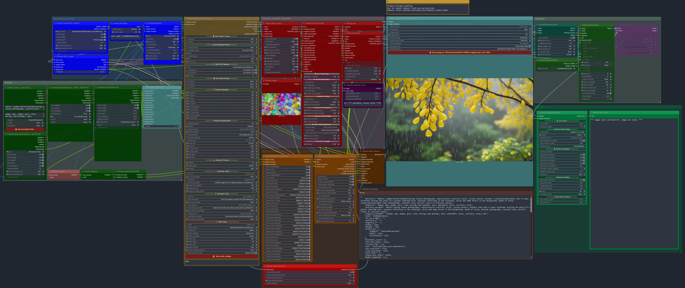
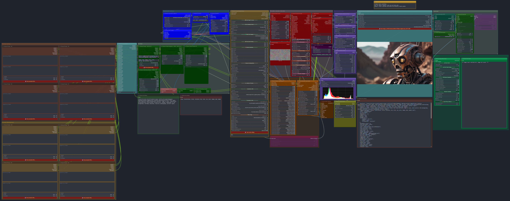
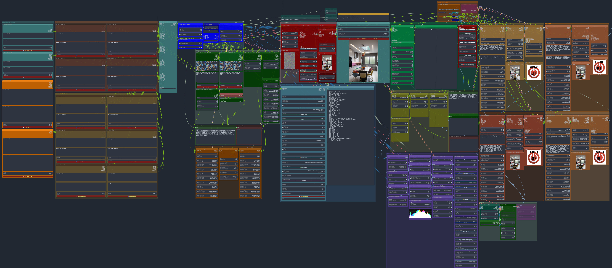

# Primere nodes for ComfyUI

**Git link:** https://github.com/CosmicLaca/ComfyUI_Primere_Nodes

**Primere Youtube channel:** https://www.youtube.com/@PrimereComfydev/videos

**Install required 3rd party nodepack dependency:** https://github.com/city96/ComfyUI_ExtraModels

Nodepack under development. Manual written by AI, please open issue if something wrong or missing. If you upgrade, check attached new workflows or use git to downgrade to previous version if something failed.

**ComfyUI core functions requirement:** This nodepack uses new ComfyUI core functions. Update your ComfyUI installation before using. Use `git pull` on your ComfyUI folder.

**All example workflows in the `Workflow` folder of the node root.**
- Within `Workflow` folder you will find subfolders:
  - **NewFE:** workflows compatible with current ComfyUI front-end
  - **Development:** workflows for node testing only

## About This Nodepack

Primere Nodes is not a collection of individual utility nodes. It's a **consistent full-system solution** architected around a central orchestrator (**Primiere Model Control**) that automatically adapts all generation parameters (sampling, CFG, VAE, CLIP, encoders, LoRAs, refiners) based on selected model type or individual checkpoint.

**Why the complexity?** Supporting 25+ diverse model architectures (SD1, SDXL, Flux, Hunyuan, etc.) with conflicting requirements demands a system-level approach. Each model expects different schedulers, sigma ranges, CFG scales, CLIP handling, and attention mechanics. Manual parameter tweaking per model is unsustainable at scale. Primere solves this by:

1. **Saving per-model settings** to JSON configs
2. **Auto-loading** correct settings when checkpoint selected
3. **Enforcing compatibility** between model type and network types (removing incompatible LoRAs, etc.)
4. **Providing override capability** for testing/optimization, then re-saving for future use

The workflow appears complex because it **handles real-world generation scenarios** (model switching, quality filtering, preview building, multi-stage refinement) that naive single-sampler approaches ignore.

> [!TIP]
> ## Something different: Universal API node 🚀
> Explore the Uniapi quick manual: **[PrimereApiProcessor (Uniapi) guide](Workflow/Manual/nodes/uniapi.md)**.
> 
> 

## Minimal workflow

### <ins>[Detailed manual for included nodes](Workflow/Manual/nodes/minimal_workflow.md)</ins>

Core generation pipeline. Single prompt input with full model concept support.

**Central Orchestrator:** **Primiere Model Control** node reads selected checkpoint, auto-loads saved settings (sampler, CFG, steps, VAE, CLIP, encoders, LoRAs, refiners), and distributes `control_data` tuple to all downstream nodes for automatic parameter application.

**Supported model concepts:** `SD1, SD2, SDXL, Illustrious, SD3, StableCascade, Chroma, Z-Image, Turbo, Flux, Nunchaku, QwenGen, QwenEdit, WanImg, KwaiKolors, Hunyuan, Playground, Pony, LCM, Lightning, Hyper, PixartSigma, SANA1024, SANA512, AuraFlow`. 

Future support: `HiDream, Mochi, WanT2V, WanI2V, Cosmos, Flux2, SSD, SegmindVega, KOALA, StableZero, SV3D, SD09, StableAudio, LTXV`.

### Minimal workflow features:

- **Central model orchestrator:** Auto-configures `sampler`, `CFG`, `steps`, `VAE`, `CLIP`, `encoders`, `attention`, LCM, speed or SRPO `LoRAs` or refiners per `model type` or `model concept type`
- Automatic model keyword insertion to prompt
- Prompt selector to any prompt sources
- Prompt can be saved to `CSV` file directly from the prompt input nodes
- `CSV` and `TOML` file readers for saved prompts, automatically organized, saved prompt selection by preview image (if preview created)
- Randomized latent noise for variations
- Prompt encoder with selectable custom clip model, long-clip mode with custom models, advanced encoding, injectable internal styles, last-layer options
- Sampler with `variation extender` and `Align Your Steps` features
- A1111 style network injection supported by text prompt `(LoRA, LyCoris, Hypernetwork, Embedding)`
- Network tag cleaner: Auto-removes incompatible network tags per model architecture
- Automatized and manual image saver with optional **preview saver** for checkpoint selectors and saved .csv prompts
- Aesthetic scorer for final image quality assessment
- Upscaler (selectable Ultimate SD and hiresFix)
- Dynamic prompt support
- Two-stage refiner support (quality refinement stage)
- Speed LoRAs: LCM, Lightning, Hyper for fast generation

## Basic workflow

### <ins>[Detailed manual for included nodes](Workflow/Manual/nodes/basic_workflow.md)</ins>

Professional prompt development workflow. Extended prompt management for testing and iteration. Adds postprocessing and style injection capabilities to Minimal workflow.

**Same central orchestration and model support as Minimal workflow.**

### Basic workflow features:

#### Same as Minimal workflow plus:

- 12 prompt inputs with 1-click selector for prompt switching
- Style injection node: Select result art style for prompt injection
- Photoshop-style postprocessing nodes: Image manipulation and effects
- Histogram for result checking
- Efficient workflow for prompt developers testing multiple variations with integrated finishing

## Basic Production workflow

### <ins>[Detailed manual for included nodes](Workflow/Manual/nodes/basic_production_workflow.md)</ins>

Full production pipeline with styling, refinement, and selective output.

**Same central orchestration and model support as Minimal workflow.**

### Basic Production workflow features:

#### Same as Basic workflow plus:

- 19 prompt sources for special cases (Daily Challenges, Articles, etc.)
- Style block: Style Pile, Midjourney, Emotions, Camera Lens (prompt injection styling)
- 4 separated refiner detailer blocks: Face, Eye, Mouth, Hands
- Selective image saver: saves only images exceeding user-defined aesthetic score threshold (portfolio filtering)

## Workflow Comparison

| Feature                        | Minimal         | Basic | Basic Production |
|--------------------------------|-----------------|-------|------------------|
| **Primary Use**                | Core generation | Prompt dev + postprocessing | Production pipeline |
| **Prompt Inputs**              | 4               | 12 | 19 |
| **Prompt Selector**            | 1-click         | 1-click | 1-click |
| **Model Concepts**             | 25+             | 25+ | 25+ |
| **Central Model Orchestrator** | ✓               | ✓ | ✓ |
| **Model Keyword Insertion**    | ✓               | ✓ | ✓ |
| **CSV/TOML Readers**           | ✓               | ✓ | ✓ |
| **Network Injection**          | ✓               | ✓ | ✓ |
| **Network Tag Cleaner**        | ✓               | ✓ | ✓ |
| **Variation Extender**         | ✓               | ✓ | ✓ |
| **Image Saver**                | ✓               | ✓ | ✓ |
| **Aesthetic Scorer**           | ✓               | ✓ | ✓ |
| **Speed LoRAs**                | ✓               | ✓ | ✓ |
| **Two-Stage Refiner**          | ✓               | ✓ | ✓ |
| **Style Injection Node**       | —               | ✓ | ✓ |
| **Postprocessing Nodes**       | —               | ✓ | ✓ |
| **Histogram**                  | —               | ✓ | ✓ |
| **Style Block**                | —               | — | ✓ |
| **Refiner Detailers**          | —               | — | ✓ (Face, Eye, Mouth, Hands) |
| **Selective Saver**            | —               | — | ✓ |

