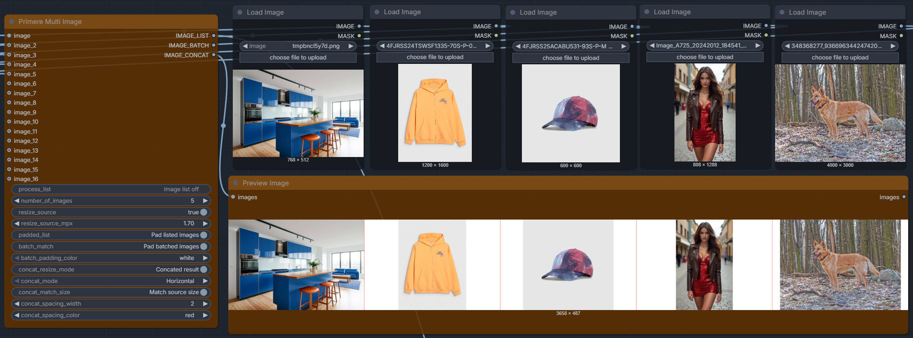

# Basic Production Plus Workflow - Node Groups Manual

Basic Production Plus workflow contains everything that exists in the Basic Production workflow. Here are only the added features listed. <ins>[Read the Basic Production workflow manual first.](./basic_production_workflow.md)</ins>

---

# <ins>Reference Image Source:</ins>



The Reference Image Source node provides the ability to feed external reference images into editing-capable models such as Qwen-Edit, FireRed, or similar image-to-image architectures. This is essential for workflows that modify existing images based on prompt instructions rather than generating from scratch.

---

### Primere Multi Image

**Purpose:** Load and prepare up to 16 source images for editing models. The node handles resizing, padding, batching, and concatenation, outputting a flexible image list that editing models consume.

---

**Inputs:**

| Input | Type | Purpose |
|-------|------|---------|
| `image` | Required *IMAGE* | Primary image input (always connected) |
| `image_2` – `image_16` | Optional *IMAGE* | Additional source images (up to 16 total) |
| `number_of_images` | *INT* | How many of the 16 slots to process (1–16) |

---

**Settings:**

| Setting | Options | Purpose |
|---------|---------|---------|
| `process_list` | ON / OFF | Enable/disable list output for editing models |
| `resize_source` | ON / OFF | Resize all source images to a target megapixel value |
| `resize_source_mpx` | 0.10 – 48.00 MPX | Target resolution when resizing is enabled |
| `padded_list` | ON / OFF | Pad listed images to uniform size (recommended for editing models) |
| `batch_match` | ON / OFF | Pad batched images to uniform size |
| `batch_padding_color` | white / black | Padding color for uniform sizing |
| `concat_resize_mode` | ON / OFF | Resize final concatenated output to target megapixels |
| `concat_mode` | Horizontal / Vertical / Square | Direction for concatenating images |
| `concat_match_size` | ON / OFF | Match all sources to the first image's dimensions |
| `concat_spacing_width` | 0 – 1024 px | Gap between concatenated images |
| `concat_spacing_color` | white/black/red/green/blue | Spacing color |

---

**Outputs:**

| Output | Purpose |
|--------|---------|
| `IMAGE_LIST` | Individual image tensors as a list (best for editing models like Qwen-Edit, FireRed) |
| `IMAGE_BATCH` | All images batched into a single tensor |
| `IMAGE_CONCAT` | Images concatenated into a single composite image |

---

**Recommended usage for editing models:**

For the best results with image editing models, use the `IMAGE_LIST` output with these settings:

```
process_list: ON
resize_source: ON
resize_source_mpx: 1.00 (or match your model's preferred input resolution)
padded_list: ON
```

The resized, padded image list ensures consistent dimensions across all source images, which editing architectures like Qwen-Edit and FireRed expect for reliable processing.

---

**Use cases:**
- Batch editing multiple reference images through Qwen-Edit
- Providing before/after style transfer references to FireRed
- Supplying multiple angles or variants to image-conditioned generators
- Creating composite reference sheets for consistent character editing

---

# <ins>Image Comparison Before/After:</ins>

The Basic Production Plus workflow includes built-in before/after comparison for the refinement process. The pre-refiner output and the post-refiner output are both preserved in the pipeline, allowing direct visual assessment of what the detailer nodes changed.

**How it works:**

- The raw generator output is tapped before entering the refiner detailer blocks (Face, Eye, Mouth, Hands)
- The final refined output is captured after all detailer passes
- Both images are available for side-by-side comparison
- This lets you evaluate whether each refiner pass improved or altered the image as intended

**Workflow position:**

`Generator → [Pre-refiner tap] → Refiner Detailers → [Post-refiner tap] → Saver`

**Use cases:**
- Verify that face detailer improved facial features without introducing artifacts
- Compare eye enhancement results against the original
- Tune refiner settings by observing before/after differences
- Debug which detailer pass caused unexpected changes

---

# <ins>Dual Histogram:</ins>

The Basic Production Plus workflow places **two histogram instances** at different points in the pipeline:

1. **Raw output histogram** — Monitors the image directly after the decoder, before any Rasterix post-processing
2. **Rasterix output histogram** — Monitors the final image after all Rasterix post-processing nodes

This dual placement gives you full insight into both the generator's native output quality and the effect of your post-processing adjustments.

**Pipeline position:**

```
Decoder → [Histogram: raw] → Rasterix stack → [Histogram: post-processed] → Saver
```

**Benefits:**
- Compare tonal distribution before and after grading
- Detect clipping introduced during post-processing
- Verify that your Rasterix adjustments improved the image rather than degrading it
- Fine-tune the Rasterix pipeline with objective visual feedback

For detailed histogram settings and behavior, see the [Rasterix Nodes Manual](./rasterix.md).

---
