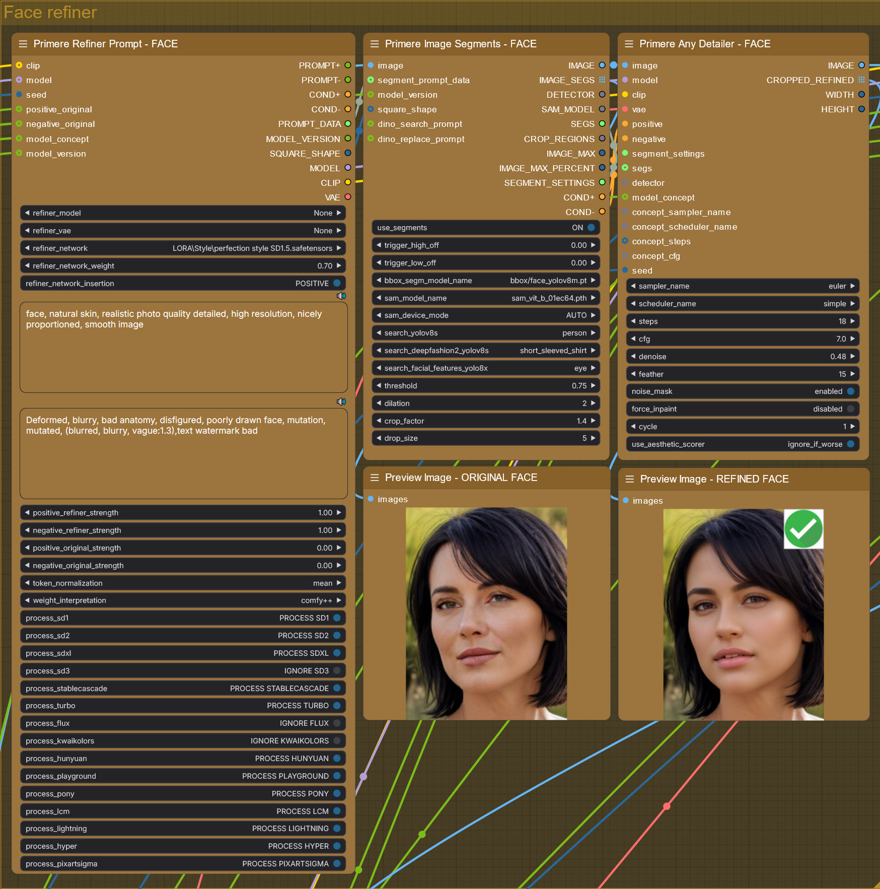
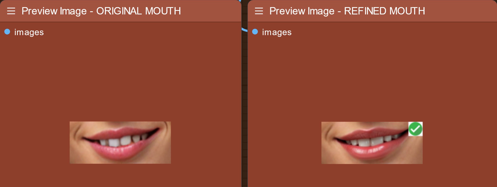
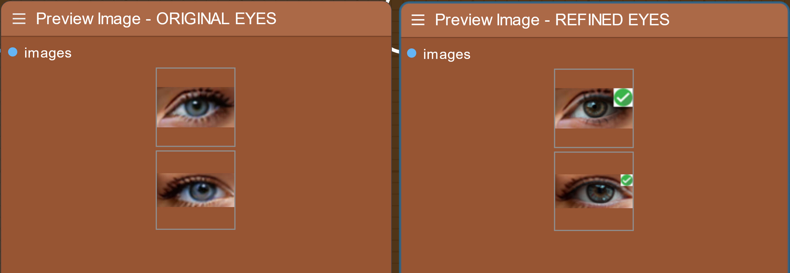

# <ins>Prompt Enhancement Node with Local LLMs:</ins>


This specialized ComfyUI node utilizes local LLM models to enhance, refine, or repair image generation prompts. It's particularly valuable for optimizing prompts for modern DiT (Diffusion Transformers) models like Flux and Cascade, which require T5-XXL compatible prompt structures.

### Recommended Models:
- **Flux-Prompt-Enhance**: Specialized for Flux model prompt optimization :: [link](https://huggingface.co/gokaygokay/Flux-Prompt-Enhance)
- **Llama-3.2-3B-Instruct**: Latest Llama instruction model :: [link](https://huggingface.co/meta-llama/Llama-3.2-3B-Instruct)
- **Llama-3.2-3B-Instruct-PromptEnhancing**: Fine-tuned for prompt enhancement :: [link](https://huggingface.co/groloch/Llama-3.2-3B-Instruct-PromptEnhancing)
- **granite-3.0-2b-instruct**: Lightweight instruction model :: [link](https://huggingface.co/ibm-granite/granite-3.0-2b-instruct)
- **Qwen2.5-3B-Instruct**: Advanced multilingual capabilities :: [link](https://huggingface.co/Qwen/Qwen2.5-3B-Instruct)
- **Qwen2.5-3B-Instruct-PromptEnhancing**: Optimized for prompt refinement :: [link](https://huggingface.co/groloch/Qwen2.5-3B-Instruct-PromptEnhancing)
- **SmoLLM-360M-prompt-enhancer**: Ultra-lightweight prompt specialist :: [link](https://huggingface.co/kadirnar/SmolLM-360M-prompt-enhancer)
- **SmoLLM2-1.7B-Instruct**: Balanced size-performance model :: [link](https://huggingface.co/HuggingFaceTB/SmolLM2-1.7B-Instruct)
- **SmoLLM2-Prompt-Enhance**: Dedicated prompt enhancement variant :: [link](https://huggingface.co/gokaygokay/SmolLM2-Prompt-Enhance)
- **TinyLlama-1.1B-32k-Instruct**: Long-context lightweight model :: [link](https://huggingface.co/Doctor-Shotgun/TinyLlama-1.1B-32k-Instruct)

Test workflow: `[your_comfy_dir]\custom_nodes\ComfyUI_Primere_Nodes\Workflow\civitai-llm-enhancer.json`

All models can be downloaded from Huggingface repositories, the node compatible with lot of another models and adapters.
The model path is: `[your_comfy_dir]\custom_nodes\ComfyUI_Primere_Nodes\Nodes\Downloads\LLM\`, models have to save in separataed subfolders, basically same name as the model.

### <ins>[Check comparison test of my favorite models](llm_enhancer_test.md)</ins>

Example structure of downloaded models:


## Configuration System:

### Custom Configuration Files:
The node uses external JSON configuration file for fine-tuned text generation settings. Users can customize and extend these configurations.
The original config file is on `[your_comfy_dir]\custom_nodes\ComfyUI_Primere_Nodes\json\llm_enhancer_config.example.json`, you can rename this file to `llm_enhancer_config.json` for your own configuration settings.

### Example Configuration Structure:
```json
{
  "detailed": {
    "ConfigName": "high detailed",
    "max_length": 150,
    "num_beams": 4,
    "early_stopping": true,
    "no_repeat_ngram_size": 3,
    "num_return_sequences": 1,
    "repetition_penalty": 1.2,
    "length_penalty": 1.0
  },
  "photorealistic": {
    "ConfigName": "photorealistic",
    "max_length": 160,
    "num_beams": 5,
    "early_stopping": true,
    "no_repeat_ngram_size": 3,
    "num_return_sequences": 1,
    "repetition_penalty": 1.3,
    "length_penalty": 1.2
  }
}
```

The value of `ConfigName` key listed to the node in `configurator` combo.

## Key Features:
1. **Automatic Model Detection**
   - Scans local model directory
   - Lists available and valid models in dropdown
   - Supports multiple model formats

2. **Configuration Management**
   - Dynamic configuration loading
   - User-customizable settings
   - Preset optimization profiles

3. **LLM Adapter Support**
   - Automatic adapter detection
   - Enhanced model capabilities
   - Improved prompt refinement

4. **DiT Model Optimization**
   - T5-XXL prompt format conversion
   - Specialized for Flux/Cascade/DiT model compatibility
   - Advanced prompt structure handling

## Benefits:
### Enhanced Prompt Quality:
- Automatic style optimization
- Coherent structure generation
- Technical term refinement

### Model Compatibility:
- DiT-specific formatting
- Cross-model compatibility
- Adaptive prompt structure

### Resource Efficiency:
- Local model execution
- Configurable performance settings
- Optimized memory usage

### Workflow Integration:
- Seamless ComfyUI integration
- Real-time prompt enhancement
- Multiple configuration profiles

## Usage Tips:
1. **Model Selection**
   - Choose models based on available VRAM
   - Consider task-specific models
   - Balance speed vs quality

2. **Configuration Customization**
   - Adjust parameters for specific needs
   - Create task-specific profiles
   - Fine-tune generation settings

3. **Prompt Optimization**
   - Use specialized models for specific styles
   - Leverage adapter capabilities
   - Monitor generated prompt quality

## Installation:
1. Download required files of desired models from Huggingface
2. Place models in specified directory: `[your_comfy_dir]\custom_nodes\ComfyUI_Primere_Nodes\Nodes\Downloads\LLM\[your_custom_llm]`
3. Create/customize configuration file: `[your_comfy_dir]\custom_nodes\ComfyUI_Primere_Nodes\json\llm_enhancer_config.json`
4. Restart ComfyUI to detect new models

## Best Practices:
1. **Model Management**
   - Keep models updated
   - Remove unused models
   - Monitor performance impact

2. **Configuration Tips**
   - Back up custom configurations
   - Test new settings thoroughly
   - Document custom changes

3. **Performance Optimization**
   - Use appropriate model sizes
   - Adjust generation parameters
   - Monitor resource usage

Remember: The effectiveness of prompt enhancement depends on both model selection and configuration settings. Experiment with different combinations for optimal results.

<hr>

# <ins>Advanced Image Refinement System:</ins>



## Components Overview:

This powerful image refinement system consists of four specialized nodes working together to provide precise control over image enhancement:

1. Primere Refiner Prompt
2. Primere Image Segments
3. Primere Any Detailer
4. Custom safetensor can be selected or externally attached to the nodes

Test workflow: `[your_comfy_dir]\custom_nodes\ComfyUI_Primere_Nodes\Workflow\civitai-all-refiner.json` and `[your_comfy_dir]\custom_nodes\ComfyUI_Primere_Nodes\Workflow\civitai-face-refiner.json` 

## Primere Refiner Prompt Nodes:

### Key Features:
- Custom text input as prompt for targeted refinement
- Model and VAE selection for refiners only
- Network adapter support (LoRA, LyCORIS, Embeddings, Hypernetworks)
- Concept-specific processing controls (you can on off refining process for Flux, Cascade, or any other supported model concepts)
- DeepFace analyzer folow age, race, gender and mood if required models avalilable

### Positive/Negative Prompting for refiners:
```plaintext
Positive Example:
"face, natural skin, realistic photo quality detailed, high resolution, nicely proportioned, smooth image"

Negative Example:
"Deformed, blurry, bad anatomy, disfigured, poorly drawn face, mutation, mutated, (blurred, blurry, vague:1.3), text, watermark"

Positive Example if use Deepface analyzer:
"1 (detailed detailed sharp closeup portrait picture of [age] year old):1.2 ([dominant_race] [dominant_gender] face):1.2, ([dominant_emotion] mood):1.2, natural skin, realistic photo quality detailed, high resolution, nicely proportioned"

where the string between [key] will be changed by DeepFace analyzer
```

You can mix the original positive and negative prompts to refining process with `positive_original_strength` and `negative_original_strength` inputs

### Model Concept Controls for all supported types:
- Individual toggles for each model type (I call model concept):
  - SD1, SD2, SDXL, SD3
  - StableCascade
  - Turbo
  - Flux
  - KwaiKolors
  - Hunyuan
  - Playground
  - Pony
  - LCM
  - Lightning
  - Hyper
  - PixartSigma
  - Sana

## Primere Image Segments Node:

### DeepFace analyzer:
4 switch available to use [DeepFace analyzer](https://github.com/serengil/deepface) to keep characteristic of original faces. These 4 attribute: `age`, `gender`, `race` and `emotion`. These four results will be used on the refiner's prompt if prompt contains string: `[key_of_attribute]`  

**This Python module change another modules by version. Make backup of your current Python libs before install DeepFace. If something wrong after installed DeepFace, just revert back the updated Python libs to previous state from backup.**

#### DeepFace installation:
- Backup your current Python libraries
- Use `pip install deepface` on terminal, but dont't forget to activate virtual environment before
- Start comfy, and if failed because Python library versions changed, just copy back the original version from backup
- Download 4 required weights: `'age_model_weights.h5', 'facial_expression_model_weights.h5', 'gender_model_weights.h5', 'race_model_single_batch.h5'` from here: https://github.com/serengil/deepface_models/releases/ and save them to this folder: `[comfypath]\models\deepface\.deepface\weights\`
- Use four On/Off switches of analyzer to compare results
- Check difference between on/off states using same prompt and seed

#### Examples:
Face detailer without analyzer:


Face detailer with analyzer:


### Intelligent Size-Based Processing:
- `trigger_high_off`: Skips refinement for large segments
- `trigger_low_off`: Ignores very small segments
- Size thresholds based on percentage of original image

### Example Settings:
```plaintext
Face Refinement:
- trigger_high_off: 5.00 (skip if face >5% of image)
- trigger_low_off: 0.75 (ignore if eye <0.75% of image)

Eye Enhancement:
- trigger_high_off: 2.00
- trigger_low_off: 0.25
```

### Additional Controls:
- `bbox_segm_model_name`: Segmentation model selection
- `sam_model_name`: Segment anything model
- `search_yolov8s`: Object detection settings
- `crop_factor`: Segment crop ratio
- `dilation`: Border expansion
- `threshold`: Detection confidence

## Primere Any Detailer Node:

### Quality Control Features:
- Custom sampler configuration
- Aesthetic quality comparison
- Original vs refined segment evaluation by aesthetic score

### Example Refinement Settings:
- `sampler_name`: euler
- `scheduler_name`: simple
- `steps`: 18
- `cfg`: 7.0
- `denoise`: 0.48
- `feather`: 15

### Quality Assurance:
- `use_aesthetic_scorer`: Enables quality comparison, ignore refined segment if lower than the original
- `noise_mask`: Enhanced mask processing
- `force_inpaint`: Optional inpainting mode

## Benefits and Use Cases:

### Selective Processing:
- Process only appropriately-sized segments
- Skip unnecessary refinements
- Optimize processing time

### Quality Preservation:
```plaintext
Scenario: Face Refinement
- Large faces (>5%): Keep original quality
- Medium faces (0.75-5%): Apply refinement
- Tiny faces or eyes (<0.75%): Skip processing
```

### Performance Optimization:
- Model-specific toggles
- Size-based processing decisions
- Quality-based result selection

## Best Practices:

### Face Refinement:
1. Set appropriate size thresholds
2. Enable aesthetic scoring
3. Use targeted positive/negative prompts

### General Settings:
1. Adjust `crop_factor` for context preservation
2. Fine-tune `dilation` for seamless blending
3. Balance `denoise` for natural results

### Performance Tips:
1. Disable unnecessary model processes
2. Set efficient size thresholds
3. Use appropriate sampling steps

Remember: Fine-tune these settings based on your specific use case and desired output quality. The system's flexibility allows for precise control over refinement processes while maintaining efficiency.

**Basic Production Workflow** included 4 refiner's group, `face`, `eye`, `mouth`, and `hands`, but nodes can be used refine/inpaint any other parts of image dependng you downloaded segmentation models. 

<hr>

#### Mouth:


#### Eye:


#### Hands:


#### Faces:


#### Hands, but aesthetic scorer automatically ignored the second:


#### Auto model downloader deleted, you must download segmentation models manually and save them to right path. [Here are examples what to download and where to save](segment_model_download.md)

<hr>

# <ins>DiT Prompt Purifier Node:</ins>


### Overview:
The DiT Prompt Purifier node automatically cleans and optimizes prompts for modern Diffusion Transformer (DiT) architectures by removing incompatible elements, weights, and structural components that may interfere with newer models.

### Key Features:

- Automatic model version detection
- Character length limitation
- Architecture-specific prompt purification
- Selective cleaning based on model Architecture
- Incompatible weight and structure removal

### Cleaning Operations:

#### Removes:
- Prompt weights (e.g., `(element:1.2)`)
- Legacy break commands (`BREAK`)
- Nested parentheses structures
- Old-style prompt formatting

#### Controls:
- `max_length`: Character limit (0 = unlimited)
- Model-specific purification toggles
- Automatic architecture detection by loaded checkpoint

### Architecture Controls:

#### Standard Models (no need to purify)
- `purify_sd1`: SD1.x prompts
- `purify_sd2`: SD2.x prompts
- `purify_sdxl`: SDXL prompts
- `purify_sd3`: SD3 prompts
- `purify_sana`: Sana prompts

#### Modern DiT Models (have to purify)
- `purify_stablecascade`: Stable Cascade
- `purify_flux`: Flux models
- `purify_kwaikolors`: KwaiKolors
- `purify_hunyuan`: Hunyuan

#### Specialized Models (no need to purify)
- `purify_turbo`: Turbo models
- `purify_playground`: Playground
- `purify_pony`: Pony models
- `purify_lcm`: LCM variants
- `purify_lightning`: Lightning
- `purify_hyper`: Hyper models
- `purify_pixartsigma`: PixArt-Sigma

### Use Cases:

#### Basic Prompt Cleaning:
```plaintext
Input: "(high quality:1.2), (detailed:1.4) BREAK (masterpiece)"
Output: "high quality, detailed, masterpiece"
```

#### Length Control:
```plaintext
Settings:
- max_length: 50
- purify_flux: ON

Input: "Long prompt with excessive description and weights..."
Output: "Truncated prompt within 50 characters but keep the whole last word..."
```

### Configuration Examples:

#### Flux Optimization:
```plaintext
Settings:
- purify_flux: ON
- max_length: 0

Benefits:
- DiT-compatible structure
- Weight removal
- Clean formatting
```

#### Mixed Model Pipeline:
```plaintext
Settings:
- Keep non-target models OFF
- Enable specific model purification
- Set appropriate length limit

Benefits:
- Model-specific optimization
- Controlled cleaning
- Maintained compatibility
```

### Benefits:

#### Compatibility:
- Ensures DiT architecture compliance
- Removes problematic structures
- Maintains old (A1111 compatible) prompt essence

### Best Practices:

1. **Model Selection**
   - Enable purification for target model
   - Disable for non-relevant architectures
   - Verify model detection

2. **Length Management**
   - Set appropriate max_length
   - Use 0 for unlimited length
   - Monitor output for truncation

3. **Cleaning Strategy**
   - Enable relevant model switches
   - Check debug output
   - Verify cleaned prompt

### Recommended Settings:

#### DiT Models:
```plaintext
- set purify_<model_type>: ON
- max_length: 0 (or set if the result too noisy)
- other model type purify switches: OFF
```

#### Legacy Models:
```plaintext
Keep settings:
- purify switches: OFF
- max_length: 0
- Maintains original structure
```

### Tips for Usage:

1. Monitor debug output for cleaning verification
2. Adjust length limits based on model requirements
3. Enable only relevant DiT model purification
4. Test cleaned prompts before batch processing
5. Keep original prompts for reference

Remember: DiT prompt purification is essential for optimal performance with modern architectures while maintaining prompt effectiveness.

<hr>