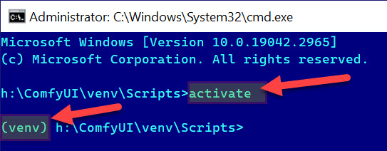
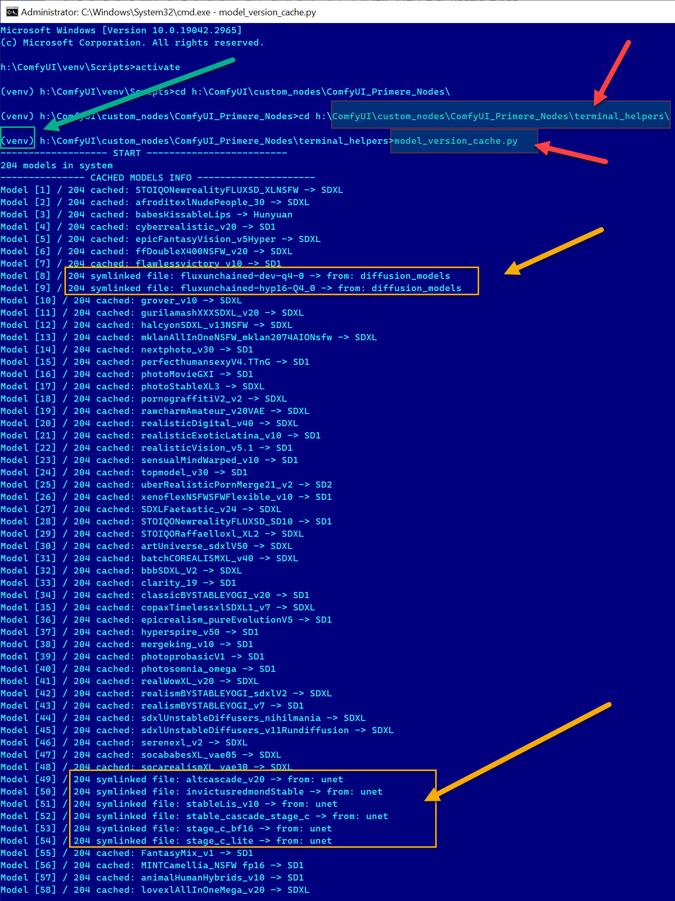
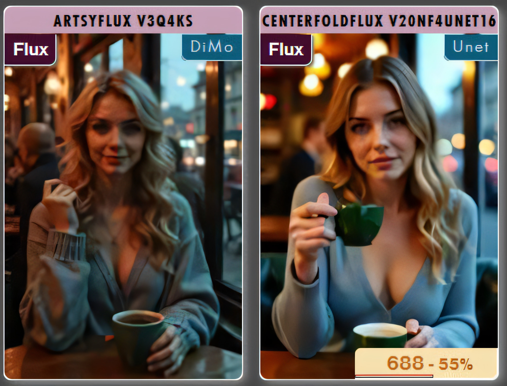

# <ins>Model Concept Selector:</ins>

This node node provides intelligent (half-autmatic) model concept detection and automated settings for various AI image generation models. The node significantly simplifies workflow usage by automatically configuring appropriate samplers, encoders, and model-concept specific settings.
- No need to load another workflow id want to change model concept
- Unet/Diffuser models can be selected from same loader as SD/SDXL safetensors

### Key Features:
- Half-automatic model concept detection, usage of attached teminal helper needed, see later
- Custom configurable sampler settings for each model type (I call: **model concept**)
- Built-in support for speed-enhancing LoRA modules, Hyper, Lightning and Turbo
- VAE and text-encoder management by concept
- Auto sampler settings selection based on concept
- Set one time, use anytime

### List of supported Model Concepts:
- **SD1**: Original Stable Diffusion 1.x models
- **SD2**: Stable Diffusion 2.x series with improved image quality (sorry I used AI to write this mnual by node's screenshot...)
- **SDXL**: Enhanced large-scale Stable Diffusion model
- **SD3**: Latest generation of Stable Diffusion technology
- **StableCascade**: Multi-stage cascading diffusion model
- **Turbo**: High-speed inference optimized model
- **Flux**: Advanced diffusion model with enhanced coherence
- **KwaiKolors**: Specialized for artistic color manipulation
- **Hunyuan**: Advanced Chinese language model (but useful with English prompts too)
- **Playground**: Experimental playground variant
- **Pony**: Specialized character-focused model
- **LCM**: Latent Consistency Model for faster generation
- **Lightning**: Speed-optimized inference model
- **Hyper**: Enhanced speed and quality balance model
- **PixartSigma**: Advanced image refinement model (using SD1 refiner in workflow)
- **Sana**: NVIDIA model

### Initial Setup (for model concept detection):
1. **Run the concept detection terminal command, required Python file attached to nodepack:**
   - Open terminal window (`cmd` command on Windows)
   - Activate your Comfy's virtual environment by this command: `[your_comfy_path]\venv\Scripts\activate`
   - When the new row start with sign `(venv)` you can continue, if not, stop here and try to activate again...

        
   
   - Change your directory to `[your_comfy_path]\custom_nodes\ComfyUI_Primere_Nodes\terminal_helpers\`
   - Here you will found 4 Python files for model concept detection (use `dir` command if you don't see files)
     - Enter `model_version_cache.py` on `terminal_helpers` folder
     
       

   - When process done, check the `.cache.json` file on the path: `[your_comfy_path]\custom_nodes\ComfyUI_Primere_Nodes\Nodes\.cache\.cache.json`
     - This file contains the result of concept detection. Check the concept name after the model name. If something wrong, enter right model type manually
     - You can symlink `unet` and `diffuser` models to the Comfy's checkpoint directory for easier selection from simple model selector and loader (no need to change model loader for unet or diffuser). But the included terminal helper `model_version_cache.py` cannot detect the concept of symlinked files. These rows of symlinks must be modify manually, seek the word `symlink` and `unknown` to found undetected models
   - If you use additional networks, like LoRA, Lycoris, Hypernetwork and Ebedding, you can use terminal helper for concept detection of these files too:
     - `lora_version_cache.py` for LoRA
     - `lyco_version_cache.py` for Lycoris
     - `embedding_version_cache.py` for Embeddings
       - Because cannot detect Embedding's concept, the helper will collect all embedding filenames with value `SD1` only. You must modify all Embedding's value to right concept name if not for `SD1` models only
     - Check `.cache.json` and manually enter right value if the helper failed
   - Refresh your browser, and you will see version info on the top left badge of preview (instead of questionmark). The `unet` mean the symlinked file is UNET, the `DiMo` mean Diffusion Model (including gguf)

      
    
    [This video contains tutorial how to use terminal helpers](https://www.youtube.com/watch?v=joqvC8vb6Xo)

- ### [Claude](https://claude.ai) created detailed manual for you about [.json file editing.](cachefile.md) Please read before.
- ### [Claude](https://claude.ai) created detailed manual for you about [symlink files.](symlink_models.md) Please read before.

2. **Download required model files manually of all model concepts you needed. For unused concepts just set the inputs to `None`. You have to found:**
   - Custom clip encoders
   - Custom VAE files
   - Required Model/UNet/Diffuser files, models and clipping encoders
   - All of these files must be saved to the right path. The best if you use Comfy's model manager, or read the concept manual on Huggingface
   - If all required files available on right path, you can select best for your used concept

### Support speed Enhancement Files:
The node will automatically download speed-enhancement LoRAs on first use:
  - Hyper LoRA modules
  - Lightning LoRA modules
  - Turbo LoRA modules

## Recommended Settings I like: (you can use different models or settings if needed)

### Basic Configuration:
- default_sampler_name: euler (I prefer `dpmpp_sde`)
- default_scheduler_name: normal (I prefer `karras`)
- default_cfg_scale: 7.00 (I prefer little higher)
- default_steps: 12 (I prefer `30-35` steps for SD/SDXL)
- override_steps: Override sampler step is filename contains `xSteps`. If this switch set to `True`, the steps will be `x` by filename instead of sampler setting
- sd_vae and sdxl_vae: Default vae settings for SD1 and SDXL models
- model_concept: if `Auto`, the concept name will be read from `.cache.json`. If select other value, the concept setting will be force apply to the selected model
- clip_selection / vae_selection: use `baked` if exist in model, or always use custom if set in the node

### Speed LoRA Settings for SD/SDXL/Hyper/Lightning/LCM models:
- strength_lcm_lora_model: 1.000 (add to standard SD/SDXL models)
- lightning_selector: LORA/UNET/SAFETENSOR
- lightning_model_step: 8 -> this value will select right LoRA
- lightning_sampler: use official settings or custom by external sampler setting node
- strength_lightning_lora_model: 1.200
- hyper_selector: LORA/UNET/SAFETENSOR
- hyper_model_step: 8 -> this value will select right LoRA
- hyper_sampler: use official settings or custom by external sampler setting node
- strength_hyper_lora_model: 1.100

### Stable Cascade Configuration:
- cascade_stage_a: Stable-Cascade/stage_a.safetensors
- cascade_stage_b: Stable-Cascade/stable_cascade_stage_b.safetensors
- cascade_stage_c: Stable-Cascade/stable_cascade_stage_c.safetensors

### Flux Settings:
- flux_selector: GGUF/DIFFUSION/SAFETENSOR
- flux_diffusion: Select `diffusion` model if the `flux_selector` is **DIFFUSION** 
- flux_weight_dtype: fp8_e5m2/fp8_e4m3fn
- flux_gguf: select `GGUF` model if the `flux_selector` is **GGUF**
- flux_clip_t5xxl: Select T5-XXL encoder for Flux 
- flux_clip_l: Select L clipping for Flux
- flux_clip_guidance: 4.0 (the official default is 3.5)
- flux_vae: select va for flux like ae.safetensors
- flux_sampler: custom_advanced/ksampler
- use_flux_hyper_lora: on/off Flux speed LoRA
- flux_hyper_lora_type: FLUX.1-dev/FLUX.1-dev-fp16 -> automatically download at first usage
- flux_hyper_lora_step: 8/16 -> this setting auto select right LoRA
- flux_hyper_lora_strength: 0.100 - 0.130
- use_flux_turbo_lora: on/off Flux speed LoRA
- flux_turbo_lora_type: TurboRender/TurboAlpha -> automatically download at first usage
- flux_turbo_lora_step: 4/6/8/10/12 -> this setting auto select right LoRA
- flux_hyper_lora_strength: 1

### Hunyuan Settings:
- hunyuan_clip_t5xxl: Select T5-XXL encoder for Hunyuan 
- hunyuan_clip_l: Select L clipping for Hunyuan
- hunyuan_vae: Select VAE clipping for Hunyuan
 
### SD3/SD3.5 Settings:
- sd3_clip_t5xxl: Select T5-XXL encoder for SD3 
- sd3_clip_l: Select L clipping for SD3
- sd3_clip_g: Select G clipping for SD3
- sd3_unet_vae: Select VAE for SD3 (used only if the selected model UNET)
- use_sd3_hyper_lora: on/off SD3/SD3.5 speed LoRA
- sd3_hyper_lora_step: 4/8/16/ -> this setting auto select right LoRA
- sd3_hyper_lora_strength: 0.100

### Kolors and Pixart settings:
- kolors_precision: fp16/quant8/quant4
- pixart_model_type: Auto detect by filename or force favorite type
- pixart_t5_encoder: T5 clipping encoder
- pixart_vae: VAE
- pixart_denoise: main denoise value 0.9 (I prefer 0.88)
- pixart_refiner_model: select SD1 model, or `None` to ignore refiner
- pixart_refiner_start: 12 (sigma split for refiner)
- pixart_refiner_denoise: 0.90
- pixart_refiner_ignore_prompt: on/off send original prompt to refiner model

## [See large screenshot of my favorite settings](concept_group.jpg)

## Benefits:
1. **Simplified Workflow**
   - Automatic concept detection and sampler settings
   - Reduced manual configuration and workflow switch if already set

2. **Performance Optimization**
   - Integrated speed enhancement by LoRA if the concept support it
   - Automatic resource management
   - Optimal sampler selection

3. **Flexibility**
   - Support for multiple model types (I called "concepts")
   - Customizable settings, have to set only one time (see screenshot)

4. **Quality Assurance**
   - Proper model-specific configurations
   - Integrated refinement options

## Usage Tips:
1. Always ensure model files are correctly placed in the right models directory
2. Run concept detection before first use (terminal helper)
3. Check VAE and clipping compatibility with your chosen model type
4. Monitor VRAM usage with larger models
5. Adjust custom sampler, scheduler, steps and guidance scale based on your needs