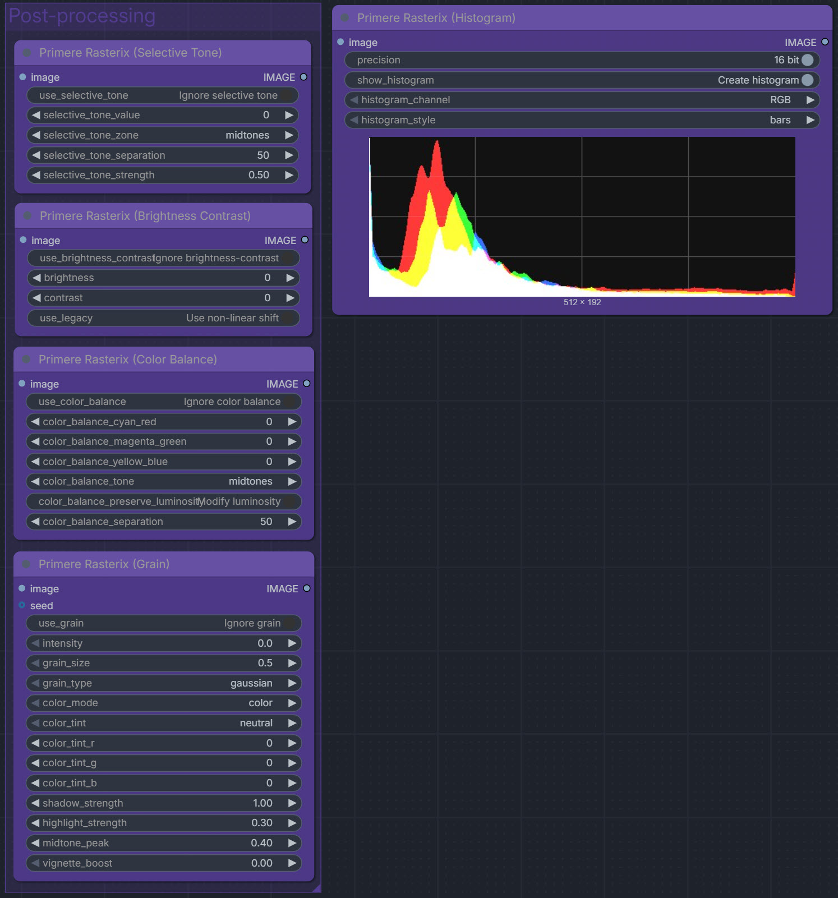

# Basic Workflow - Node Groups Manual

Basic workflow contains everything that exists in minimal workflow. Here are only the added features listed. <ins>[Read the minimal workflow manual first.](./minimal_workflow.md)</ins>

---

## Post-processing & Analysis Group

---

The Post-processing & Analysis group extends the Minimal workflow with Photoshop-style image manipulation tools and visual feedback analysis. These nodes operate after image generation, enabling controlled refinement, color grading, and quality inspection without re-sampling.

---

### Primiere Rasterix (Selective Tone)

Purpose: Adjust tonal regions independently (highlights, midtones, shadows, blacks) using selective tonal targeting similar to professional photo editing tools.

---

Inputs:

| Input   | Purpose                         |
| ------- | ------------------------------- |
| `image` | Input image for tone adjustment |

---
Settings:

| Setting                     | Purpose                                                                                       |
| --------------------------- | --------------------------------------------------------------------------------------------- |
| `use_selective_tone`        | Enable/disable selective tone adjustment                                                      |
| `selective_tone_value`      | Tone shift intensity (-100 to 100). Positive brightens, negative darkens                      |
| `selective_tone_zone`       | Target tonal range: highlights, midtones, shadows, blacks                                     |
| `selective_tone_separation` | Defines how strictly the tonal range is isolated (low = soft blend, high = strict separation) |
| `selective_tone_strength`   | Blend strength of the effect (0.0–1.0)                                                        |

#### Behavior:
* Works as localized exposure control
* Separation + strength define how “Photoshop-like” the masking behaves
* Non-destructive when disabled (use_selective_tone = OFF)

#### Use Cases:
* Recover blown highlights without affecting shadows
* Lift shadow detail while preserving contrast
* Fine-tune midtone exposure for portraits

---

### Primiere Rasterix (Brightness Contrast)

Purpose: Global brightness and contrast adjustment with optional adaptive (non-linear) behavior.

---

Inputs:

| Input   | Purpose     |
| ------- | ----------- |
| `image` | Input image |

---

Settings:

| Setting                   | Purpose                                                  |
| ------------------------- | -------------------------------------------------------- |
| `use_brightness_contrast` | Enable/disable adjustment                                |
| `brightness`              | Global brightness shift (-150 to 150)                    |
| `contrast`                | Contrast adjustment (-50 to 100)                         |
| `use_legacy`              | Switch between non-linear shift and adaptive offset mode |

#### Behavior:
* Standard mode: linear brightness/contrast adjustment
* Adaptive mode (use_legacy = ON): preserves highlights/shadows more naturally

#### Use Cases:
* Quick exposure correction
* Contrast boosting for flat renders
* Pre-conditioning before further grading

---

### Primiere Rasterix (Color Balance)

Purpose: Perform channel-based color grading per tonal range (highlights, midtones, shadows), similar to Photoshop Color Balance.

---

Inputs:

| Input   | Purpose     |
| ------- | ----------- |
| `image` | Input image |

---

Settings:

| Setting                             | Purpose                                                   |
| ----------------------------------- | --------------------------------------------------------- |
| `use_color_balance`                 | Enable/disable color grading                              |
| `color_balance_cyan_red`            | Shift between cyan ↔ red                                  |
| `color_balance_magenta_green`       | Shift between magenta ↔ green                             |
| `color_balance_yellow_blue`         | Shift between yellow ↔ blue                               |
| `color_balance_tone`                | Select active tonal range (highlights, midtones, shadows) |
| `color_balance_preserve_luminosity` | Preserve original brightness while shifting color         |
| `color_balance_separation`          | Controls transition softness between tonal regions        |

#### Behavior:
* Each tone (highlights/midtones/shadows) stores independent parameter values
* Switching `color_balance_tone` acts like Photoshop radio buttons:
  * Values are remembered per tone
  * Enables precise multi-zone grading

#### Use Cases:
* Warm highlights + cool shadows cinematic look
* Fix color cast in specific tonal ranges
* Advanced color grading pipelines

---

### Primiere Rasterix (Grain)

Purpose: Add film grain with physically-inspired distribution and tonal response.

---

Inputs:

| Input               | Purpose                     |
| ------------------- | --------------------------- |
| `image`             | Input image                 |
| `seed` *(optional)* | Seed for reproducible grain |

---

Settings:

| Setting              | Purpose                                           |
| -------------------- | ------------------------------------------------- |
| `use_grain`          | Enable/disable grain                              |
| `intensity`          | Overall grain strength                            |
| `grain_size`         | Scale of grain particles                          |
| `grain_type`         | Noise model: gaussian, organic, salt_pepper, fine |
| `color_mode`         | Color or monochrome grain                         |
| `color_tint`         | Preset tint (neutral, warm, cool, etc.)           |
| `color_tint_r/g/b`   | Custom tint adjustment (used when `custom`)       |
| `shadow_strength`    | Grain strength in dark areas                      |
| `highlight_strength` | Grain strength in bright areas                    |
| `midtone_peak`       | Controls where grain is most visible              |
| `vignette_boost`     | Boost grain near edges for film-style vignette    |

#### Behavior:
* Grain is tonally distributed, not uniform
* Supports cinematic film simulation
* Seed allows deterministic grain for batch workflows

#### Use Cases:
* Add realism to AI-generated images
* Film emulation (cinematic / analog look)
* Reduce overly “clean” digital appearance

---

### Primiere Rasterix (Histogram)

Purpose: Visualize image luminance and color distribution for analysis and correction.

---

Inputs:

| Input   | Purpose     |
| ------- | ----------- |
| `image` | Input image |

---

Settings:

| Setting             | Purpose                                                           |
| ------------------- | ----------------------------------------------------------------- |
| `precision`         | 8-bit or 16-bit histogram calculation                             |
| `show_histogram`    | Enable/disable histogram rendering                                |
| `histogram_channel` | Channel selection: RGB, Red, Green, Blue                          |
| `histogram_style`   | Visualization mode (bars, lines, waveform, heatmap, parade, etc.) |

#### Behavior:
* Provides real-time visual feedback
* Supports multiple professional scopes:
  * RGB histogram
  * waveform
  * parade
  * luma analysis
  * etc...
* Style selection changes interpretation method, not underlying data

#### Use Cases:
* Detect clipping (blown highlights / crushed shadows)
* Validate exposure and contrast adjustments
* Analyze color distribution before/after grading

---

### Workflow Integration

Pipeline position:

`Sampler → Decoder → (Post-processing stack) → Histogram → Saver`

#### Key principles:
* All nodes are modular and optional
* Can be chained in any order depending on workflow needs
* Designed for non-destructive iterative refinement

---

### Example Workflows

#### Basic enhancement:
`Brightness/Contrast → Color Balance → Histogram`

#### Cinematic grading:
`Selective Tone → Color Balance → Grain → Histogram`

#### Technical validation:
`(no processing) → Histogram only`