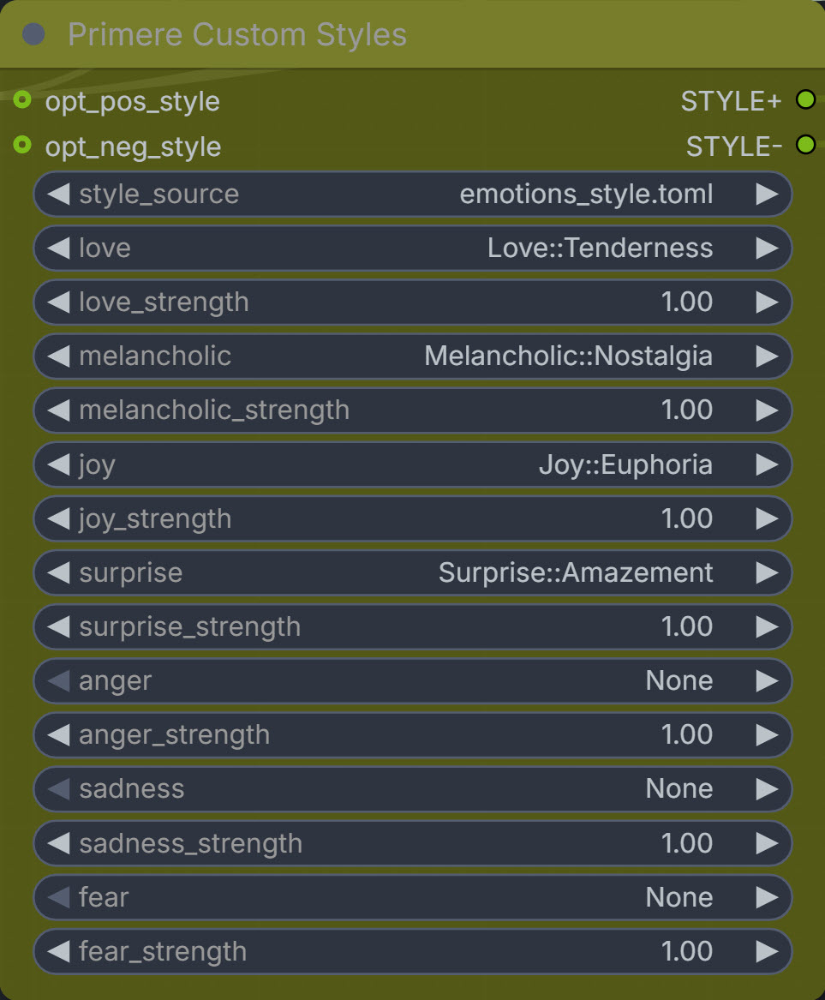
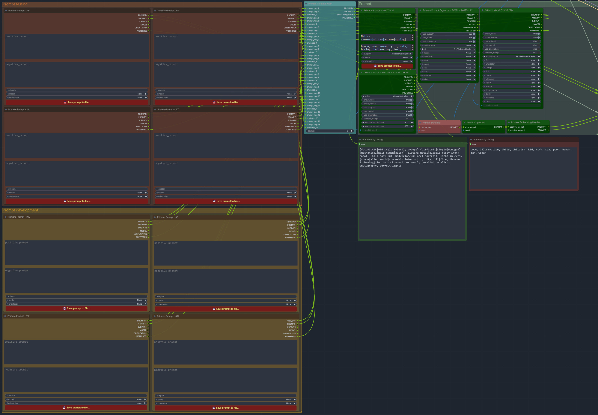

# Basic Workflow - Node Groups Manual

Basic workflow contains everything that exists in minimal workflow. Here are only the added features listed. <ins>[Read the minimal workflow manual first.](./minimal_workflow.md)</ins>

---

## Post-processing & Analysis Group

---

The Post-processing & Analysis group extends the Minimal workflow with Photoshop-style image manipulation tools and visual feedback analysis. These nodes operate after image generation, enabling controlled refinement, color grading, and quality inspection without re-sampling.


---

### Primiere Rasterix (Selective Tone)

Purpose: Adjust tonal regions independently (highlights, midtones, shadows, blacks) using selective tonal targeting similar to professional photo editing tools.

---

Inputs:

| Input   | Purpose                         |
| ------- | ------------------------------- |
| `image` | Input image for tone adjustment |

---
Settings:

| Setting                     | Purpose                                                                                       |
| --------------------------- | --------------------------------------------------------------------------------------------- |
| `use_selective_tone`        | Enable/disable selective tone adjustment                                                      |
| `selective_tone_value`      | Tone shift intensity (-100 to 100). Positive brightens, negative darkens                      |
| `selective_tone_zone`       | Target tonal range: highlights, midtones, shadows, blacks                                     |
| `selective_tone_separation` | Defines how strictly the tonal range is isolated (low = soft blend, high = strict separation) |
| `selective_tone_strength`   | Blend strength of the effect (0.0–1.0)                                                        |

#### Behavior:
* Works as localized exposure control
* Separation + strength define how “Photoshop-like” the masking behaves
* Non-destructive when disabled (use_selective_tone = OFF)

#### Use Cases:
* Recover blown highlights without affecting shadows
* Lift shadow detail while preserving contrast
* Fine-tune midtone exposure for portraits

---

### Primiere Rasterix (Brightness Contrast)

Purpose: Global brightness and contrast adjustment with optional adaptive (non-linear) behavior.

---

Inputs:

| Input   | Purpose     |
| ------- | ----------- |
| `image` | Input image |

---

Settings:

| Setting                   | Purpose                                                  |
| ------------------------- | -------------------------------------------------------- |
| `use_brightness_contrast` | Enable/disable adjustment                                |
| `brightness`              | Global brightness shift (-150 to 150)                    |
| `contrast`                | Contrast adjustment (-50 to 100)                         |
| `use_legacy`              | Switch between non-linear shift and adaptive offset mode |


#### Behavior:
* Standard mode: linear brightness/contrast adjustment
* Adaptive mode (use_legacy = ON): preserves highlights/shadows more naturally

#### Use Cases:
* Quick exposure correction
* Contrast boosting for flat renders
* Pre-conditioning before further grading

---

### Primiere Rasterix (Color Balance)

Purpose: Perform channel-based color grading per tonal range (highlights, midtones, shadows), similar to Photoshop Color Balance.

---

Inputs:

| Input   | Purpose     |
| ------- | ----------- |
| `image` | Input image |

---

Settings:

| Setting                             | Purpose                                                   |
| ----------------------------------- | --------------------------------------------------------- |
| `use_color_balance`                 | Enable/disable color grading                              |
| `color_balance_cyan_red`            | Shift between cyan ↔ red                                  |
| `color_balance_magenta_green`       | Shift between magenta ↔ green                             |
| `color_balance_yellow_blue`         | Shift between yellow ↔ blue                               |
| `color_balance_tone`                | Select active tonal range (highlights, midtones, shadows) |
| `color_balance_preserve_luminosity` | Preserve original brightness while shifting color         |
| `color_balance_separation`          | Controls transition softness between tonal regions        |

#### Behavior:
* Each tone (highlights/midtones/shadows) stores independent parameter values
* Switching `color_balance_tone` acts like Photoshop radio buttons:
  * Values are remembered per tone
  * Enables precise multi-zone grading

#### Use Cases:
* Warm highlights + cool shadows cinematic look
* Fix color cast in specific tonal ranges
* Advanced color grading pipelines

---

### Primiere Rasterix (Grain)

Purpose: Add film grain with physically-inspired distribution and tonal response.

---

Inputs:

| Input               | Purpose                     |
| ------------------- | --------------------------- |
| `image`             | Input image                 |
| `seed` *(optional)* | Seed for reproducible grain |

---

Settings:

| Setting              | Purpose                                           |
| -------------------- | ------------------------------------------------- |
| `use_grain`          | Enable/disable grain                              |
| `intensity`          | Overall grain strength                            |
| `grain_size`         | Scale of grain particles                          |
| `grain_type`         | Noise model: gaussian, organic, salt_pepper, fine |
| `color_mode`         | Color or monochrome grain                         |
| `color_tint`         | Preset tint (neutral, warm, cool, etc.)           |
| `color_tint_r/g/b`   | Custom tint adjustment (used when `custom`)       |
| `shadow_strength`    | Grain strength in dark areas                      |
| `highlight_strength` | Grain strength in bright areas                    |
| `midtone_peak`       | Controls where grain is most visible              |
| `vignette_boost`     | Boost grain near edges for film-style vignette    |

#### Behavior:
* Grain is tonally distributed, not uniform
* Supports cinematic film simulation
* Seed allows deterministic grain for batch workflows

#### Use Cases:
* Add realism to AI-generated images
* Film emulation (cinematic / analog look)
* Reduce overly “clean” digital appearance

---

### Primiere Rasterix (Histogram)

Purpose: Visualize image luminance and color distribution for analysis and correction.

---

Inputs:

| Input   | Purpose     |
| ------- | ----------- |
| `image` | Input image |

---

Settings:

| Setting             | Purpose                                                           |
| ------------------- | ----------------------------------------------------------------- |
| `precision`         | 8-bit or 16-bit histogram calculation                             |
| `show_histogram`    | Enable/disable histogram rendering                                |
| `histogram_channel` | Channel selection: RGB, Red, Green, Blue                          |
| `histogram_style`   | Visualization mode (bars, lines, waveform, heatmap, parade, etc.) |


#### Behavior:
* Provides real-time visual feedback
* Supports multiple professional scopes:
  * RGB histogram
  * waveform
  * parade
  * luma analysis
  * etc...
* Style selection changes interpretation method, not underlying data

#### Use Cases:
* Detect clipping (blown highlights / crushed shadows)
* Validate exposure and contrast adjustments
* Analyze color distribution before/after grading

---

### Workflow Integration

Pipeline position:

`Sampler → Decoder → (Post-processing stack) → Histogram → Saver`

#### Key principles:
* All nodes are modular and optional
* Can be chained in any order depending on workflow needs
* Designed for non-destructive iterative refinement

---

### Example Workflows

#### Basic enhancement:
`Brightness/Contrast → Color Balance → Histogram`

#### Cinematic grading:
`Selective Tone → Color Balance → Grain → Histogram`

#### Technical validation:
`(no processing) → Histogram only`

---

## Style Injection Group

---

The Style Injection group adds professional-grade art style control to the Basic workflow. It enables rapid selection and injection of complex artistic styles, concepts, moods, lighting, and more directly into your prompts. This node works in tandem with the 12-prompt selector system for efficient style experimentation and iteration.



---

### Primere Custom Styles

**Purpose:** Universal TOML-based style handler that loads all style definitions from external `.toml` files. The node scans the `Toml/Styles/` directory and presents every `.toml` file as a selectable style source. Each section within the file becomes a pair of dynamic widgets — a dropdown and a strength slider — giving you full control over style composition.

**Key benefit:** Users can create custom `.toml` files with their own style sections and drop them into `Toml/Styles/`. The node automatically detects new files and loads their contents, with no code changes or configuration needed. There is no limit to the number of custom style sources.

The node ships with 18 example `.toml` files covering emotions, lighting, lens effects, art movements, organic forms, perception, and more.

---

**How It Works:**

1. On node load, `Nodes/Styles.py` scans `Toml/Styles/*.toml` and populates the `style_source` dropdown.
2. When you select a source file, the frontend fetches its parsed sections and creates dynamic widgets: a **combo dropdown** per section for style selection, and a **number widget** for per-style strength (0–10, step 0.01).
3. On execution, the backend reads your selections via workflow metadata, builds style strings, and merges them with optional manual overrides.

---

**Inputs:**

| Input | Type | Purpose |
|-------|------|---------|
| `style_source` | Required *COMBO* | Select a `.toml` file from `Toml/Styles/` |
| `opt_pos_style` | Optional *STRING* | Manual positive style override text |
| `opt_neg_style` | Optional *STRING* | Manual negative style override text |
| *(dynamic)* | *COMBO + FLOAT* | Per-section dropdown + strength, created per TOML section |

---

**Outputs:**

| Output | Purpose |
|--------|---------|
| `STYLE+` | Positive style injection string (ready to connect to prompt) |
| `STYLE-` | Negative style injection string (ready to connect to prompt) |

---

**Adding Custom Style Sources:**

Create a new `.toml` file in `Toml/Styles/` with this structure:

```toml
[SectionName]
   [SectionName.N_0]
      MainStyle = "Your Style"
      SubStyle = ""
      Positive = "Positive prompt text for this style"
      Negative = "Negative prompt text for this style"
```

Each top-level section becomes a widget pair. The `Positive` field feeds into `STYLE+`, and the `Negative` field into `STYLE-`. You can add as many sections and files as needed — the node will load all of them automatically.

---

**Use Cases:**
* One-click style switching during prompt development
* Custom style libraries shared across projects
* Themed style packs for specific genres or aesthetics
* Rapid A/B testing of different artistic directions

---

### Workflow Integration (Style Injection)

Pipeline position:

`Prompt Sources / 12-Prompt Selector → Primere Custom Styles (STYLE+ / STYLE-) → Prompt Encoder → Sampler`

The style injection sits early in the prompt pipeline and feeds directly into the prompt encoder. It is fully compatible with CSV/TOML prompt readers, dynamic prompts, and the existing style injection points.

---

## Prompt Development Group

---

The Prompt Development group adds `any` independent, fully-featured prompt input channels with a centralized 1-click selector. This turns the workflow into a professional prompt-testing environment where you can develop, compare, and iterate on multiple prompt variations simultaneously — without rebuilding or reconnecting nodes.



---

### Primiere Prompt (×12 but expandable) + Primiere Prompt - SWITCH

**Purpose:** Dedicated multi-prompt development station. Each of the 12 (but expandable) Primiere Prompt nodes provides complete positive/negative prompt fields, subject keywords, model overrides, orientation, and one-click “Save prompt to file…” functionality. The Primiere Prompt - SWITCH node lets you instantly route any of the 12 channels to the rest of the pipeline with a single index change.

---

**Key Features:**

- 12 expandable parallel prompt channels (labeled #0 through #11 in most workflows)
- Each channel is fully independent and always active
- Built-in “Save prompt to file…” buttons on every slot (saves to CSV with preview if enabled)
- Centralized **Primiere Prompt - SWITCH** node with `SELECTED_INDEX` control

---

**Settings (Primiere Prompt - SWITCH):**

| Setting          | Purpose                                              |
| ---------------- |------------------------------------------------------|
| `SELECTED_INDEX` | 0–xx — instantly selects which prompt channel to use |

#### Behavior:
* Changing the index instantly swaps the active prompt (positive + negative + all metadata) downstream.
* No need to reconnect wires or duplicate large parts of the workflow.
* All 12 prompt nodes remain visible and editable at the same time.
* Fully compatible with CSV/TOML readers, Dynamic Prompts, and Style nodes.

#### Use Cases:
- Rapid A/B testing of prompt variations
- Developing and refining prompts for daily challenges or themed series
- Comparing completely different subjects, compositions, or moods in seconds
- Efficient batch experimentation during prompt engineering sessions
- Keeping multiple client variations or style experiments ready to switch instantly

---

### Workflow Integration (Prompt Development)

Pipeline position:

`Prompt Development Group → Style Injection Group → Prompt Encoder → Sampler`

The selected prompt channel flows directly into the Primere Custom Styles node (STYLE+ / STYLE-) for seamless combination of your base prompt with artistic styling.