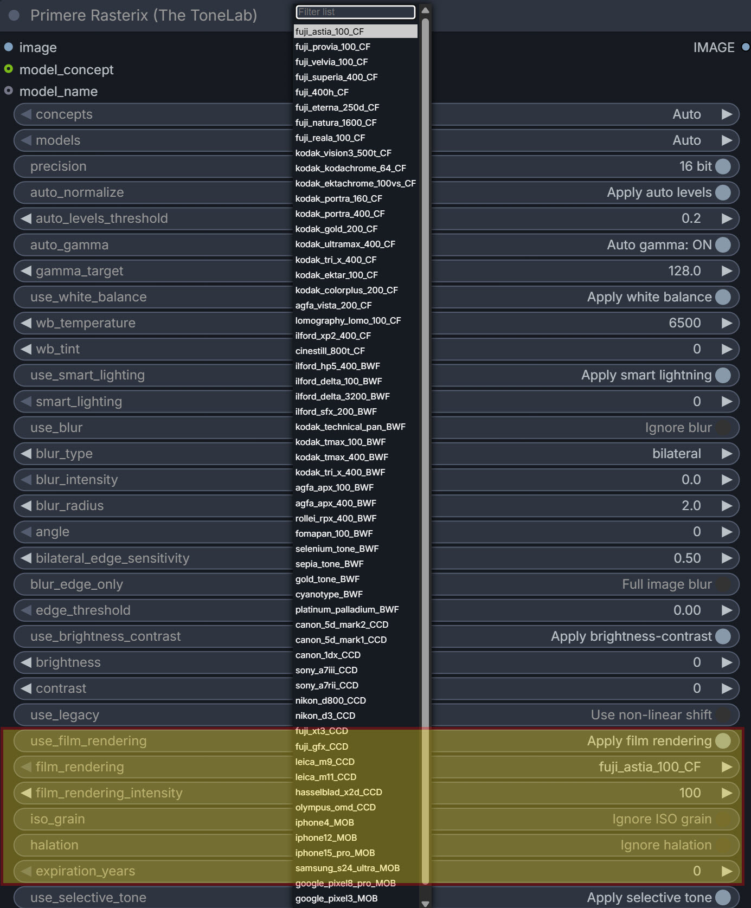
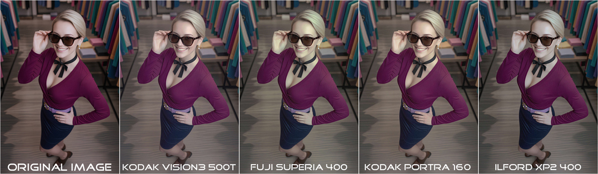
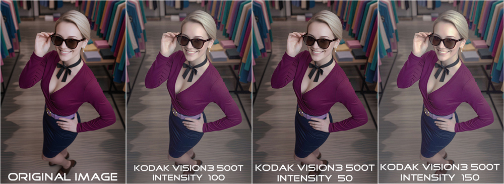
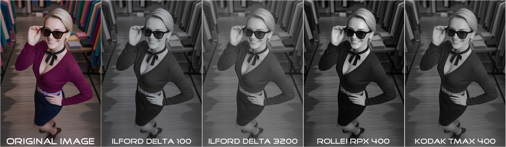
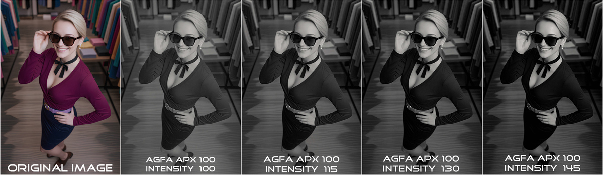

Primere Rasterix (The ToneLab)
---
### Film and CCD rendering node

Applies analog film emulation, digital sensor looks, or mobile camera rendering to the genertated input image.

---

### Inputs

| Input                      | Type    | Default                          | Description |
|----------------------------|---------|----------------------------------|-----------|
| `use_film_rendering`       | BOOLEAN | False                            | When OFF ("Ignore film rendering") the node passes the image unchanged. When ON the selected rendering is applied. |
| `film_rendering`           | STRING  | "kodak_vision3_500t_CF"          | Preset name from `FILM_PRESETS`. Controls the film/sensor/mobile emulation profile. |
| `film_rendering_intensity` | FLOAT   | 100.0                            | Strength of the effect. 0 = no effect, 100 = full preset strength, 200 = overdriven (stronger contrast/push in B&W presets). |
| `iso_grain`                | BOOLEAN | False                            | When ON, adds grain based on the preset's ISO value and grain_type (fine / gaussian / organic). |
| `halation`                 | BOOLEAN | False                            | When ON, adds highlight halation (bloom around bright areas). Stronger on cinema presets. |
| `expiration_years`         | INT     | 0                                | Simulates aged film (0–30). Adds fog, blue fade and contrast loss. Only active on colour film (CF) presets. |

---

### Presets Overview

Presets are divided into four groups by `type`:

- **CF** — **Colour negative** / slide films `(Fuji, Kodak, Agfa, Lomography, Cinestill, Ilford XP2)`
- **BWF** — **Black & White films** `(Ilford, Kodak, Agfa, Rollei, Fomapan)` + toning `(selenium, sepia, gold, cyanotype, platinum)`
- **CCD** — **Digital DSLR** / mirrorless sensor looks `(Canon, Nikon, Sony, Fuji, Leica, Hasselblad, Olympus)`
- **MOB** — **Mobile** / compact camera looks `(iPhone, Samsung, Google Pixel, Sony ZV-1)`

---

### How the Node Works

1. If `use_film_rendering` is `False` or `film_rendering_intensity` == 0 → image is returned unchanged `(RGB)`.
2. The selected preset is loaded and automatically adapted to image content `(shadow/highlight balance, cast compensation, flatness)`.
3. Base rendering is applied:
   - `CF`  → colour film curves, bias, rolloff, shadow lift
   - `BWF` → luminance mix → film curve → optional tint
   - `CCD/MOB` → linear → camera matrix → highlight rolloff → tone curves → shadow lift
4. Post effects are layered in this order (if enabled):
   - Expiration `(only CF)`
   - Halation
   - ISO grain

Final output is always RGB uint8.

---

### Parameter Details

#### film_rendering_intensity
- Range: 0 – 200
- 0–100: linear blend between original and processed image
- >100: only for BWF presets → extra contrast + shadow push + highlight compression

#### iso_grain
Grain parameters are taken from the preset:
- `iso` value defines base intensity and size
- `grain_type`: fine / gaussian / organic
- `grain_color`: color or monochrome
- Grain is luminance-masked (stronger in shadows/midtones)

#### halation
- Only affects highlight areas `(luminance > 0.80)`
- Cinema presets `(Vision3, Eterna, CineStill)` use stronger halation
- B&W uses uniform channel blur; colour uses channel-specific radii (R > G > B)

#### expiration_years
- Only on `CF` (Color Film) presets
- Adds uniform fog, reduces blue channel, lowers overall contrast

---

### Example Images:

---

---

---

---
#### Usage Tips
- Start with `film_rendering_intensity` between `80–120` for natural results.
- For strong analog character combine `iso_grain=True` + `halation=True`.
- Use `expiration_years` `5–15` on `CF` (Color Film) presets to simulate aged film stock.
- B&W presets `(BWF)` react strongest to `film_rendering_intensity` values above 100.
- `CCD` and `MOB` presets ignore expiration_years.
- Grain appears more natural on higher resolution images due to automatic area scaling.
- For portrait work prefer `Portra`, `400H` or `Canon 5D Mark II` presets.
- For landscape / vivid colour use `Velvia`, `Ektar` or `Fuji Provia`.
- Cinema looks `(Vision3 500T, Eterna 250D, CineStill 800T)` work best with halation enabled.
- Test on flat/low-contrast images first — the node internally adapts the preset.

---
#### Benefits
- Precise, data-driven emulation of real film stocks and sensors
- Consistent, repeatable results across different input images
- Automatic input image analysis and preset adaptation
- Modular post-effects `(grain, halation, expiration)` that can be toggled independently
- No external dependencies beyond NumPy and PIL
- Suitable for batch processing and workflow integration