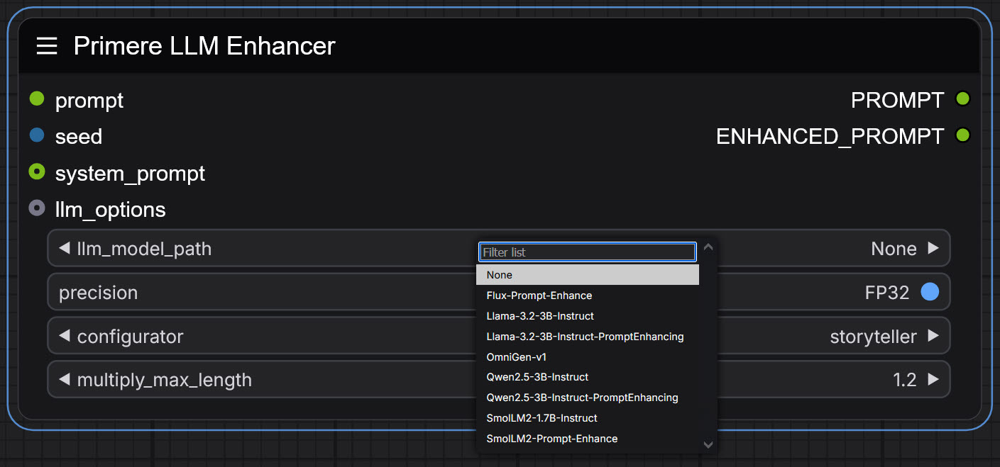

# <ins>Prompt Enhancement Node with Local LLMs:</ins>

This specialized ComfyUI node utilizes local LLM models to enhance, refine, or repair image generation prompts. It's particularly valuable for optimizing prompts for modern DiT (Diffusion Transformers) models like Flux and Cascade, which require T5-XXL compatible prompt structures.

### <ins>Comparison test:</ins>

#### Recommended Models:
- **Flux-Prompt-Enhance**: 850MB ~4 sec :: [link](https://huggingface.co/gokaygokay/Flux-Prompt-Enhance)
- **Llama-3.2-3B-Instruct**: 5.9GB ~38 sec :: [link](https://huggingface.co/meta-llama/Llama-3.2-3B-Instruct)
- **Llama-3.2-3B-Instruct-PromptEnhancing**: 17.5MB, but Llama-3.2-3B-Instruct required ~8 sec :: [link](https://huggingface.co/groloch/Llama-3.2-3B-Instruct-PromptEnhancing)
- **granite-3.0-2b-instruct**: 4.9GB ~10 sec :: [link](https://huggingface.co/ibm-granite/granite-3.0-2b-instruct)
- **Qwen2.5-3B-Instruct**: 5.7GB ~30 sec :: [link](https://huggingface.co/Qwen/Qwen2.5-3B-Instruct)
- **Qwen2.5-3B-Instruct-PromptEnhancing**: 13.7MB, but Qwen2.5-3B-Instruct required ~9 sec :: [link](https://huggingface.co/groloch/Qwen2.5-3B-Instruct-PromptEnhancing)
- **SmoLLM-360M-prompt-enhancer**: 1.3GB ~7 sec :: [link](https://huggingface.co/kadirnar/SmolLM-360M-prompt-enhancer)
- **SmoLLM2-1.7B-Instruct**: 3.1GB ~17 sec :: [link](https://huggingface.co/HuggingFaceTB/SmolLM2-1.7B-Instruct)
- **SmoLLM2-Prompt-Enhance**: 517MB ~10 sec :: [link](https://huggingface.co/gokaygokay/SmolLM2-Prompt-Enhance)
- **TinyLlama-1.1B-32k-Instruct**: 4GB ~11 sec :: [link](https://huggingface.co/Doctor-Shotgun/TinyLlama-1.1B-32k-Instruct)

Test workflow: `[your_comfy_dir]\custom_nodes\ComfyUI_Primere_Nodes\Workflow\civitai-llm-enhancer.json`

All models can be downloaded from Huggingface repositories, the node compatible with lot of another models and adapters.
The model path is: `[your_comfy_dir]\custom_nodes\ComfyUI_Primere_Nodes\Nodes\Downloads\LLM\`, models have to save in separated subfolders, basically same name as the model.

**The best model is Qwen2.5-3B-Instruct-PromptEnhancing but because this is just adapter, Qwen2.5-3B-Instruct required.**

## Test run of recommenden nodes: (GPU: RTX 3060/12, seed: `564992973323879`, precision: `FP32`)

#### <ins>Flux-Prompt-Enhance:</ins>
- **Input prompt:** `beautiful 35 years old woman, model, professional photographer, workshop, glamour magazine, lights`
  - **Configurator:** `balanced`
    - **Result:** `An ethereal surreal digital illustration A womans profile is the focal point her long brown hair flows down to shoulders. She looks like an older model with years of age and wear on it.\"LAMBORGHINIANA\" are written in bold white letters above each headpiece that read\"GLOSSMAGAZZ VIRGINA\". The right side features another person who has their back turned as they look at something off camera or other professional photography tools while left hand holds some tape measure for measuring purposes`
    - **Running time:** 4.5 sec
  - **Configurator:** `photorealistic`
    - **Result:** `An ethereal detailed oil painting a woman adorned in a black dress sits at the center of a wooden table her face illuminated by warm glowing lights. A professional photographer dressed in black stands behind her holding a camera creating a photorealistic effect. The mysterious figure shrouded in mystery is the focal point amidst a dark background`
    - **Running time:** 4 sec
  - **Configurator:** `consistent`
    - **Result:** `a closeup image of an older woman with long brown hair wearing glasses and holding something in her right hand that appears to be the brand name gabriele she is looking straight ahead at what looks like images or documents on both hands. The model has one arm extended downwards while others are slightly tilted forward as they reach another object further back from their body which seems similar but not entirely covered by them`
    - **Running time:** 4 sec
  - **Configurator:** `refinement`
    - **Result:** `An indoor close up worms eye view of a beautiful collection of beautiful 35 years old woman and a professional photographer. The woman is seated at the center of the frame. She is wearing a longsleeved black dress. Her hair is tied back in a ponytail. Her right hand is placed on her lap. Her left hand is placed upon her lap. She is also wearing a wristwatch on her left wrist. She is looking to the right at the camera. Her right arm is placed on the edge of the magazine. The magazine has a glamour magazine with the title \"LA  LA  MAGAZZO\" written in gold letters. The magazine is placed on top of a wooden table. There is a light fixture shining from the top of the magazine onto the table. The light fixture is casting a shadow over the table and the table`
    - **Running time:** 6 sec
  - **Configurator:** `default`
    - **Result:** `An ethereal highresolution digital illustration of an elderly woman with long brown hair styled in elegant curls. The model stands on her back as she looks at the camera and is looking to its right side behind him are several neatly folded clothes that have been worn over for many years or so far away it has disappeared into silence.\"LAMBORGHINIA\" written along these pages\"BLUE LAB\" \"LIVE THEIR LIFE PROXIMAMENTS AND FUNNITED\". A professional photographer dressed like one can be seen standing near this workshop while working men dot their work together under bright overhead lights which create shadow patterns across his face`
    - **Running time:** 5.3 sec

#### <ins>Llama-3.2-3B-Instruct:</ins>
- **Input prompt:** `beautiful 35 years old woman, model, professional photographer, workshop, glamour magazine, lights`
  - **Configurator:** `balanced`
    - **Result:** `Capture the essence of a stunning 35yearold woman who embodies both elegance and sophistication. As a successful model and professional photographer she exudes confidence and poise in front of the camera. Set against a glamorous backdrop with soft golden lighting her beauty shines through as she poses effortlessly in a luxurious setting. The focus is on highlighting her features from her striking eyes to her flawless skin all while conveying an air of refinement and class that would make her cover a highend fashion magazine like Glamour`
    - **Running time:** 40 sec
  - **Configurator:** `photorealistic`
    - **Result:** `Glamour in Focus`
    - **Running time:** 43 sec
  - **Configurator:** `consistent`
    - **Result:** `Create an image of a stunning 35yearold woman posing as a model with a professional photographers expertise. Incorporate glamorous lighting and a sophisticated backdrop reminiscent of the pages of a highend fashion magazine`
    - **Running time:** 42 sec
  - **Configurator:** `refinement`
    - **Result:** `Photograph a stunning 35yearold female model in a glamorous setting with soft natural light`
    - **Running time:** 43 sec
  - **Configurator:** `default`
    - **Result:** `Capture the essence of a stunning 35yearold model who embodies elegance and sophistication. Set against a glamorous backdrop with soft natural light pouring in from above she poses confidently in front of a polished wooden table adorned with luxurious props such as designer handbags fine jewelry and highend cameras. The atmosphere is one of refinement and poise reflecting her status as a successful model and professional photographer`
    - **Running time:** 47 sec

#### <ins>Llama-3.2-3B-Instruct-PromptEnhancing:</ins>
- **Input prompt:** `beautiful 35 years old woman, model, professional photographer, workshop, glamour magazine, lights`
  - **Configurator:** `balanced`
    - **Result:** `A beautiful young attractive female with short hair and bright eyes. She is a 2 5 year old wearing an elegant outfit in the studio of a professional photographer doing photoshoot for photography magazine glamorous lighting very detailed face highly detailed face well lit digital painting concept art by Brian Froud Artgerm Ruan Jia and Brent Crump and Donato Giancola and William Adolph Haag and Charles Westbrook trending on DeviantArt`
    - **Running time:** 8.6 sec
  - **Configurator:** `photorealistic`
    - **Result:** `A beautiful young female with long hair and a pretty face. She is wearing glasses. The background of the photo will be a studio photography work shop for photographers taking pictures of models in glamorous fashion magazines. A large lens camera on tripod stands at right foreground left center. There are many light sources from all directions lighting up this scene by natural daylight or artificial light. Artstation trending Photorealism high quality octane render cinematic lighting ultra detailed unreal engine`
    - **Running time:** 8.2 sec
  - **Configurator:** `consistent`
    - **Result:** `a beautiful young woman with long hair and a professional photographer in the background taking pictures of her self full body shot studio lighting studio lighting setup studio lighting studio lighting studio lighting studio lighting studio lighting studio lighting studio lighting studio lighting studio lighting studio lighting studio lighting studio lighting studio lighting studio lighting studio lighting studio lighting studio lighting studio lighting studio lighting studio lighting studio lighting studio lighting`
    - **Running time:** 8 sec
  - **Configurator:** `refinement`
    - **Result:** `A beautiful young woman with long dark hair and blue eyes. She is a 35 year old female model in her studio wearing an elegant outfit by designer brand. Her face has high definition features she has full lips perfect nose very pretty eyebrows smooth skin. The background of the photo is white. A light source from above shines down on her head. This is a highly detailed digital painting concept art created by Greg Rutkowski. It is trending on Artstation`
    - **Running time:** 8.3 sec
  - **Configurator:** `default`
    - **Result:** `A beautiful young woman with long hair and a big smile. She is wearing a white tank top and black shorts in the studio of an art photography class for women by a famous photographer. The lighting is perfect there are no shadows she has perfectly defined facial features her eyes sparkle she looks like a supermodel glamorous fashion shoot very detailed face realistic pose natural skin tone 35mm film grain digital retouched ultra wide angle shot highly`
    - **Running time:** 8.2 sec

#### <ins>granite-3.0-2b-instruct:</ins>
- **Input prompt:** `beautiful 35 years old woman, model, professional photographer, workshop, glamour magazine, lights`
  - **Configurator:** `balanced`
    - **Result:** `Capture the essence of elegance and charm with a captivating portrait. A stunningly beautiful women in her prime stands tall at an age that exudes confidence yet retains youthful allure`
    - **Running time:** 10 sec
  - **Configurator:** `photorealistic`
    - **Result:** `Glamour Unveiled`
    - **Running time:** 9.2 sec
  - **Configurator:** `consistent`
    - **Result:** `A captivating threedecade young lady with an elegant and alluring appearance is seeking your expertise in a photoshoot for the prestigious Glamor Magazines Workshop`
    - **Running time:** 11 sec
  - **Configurator:** `refinement`
    - **Result:** `Imagine a stunning 35yearold woman a professional model and photographer setting up a workshop in a glamorous magazine setting. The room is welllit highlighting her beauty and professionalism`
    - **Running time:** 10 sec
  - **Configurator:** `default`
    - **Result:** `A captivating threedimensional representation of an attractive lady aged thirteen`
    - **Running time:** 10 sec

#### <ins>Qwen2.5-3B-Instruct:</ins>
- **Input prompt:** `beautiful 35 years old woman, model, professional photographer, workshop, glamour magazine, lights`
  - **Configurator:** `balanced`
    - **Result:** `Can you create an image of a beautiful 35yearold woman who is both a model and a professional photographer in the middle of a glamorous photography workshop? She should be captured with elegant lighting that enhances her features`
    - **Running time:** 36 sec
  - **Configurator:** `photorealistic`
    - **Result:** `Heres a detailed and descriptive photo request\"A stunning photograph of an elegant 35yearold woman who exudes the confidence and grace typical of both a successful model and dedicated professional photographer. She is captured in her element at one of her photography workshops where shes sharing tips with aspiring photographers or discussing creative techniques that have made her career as glamorous as it has been.The lighting setup for this shot should be perfectsoft natural light streaming through large windows behind our subject casting flattering shadows on soft furnishings around them like plush cushions and vintage wooden bookshelves adorned with photographs from various projects theyve worked on over their illustrious career. The background features subtle textures such as woven tapestries hanging off walls creating depth while keeping focus squarely on our beautiful protagonist.\"Feel free to adjust any details based on your vision further if needed`
    - **Running time:** 39 sec
  - **Configurator:** `consistent`
    - **Result:** `Can you create an image of a beautiful 35yearold woman who is a model and professional photographer attending a glamorous workshop for a cover story in a glamour magazine? The scene should be illuminated with flattering studio lights`
    - **Running time:** 34 sec
  - **Configurator:** `refinement`
    - **Result:** `A stunning and glamorous photograph of a beautiful 35yearold woman who embodies the essence of professionalism as both an accomplished model and talented professional photographer. The scene should be set in or around her photography studioworkshop environment with soft lighting that highlights her features and captures the elegance and sophistication expected from a cover shot for a highend glamour magazine. Ensure she is centered frontally facing towards the viewer surrounded by props such as cameras lenses and perhaps some samples of her work emphasizing her expertise in capturing beauty through images`
    - **Running time:** 36 sec
  - **Configurator:** `default`
    - **Result:** `Heres a detailed and creative  for generating an image\"An exquisite portrait of a beautiful 35yearold woman who is both a model and a professional photographer. She stands confidently in the center of a studio setup that perfectly captures her elegance and professionalism. The lighting design should be glamorous with soft shadows underlining her features while highlighting her striking beauty.The background behind her could feature elegant textures like fine fabric or delicate patterns reminiscent of luxury magazines such as Glamour. Her pose suggests shes leading into action  perhaps about to capture another stunning moment on camera.In the foreground there might be props related to photography equipmentlike cameras resting gently beside her feetand possibly some accessories from her worka vintage lens cap next to one hand maybe even a small photo book open nearby showing off her portfolio.Overall this scene aims to convey not just her physical attractiveness but also her professionality through thoughtful details and composition.\"Feel free to adjust any elements based on your specific vision or preferences`
    - **Running time:** 40 sec

#### <ins>Qwen2.5-3B-Instruct-PromptEnhancing:</ins>
- **Input prompt:** `beautiful 35 years old woman, model, professional photographer, workshop, glamour magazine, lights`
  - **Configurator:** `balanced`
    - **Result:** `A beautiful female in her early 40s is a professional photographer and model. She wears glasses with an elegant face with a perfect smile wearing a stylish black outfit surrounded by studio lighting for publication of the glossy fashion magazin. Portrait shot trending on artstation. Professional photography full body shot from behind. Studio quality lighting clean background. Art nouveau style. Beautifully retouched skin sharp focus eyes. Golden ratio composition. Fashion shoot. Trending on Pinterest`
    - **Running time:** 10 sec
  - **Configurator:** `photorealistic`
    - **Result:** `a beautiful female in her early thirties with long straight hair and a smile. she is wearing an elegant white dress that fits perfectly around the waistline of this figure as it hugs their curves while leaving them bare from hip down. She has short black eyelashes on each eye which are framed by dark brown eyebrows above sharp cheekbones. Her face features delicate bone structure along its edges where lines meet skin tone smoothly together creating smooth transitions between areas like eyes cheeks nose mouth forehead chin`
    - **Running time:** 9 sec
  - **Configurator:** `consistent`
    - **Result:** `a beautiful 35 year old woman with long blonde hair and blue eyes model professional photographer workshop glamour magazine cover light fashion trending on artstation high quality sharp focus realistic hyperdetailed hyperrealistic hyperdetailed hyperrealistic unreal engine photorealism photo realistic photorealism photorealism photorealism photorealism photorealism photorealism photoreal`
    - **Running time:** 9.3 sec
  - **Configurator:** `refinement`
    - **Result:** `a beautiful female in her early thirties with a long blonde hair and blue eyes. she is wearing an elegant outfit of black leather pants white blouse and red high heels. she looks like a professional fashion photographer who works as a model for magazines such as Glamour Magazine and Vogue Magazine. the background has soft lighting from different angles. this picture will be featured on a glossy page of a beauty magazine cover. by Garry Spitznagel. Ilya Kuv`
    - **Running time:** 9 sec
  - **Configurator:** `default`
    - **Result:** `a beautiful young women in her mid thirties with long blonde hair and a perfect face. she is wearing an elegant dress as a fashion model on the cover of a glamorous glossy magazine. she has just won best portrait photography award at the international photo festival. there are many other photographers around her taking pictures while she poses for them. they all have cameras hanging from their necks like trophies. its very bright studio lighting. trending on artstation. digital painting by greg`
    - **Running time:** 10 sec

#### <ins>SmoLLM-360M-prompt-enhancer:</ins>
- **Input prompt:** `beautiful 35 years old woman, model, professional photographer, workshop, glamour magazine, lights`
  - **Configurator:** `balanced`
    - **Result:** `No useful result...`
    - **Running time:** - sec
  - **Configurator:** `photorealistic`
    - **Result:** `The woman in the photo wears a black and white dress with a floral pattern. Her hair is styled in a ponytail and her eyes are focused on the camera. She stands in front of a white wall with a mirror. The lighting is warm and soft creating a cozy and intimate atmosphere. The background features a cityscape with buildings and trees. The composition is balanced and harmonious with the womans gaze capturing the viewers attention. Overall the photo conveys a sense of elegance sophistication and a connection to the past. Its a captivating snapshot of a woman in her golden years dressed in a classic style set against a warm natural backdrop. The use of light and shadow adds depth and mystery to the composition inviting the viewer to explore the mysterious womans world`
    - **Running time:** 10 sec
  - **Configurator:** `consistent`
    - **Result:** `No useful result...`
    - **Running time:** - sec
  - **Configurator:** `refinement`
    - **Result:** `No useful result...`
    - **Running time:** - sec
  - **Configurator:** `default`
    - **Result:** `No useful result...`
    - **Running time:** - sec

#### <ins>SmoLLM2-1.7B-Instruct:</ins>
- **Input prompt:** `beautiful 35 years old woman, model, professional photographer, workshop, glamour magazine, lights`
  - **Configurator:** `balanced`
    - **Result:** `Photographing a stunning 35yearold beauty with an eye for elegance and grace  capturing her on camera in our exquisite studio setting under soft golden lighting that accentuates every curve of perfection`
    - **Running time:** 17.4 sec
  - **Configurator:** `photorealistic`
    - **Result:** `A stunningly beautiful young lady in her mid thirties with an undeniable allure of professionalism is seen posing elegantly while being photographed by herself under soft golden lighting`
    - **Running time:** 17.4 sec
  - **Configurator:** `consistent`
    - **Result:** `A stunning 35yearold woman a seasoned professional in both modeling and photography showcases her captivating beauty at an exclusive workshop for glamour magazines`
    - **Running time:** 17 sec
  - **Configurator:** `refinement`
    - **Result:** `A stunning 35yearold beauty a seasoned professional in both modeling and photography who has graced numerous glossy pages of top fashion magazines with her dazzling presence`
    - **Running time:** 17 sec
  - **Configurator:** `default`
    - **Result:** `A stunning 35yearold beauty with a passion for modeling and photography has just stepped into our elegant studio where she will be capturing her radiant glow under soft warm lighting`
    - **Running time:** 20 sec

#### <ins>SmoLLM2-Prompt-Enhance:</ins>
- **Input prompt:** `beautiful 35 years old woman, model, professional photographer, workshop, glamour magazine, lights`
  - **Configurator:** `balanced`
    - **Result:** `beautiful 35 years old woman model professional photographer workshop glamour magazine lights A detailed elaboration of \"The Beautiful Woman\" with an emphasis on subtle details in light blue color palette (120). The female figure is depicted standing at her left side facing away from you while she holds up two large white glass jars that have been placed over each other for about five seconds before being lifted off their pedestals so they can be seen more clearly without them touching or falling into one anothers hands this has made it possible not just visible but also almost invisible when viewed directly through these small windows.\"BEGINED BY THE WOMAN OF BEAUTIFUL FATHERS MISSION\" which reads out loud\"THIS IS AN EMPLOYEE SURVIVING A PROBLEM THAT MAKES HER DETECTIVE AND EVALUABLE\". She wears long black hair styled down curving back slightly towards top right corner showing dark brown eyes looking straight ahead toward what looks like sunlight shining onto both faces forming shadowy silhouettes against sky above.\"the caption says \"beautiful lady\"\") there appears no background elements including any objects within viewable distance.nIn stark contrastneerclawed tree trunk stands immediately below center frame where its branches extend further extending outward beyond`
    - **Running time:** 12 sec
  - **Configurator:** `photorealistic`
    - **Result:** `beautiful 35 years old woman model professional photographer workshop glamour magazine lights a woman with long dark hair wearing a black dress standing on a wooden platform in the center of the image her left hand resting on her forehead her right hand holding a camera the woman is in the middle of the frame the photograph has a shallow depth of field with a blurred background the lighting is soft and diffused creating a warm and romantic atmosphere the photo has a high contrast between the woman and the background no other objects or text visible the image has a clean and minimalist aesthetic`
    - **Running time:** 5.6 sec
  - **Configurator:** `consistent`
    - **Result:** `beautiful 35 years old woman model professional photographer workshop glamour magazine lights A detailed elaboration of \"The Beautiful Woman\" in bold white lettering with an orange background is rendered into two images that clearly show her face at full length while shes looking directly down from up on top left corner toward right bottom center behind this view we see three more women who all have their heads slightly tilted towards each other but still look straight ahead for some time before they turn back or continue walking forward without touching anything else around them (the first one has its head turned away). Behind these ladies there can be seen another person standing next door wearing dark blue pants which looks like it was worn out after being outdoors during summer days when suns rays shine brightly through windows making shadows appear darker than what you would normally expect because sunlight reflects off glass surfaces.) The entire room appears dimly lit except where light shines onto either side creating shadowy silhouettes against wall walls below those areas so no visible objects beyond small window panes above both sides.\"WOMENS STORAGE\". A large black metal box sits atop several smaller wooden boxes stacked vertically along long horizontal lines running horizontally across vertical sections extending far enough past any ceiling tiles forming floor level panels underneath floors beneath ceilings hanging over balconies outside buildings near city skyline views overlooking ocean waves crashing upon shore opposite building`
    - **Running time:** 10 sec
  - **Configurator:** `refinement`
    - **Result:** `beautiful 35 years old woman model professional photographer workshop glamour magazine lights An enhanced version of the original text \"35 year old woman a professional photographer working in a workshop. She is wearing a black dress and her hair is styled in a ponytail. She is standing in front of a mirror looking at her reflection. She is smiling and looking at the camera.\" The text has been transformed into a more detailed and realistic image with a focus on the womans face and body. The background is blurred creating a shallow depth of field effect giving a sense of depth to the image. The image is centered on the woman with her left hand resting on her forehead and her right hand touching her face`
    - **Running time:** 7 sec
  - **Configurator:** `default`
    - **Result:** `beautiful 35 years old woman model professional photographer workshop glamour magazine lights A detailed elaboration of \"The Beautiful Woman\" with bolded words in black ink on white paper is rendered into an immersive digital art style that seamlessly transitions from pastel colors (white) towards dark blue hues while highlighting her striking features like sharp jawline or piercing green eyes she has long curly hair cascading down both arms revealing intricate patterns around each shoulder  all details perfectly captured without any extra embellishments  this stunning portrait showcases how one person can be so breathtakingly different yet connected through their shared passion for photography. The light source creates subtle shadows creating contrast between what appears at first glance but ultimately becoming clear upon closer inspectiona perfect balance within natures majestic beauty.\" hspace20cmrightarrow textbfemphics \"1984\" \" which reads the worlds most famous photograph adds another sentence below it\"and then there were two people who looked very much alike both women with no discernible differences they had been together since childhood.\" also written above themleftmost right hand pointing upwards`
    - **Running time:** 11 sec

#### <ins>TinyLlama-1.1B-32k-Instruct:</ins>
- **Input prompt:** `beautiful 35 years old woman, model, professional photographer, workshop, glamour magazine, lights`
  - **Configurator:** `balanced`
    - **Result:** `Hey. This is a beautiful 35yearold woman named Julia whos also a model a professional photographer has worked with magazines like Glamour and lights`
    - **Running time:** 11 sec
  - **Configurator:** `photorealistic`
    - **Result:** `I am thrilled to present you with a stunning portrait of an exquisite beauty that is both captivating in her presence yet radiant underneath her warmth. Her eyes sparkle like diamonds beneath the soft glow of natural light while her figure gleams against the backdrop of your chosen background. The vibrant hues of this artwork evoke emotion through its intricate details from the subtly shifting colors within each facial feature to the lush foliage surrounding them. This composition offers an array of possibilities for future edits or creative exploration making it ideal for any space where style meets sophistication`
    - **Running time:** 13.5 sec
  - **Configurator:** `consistent`
    - **Result:** ` Im a professional photographer who specializes in glamour photography. I have been working for many years now and Ive had the pleasure of capturing some incredible images that have been featured in magazines like Glamour and other highprofile publications.`
    - **Running time:** 13 sec
  - **Configurator:** `refinement`
    - **Result:** `beautiful 35 years old woman model professional photographer workshop glamour magazine lights An enhanced version of the original text \"35 year old woman a professional photographer working in a workshop. She is wearing a black dress and her hair is styled in a ponytail. She is standing in front of a mirror looking at her reflection. She is smiling and looking at the camera.\" The text has been transformed into a more detailed and realistic image with a focus on the womans face and body. The background is blurred creating a shallow depth of field effect giving a sense of depth to the image. The image is centered on the woman with her left hand resting on her forehead and her right hand touching her face`
    - **Running time:** 7 sec
  - **Configurator:** `default`
    - **Result:** `beautiful 35 years old woman model professional photographer workshop glamour magazine lights A detailed elaboration of \"The Beautiful Woman\" with bolded words in black ink on white paper is rendered into an immersive digital art style that seamlessly transitions from pastel colors (white) towards dark blue hues while highlighting her striking features like sharp jawline or piercing green eyes she has long curly hair cascading down both arms revealing intricate patterns around each shoulder  all details perfectly captured without any extra embellishments  this stunning portrait showcases how one person can be so breathtakingly different yet connected through their shared passion for photography. The light source creates subtle shadows creating contrast between what appears at first glance but ultimately becoming clear upon closer inspectiona perfect balance within natures majestic beauty.\" hspace20cmrightarrow textbfemphics \"1984\" \" which reads the worlds most famous photograph adds another sentence below it\"and then there were two people who looked very much alike both women with no discernible differences they had been together since childhood.\" also written above themleftmost right hand pointing upwards`
    - **Running time:** 11 sec