# <ins>Visual Checkpoint Selector:</ins>


The Visual Checkpoint Selector helps you choose and manage AI models (checkpoints) in your workflow with a visual (or legacy list) interface.

### Basic Usage:
Select your AI model from the `base_model` dropdown list, which shows all installed models on your system.

### Visual Selection Mode:
Toggle `show_modal` to ON to open a visual gallery of preview images for each model. This makes it easier to choose the right model by seeing example outputs.

### Preview Settings:
- Select `preview_path`:
  - `Primere legacy` - uses custom path for preview images
  - `Model path` - uses preview images from your original model folder

- `show_hidden` controls visibility of hidden files/folders (those starting with a dot)

Visual `checkpoint` selection, automatized filtering by subdirectories (first row of buttons) and versions (second row of buttons):

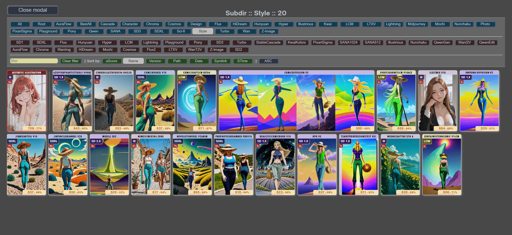

### Random Model Feature:
Turn on `random_model` to automatically select random models from the current folder. For example, if you've selected checkpoint from "Photo" folder, it will randomly pick from any model in that folder. This is useful for batch processing too.

### Aesthetic Score percent display:
- `aescore_percent_min`: Because the preview images show aesthetic scores if saved and measured, this value or less mean 0% 
- `aescore_percent_max`: Because the preview images show aesthetic scores if saved and measured, this value or more mean 100%

These scores help sorting models based on their quality ratings.

**When all data available, thse badges will visible in the preview:**

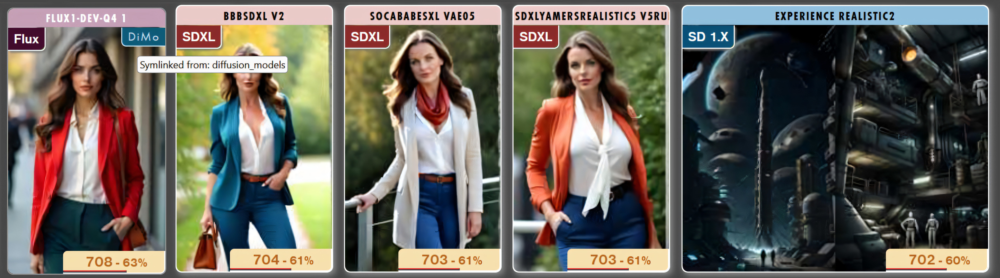

- **Top left:** model concept (Flux, SD1, SD2, SDXL, etc...)
- **Top right:** if symlinked, what type of diffuser linked
- **Botom:** the average aesthetic score. Have to use aesthetic scorer node before store this data for checkpoints and saved prompts. The number is the average, but the percent depending on the checkpoint selector settings, where the `aescore_percent_min` and lower value mean 0%, `aescore_percent_max` and higher mean 100%.

<hr>

# <ins>Resolution Selector:</ins>


This node helps you set the perfect image dimensions for your generations with preset ratios or custom settings.

### Basic Resolution Selection:
- Choose from predefined aspect ratios in the `ratio` dropdown (Photo, Portrait, Old TV, HD, HD+, Square, etc.)
- Use `resolution` mode:
 * "Auto" - automatically sets base resolution based on your selected model. If the model version available this settings useful.
 * "Manual" - lets you input custom dimensions bases using:
   - `sd1_res`: Base resolution for SD1 models (768 default)
   - `sdxl_res`: Base resolution for SDXL models (1024 default)
   - `turbo_res`: Base resolution for Turbo models (512 default)

### Image Orientation:
- Set `orientation` to Horizontal or Vertical
- Enable `rnd_orientation` to randomly switch between orientations. This function useful for batch generation.
- `round_to_standard` re-count dimensions to "standard" of selected AI models

### Custom Ratio Settings:
Enable `calculate_by_custom` to use your own aspect ratios (example: 1.6:2.8):
- `custom_side_a`: First side ratio (e.g., 1.60)
- `custom_side_b`: Second side ratio (e.g., 2.80)

Note: Aspect ratios can be customized by editing the external .toml configuration file from path: `Toml/resolution_ratios.toml`

<hr>

# <ins>Primere Prompt:</ins>


The Prompt node provides advanced prompt control with organization features and special settings.

### Prompt Inputs:
- `positive_prompt`: Enter your main prompt describing what you want to create
- `negative_prompt`: Enter elements you want to avoid in the generation

### Organization Features:
- `subpath`: Save your generated images into themed folders (e.g., "CutePets", "Sci-Fi, etc...")
- `model`: Choose a specialized model for specific types of images (e.g., interior, exterior, etc...). This is standard model list.

### Orientation Control:
Choose how to handle image orientation:
- `None`: Use default orientation from `Resolution Selector` node
- `Random`: Randomly switch between **horizontal** and **vertical**. This function useful for batch generation.
- `Horizontal`: Force **horizontal** composition
- `Vertical`: Force **vertical** composition

The orientation setting helps compose your image properly for your selected subject matter.

### Save prompt to external file:
With `Save prompt to file...` button you can save your current prompt to external CSV file, what the `Visual Style Selector` and `Visual Prompt CSV` nodes will read by name. 
Read the manual of **Visual Prompts (style) Selector** and **Visual Prompts - auto organized** nodes later.
- To the prompt saver dialog you can enter or choose name for prompt. If you choose existing prompt name from the `Prompt name` list, the original prompt with same name will be overwritten
- You can select existing or crete new category what will be use as folder name for generated image
- You can edit both positive and nagetive prompt, but positive prompt required
- The `Preferred model` and `Preferred orientation` are read only. These date must be set on the prompt input node.
- Cancel or finish prompt save by buttons
- Make backup from your previous `styles.csv` file on the `custom_nodes\ComfyUI_Primere_Nodes\stylecsv\` folder before use prompt saver

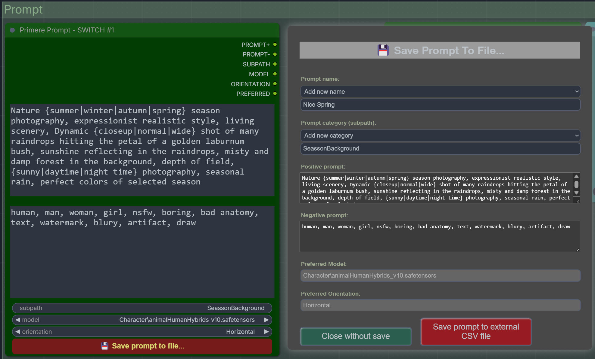

[This video contains tutorial for prompt engineering](https://www.youtube.com/watch?v=joqvC8vb6Xo)

<hr>

# <ins>Prompt Switch:</ins>

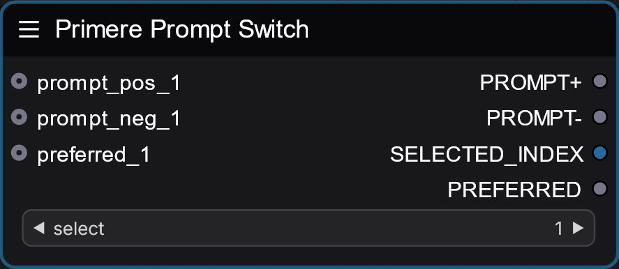

A control node that lets you quickly switch between different prompt sources in your workflow, including `Style Selector` nodes.

### How It Works:
- Connect multiple prompt sources to this node (any different sources), but the connection and unconnection queue is important. If failed, just reload the browser.
- Use the `select` input to choose which prompt source to use (1-any)
- The selected prompt source becomes active, while others remain inactive

### Usage Example:
If you have different prompts for:
- Portrait shots
- Landscape scenes
- Character designs

You can connect all of them to the Prompt Switch and easily toggle between them using the selector, without needing to reconnect nodes or modify your workflow.

<hr>

# <ins>Visual Prompts (style) Selector:</ins>

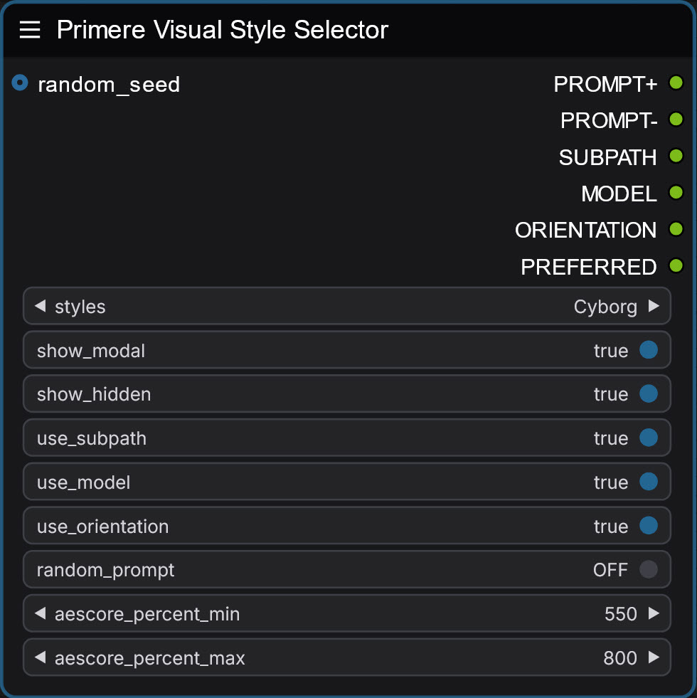

A powerful tool that lets you save and load complete prompt configurations using a visual interface or simple list.

### Basic Usage:
- Choose from saved styles using the `styles` dropdown
- Toggle `show_modal` to switch between:
 * List view: Simple dropdown of style names
 * Visual view: Preview images of each style's output

Visual `saved prompt` selection `(csv source)`, automatized filtering by categories:


### Style Components:
Each saved style can include:
- Name of saved prompt
- Positive and negative prompts
- Specific orientation
- Custom save folder (subpath)
- Model preference

### Control Options:
- `use_subpath`: Apply the style's saved folder path
- `use_model`: Use the style's recommended/preferred model
- `use_orientation`: Apply the style's preferred orientation
- `show_hidden`: Show/hide styles names or path contains word `nsfw`
- `random_prompt`: Randomly select prompt from available styles from same subpath as selected

### Quality sorting:
- `aescore_percent_min`: Because the preview images show aesthetic scores if saved and measured, this value or less mean 0% 
- `aescore_percent_max`: Because the preview images show aesthetic scores if saved and measured, this value or more mean 100% 

Note: Styles are stored in an external .csv file that can be easily edited and shared. Rename `stylecsv/styles.example.csv` to `stylecsv/styles.csv` and use your own prompt collection.

<hr>

# <ins>Visual Prompts - auto organized:</ins>

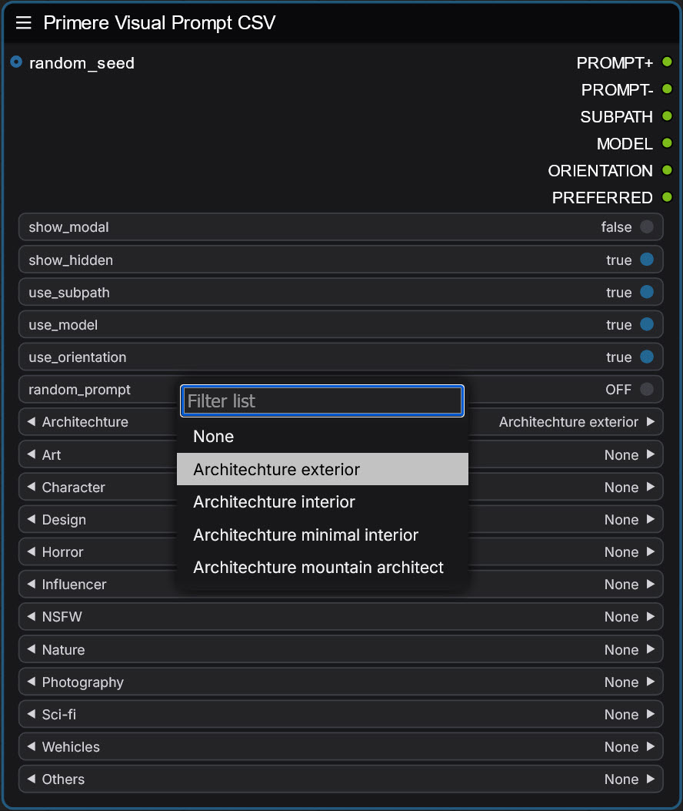

This node organizes your saved prompts into categories for easier management, especially useful when you have a large saved collection of prompts.

### Category Organization:
- Prompts are automatically sorted into categories like:
  - Architecture
  - Art
  - Character
  - ...and more dependign your source .csv.

### How to Use:
1. Select a category from node
2. Choose a specific prompt from that category
3. All related settings (prompt, model, path) load automatically from .csv file: Rename `stylecsv/styles.example.csv` to `stylecsv/styles.csv` and use your own prompt collection.

## Control Options (same as than the Visual Prompts (style) Selector node)
- `show_modal`: Switch between list and visual preview mode
- `show_hidden`: Include/ignore hidden category items if name or path contains word `nsfw`
- `use_subpath`: Use saved folder paths (usually as prompt category)
- `use_model`: Apply recommended models
- `use_orientation`: Use saved orientation settings
- `random_prompt`: Pick random prompt from selected category

## Benefits
- Organized browsing instead of one long list
- Quick access to themed prompts
- Easy to find related styles
- Categories are created automatically from your saved paths

Note: Categories are created from the folder structure in your styles.csv file, making organization automatic and maintenance-free.

<hr>

# <ins>Dynamic Prompt Handler:</ins>

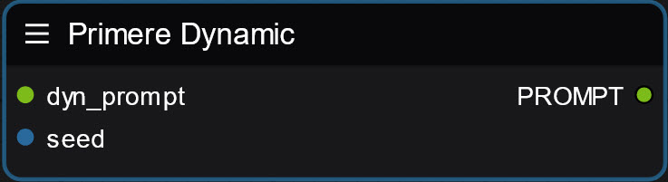

This node processes dynamic text prompts with random variations and maintains seed control for consistent results. The node has two inputs: a dynamic prompt string and a seed value.

### Input Fields:
- `dyn_prompt`: Takes your prompt text containing dynamic sections
- `seed`: Controls randomization for consistent results

### Usage:
This node helps create varied prompts while maintaining reproducibility. When you input a prompt with dynamic sections (like {red|blue|green}), the node will randomly select one option based on the seed value. Perfect for batch processing or exploring variations while keeping track of successful combinations.

### Benefits:
- Consistent randomization with seed control
- Streamlines prompt variation workflow
- Integrates seamlessly with other prompt processing nodes
- Reduces manual prompt editing time
- Perfect for batch generation with controlled variations

Read manual of dynamic prompt syntax: https://github.com/adieyal/sd-dynamic-prompts/blob/main/docs/SYNTAX.md

<hr>

# <ins>Primere KSampler with Variations:</ins>


This KSampler node extends the standard sampling functionality with fine-tuned variation controls and performance options.

#### Variation System:
- `variation_extender`: Fine-tunes noise injection from 0.0 to 1.0, allowing subtle variations while maintaining the original image's core elements
- `variation_batch_step`: Enables progressive variation in batch processing by incrementing noise injection per step (e.g., 0.1 increment over 10 steps creates a gradual transformation sequence)
- `variation_level`: When set to "Maximize", randomizes the noise injection values for more diverse outputs

#### Performance Options
- `device`: Select processing hardware (CPU/GPU/Default)
- `align_your_steps`: Implements NVIDIA's AlignYourSteps technology, which helps maintain temporal consistency and reduces unwanted artifacts during the sampling process. Read details from here: https://research.nvidia.com/labs/toronto-ai/AlignYourSteps/

### Additional Settings:
- `denoise`: Controls the denoising strength
- `model_sampling`: Adjusts the model's sampling parameters (usually for SD3 models only)

<hr>

# <ins>Primere Prompt Encoder:</ins>

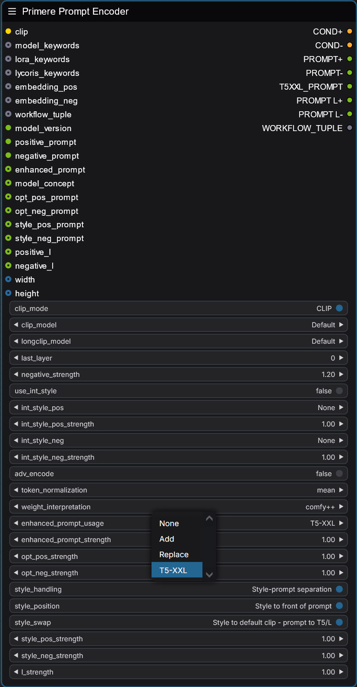

This sophisticated prompt encoder node offers extensive control over prompt processing with multiple CLIP and LONG-CLIP models and advanced encoding options.

### CLIP Processing:
- `clip_mode`: Toggle between standard CLIP and Long-CLIP processing
  - `clip_model/longclip_model`: Model selection based on clip_mode switch
- `last_layer`: Fine-tune CLIP encoding by selecting specific negative layers for feature extraction
- `negative_strength`: Adjusts the intensity of negative prompt influence

### Style System:
- `use_int_style`: Enables internal style system loaded from external .toml configurations from the path: `Toml/default_neg.toml` and `Toml/default_pos.toml`
  - `int_style_pos/neg`: Select predefined styles by name
  - `int_style_pos/neg_strength`: Control strength of applied styles

### Advanced Encoding Options:
- `adv_encode`: Enables alternative (advanced) CLIP encoding methodology
- `token_normalization`: Controls how token weights are normalized (mean/none/length/length+mean)
- `weight_interpretation`: Defines how prompt weights are processed (comfy++/A1111/comfy)

### Enhanced Prompt System:
- `enhanced_prompt_usage`: Controls enhanced prompt processing
  - `None`: Ignores enhanced prompt
  - `Add`: Appends to end of positive prompt
  - `Replace`: Replace positive prompt (very strong modification)
  - `T5-XXL`: Uses enhanced prompt input for T5-XXL encoding if concept support T5 clipping
- `enhanced_prompt_strength`: Controls enhanced prompt influence if added to original positive prompt

### Additional Controls:
- `style_position`: Placement of additional style prompts (Top/Bottom)
  - `opt_pos/neg_strength`: Fine-tune optional prompt strengths
- `copy_prompt_to_l`: Enables SDXL first-pass prompt copying
  - `sdxl_l_strength`: Controls SDXL first-pass prompt intensity

<hr>

# <ins>Aesthetic Scorer:</ins>


This node evaluates the aesthetic quality of generated images and saving scoring data to display in visual previews. It provides numerical scoring and statistical tracking for your generations.

### Key Features:
- `get_aesthetic_score`: Enables/disables image quality scoring
  - `add_to_checkpoint`: Save scores to checkpoint data, allowing you to sort image quality of different model checkpoints
  - `add_to_saved_prompt`: Save scores to saved prompts, helping identify (and sort) consistently high-performing prompts

### Benefits:
- Track generation quality automatically
- Compare performance across different checkpoints and prompts
- Identify your most successful prompts through statistical tracking
- View average scores in visual selectors
- Make data-driven decisions about your workflow settings

The scoring system helps optimize your workflow by providing objective (or subjective?) feedback on image quality and maintaining statistics for both checkpoints and prompts.

<hr>

# <ins>Primere Image Saver</ins>:

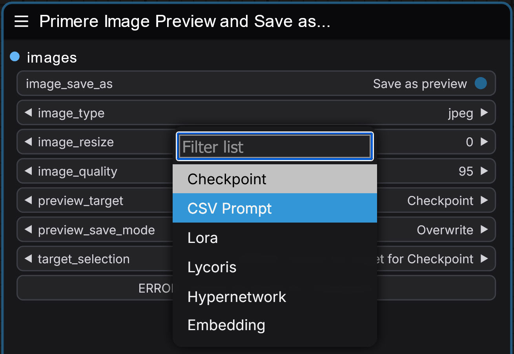

This versatile node provides comprehensive image saving functionality with **visual preview management** capabilities for your workflow.

### Save Modes:
#### Preview Save Mode: `Save as preview`
- Saves images as visual previews for checkpoints, LoRAs, Lycoris, Hypernetworks, Embedding, and saved prompt selections
- `Overwrite`: Replace existing or create new preview
- `Keep`: Preserve existing, only create if missing
- `Join horizontal`: Combine horizontally with existing preview or create new
- `Join vertical`: Combine vertically with existing preview or create new
- `Target selection`: Select only one target if more than one available in the process, for example Loras or Embeddings.

#### The bonus hidden feature, that one click very close under the save button, the previously saved preview visible if exist.

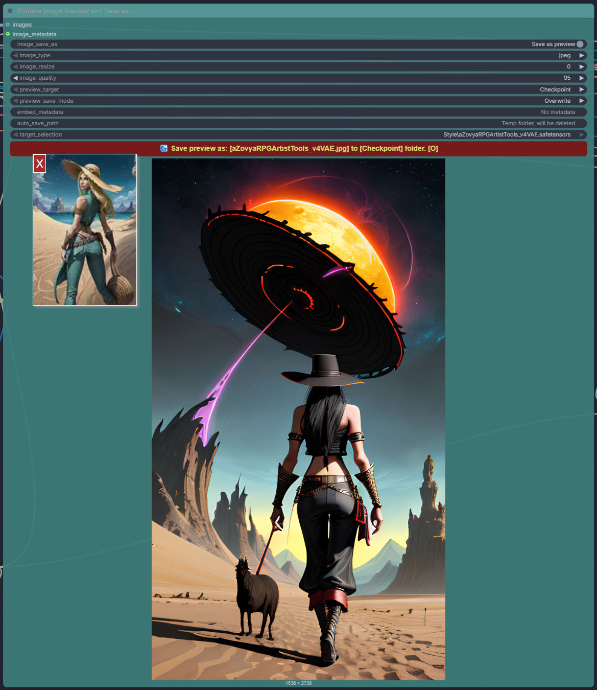

#### Local Storage Mode: `Save as any`
- `Format Options`: PNG, JPEG, WebP
- `Size Control`: Resize by specifying maximum dimension while preserving aspect ratio. 0 mean no resize
- `Quality Settings`: Adjust compression for JPEG/WebP formats

### Benefits:
- Create visual reference libraries for models, additional networks and prompts
- Flexible preview management for workflow organization
- Custom export settings for different use cases
- Space-efficient preview combinations
- Maintain organized model and prompt libraries with visual references

<hr>

# <ins>Resolution MPX</ins>:


This node allows you to set a target resolution for upscaling images while preserving the original aspect ratio. Below are the available settings:

- `image`: Connect the input image
- `width & height`: Connect the original dimensions of the image

### Settings:

- `use_multiplier`: Enable or disable the upscaler
- `upscale_to_mpx`: Specify the final target resolution in megapixels, maintaining the original aspect ratio
- `triggered_prescale`: Pre-resizes the image if it’s smaller than the value in **area_trigger_mpx**. This setting helps reduce resource demand for extreme upscaling
- `area_trigger_mpx`: The megapixel size threshold to trigger prescaling. Useful for minimizing resource consumption
- `area_target_mpx`: Sets the target size (in megapixels) before sending the image to the upscaler. It is recommended to set this to about a quarter to half of the final target size
- `upscale_model`: Select an upscaling model from the standard list of available options
- `upscale_method`: Method for resizing the image if **triggered_prescale** is activated (as shown in the screenshot)

### Benefits:

- `Efficient Resource Management`: Reduces resource demand by prescaling smaller images before upscaling if the difference between source and target size too much
- `Flexible Settings`: Various settings to customize the upscaling process according to your needs

<hr>

# <ins>Automatic Image Saver</ins>:

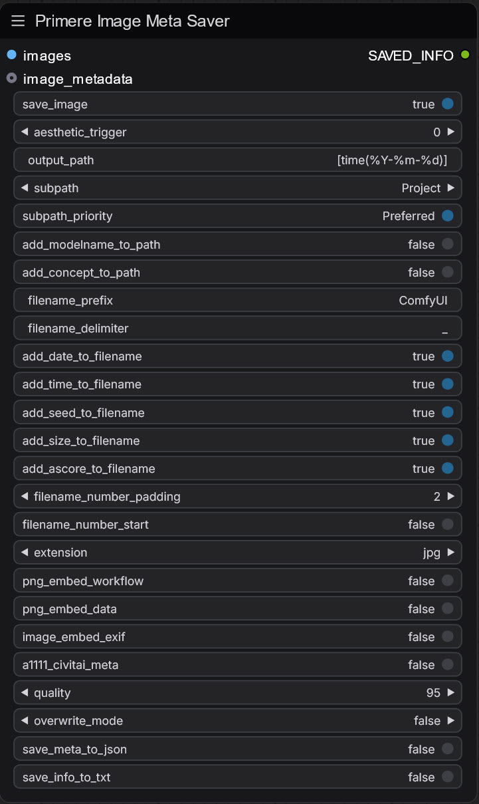

This node automatically saves images along with metadata, generated by the full workflow, to specified paths. Below are the settings available for configuring the node:

- `images`: Connect the input image
- `image_metadata`: Connect the metadata generated by the workflow

#### Settings:

- `save_image`: Enable or disable the saving of images
- `aesthetic_trigger`: Set a minimum required aesthetic score. If set to 0, all images will be saved. If set to a value greater than 0, only images meeting this score threshold are saved. If no score measure, all images will be saved
- `output_path`: Specify the final image path using Python-style format. My favorite setting is: `{my_local_path}\[time(%Y-%m-Week-%W)]` for weekly subdirectories
- `subpath`: Select a subpath based on the project type (e.g., dev, test, fashion, etc...)
- `subpath_priority`: Choose either "Selected subpath" uses `subpath` value or set to "Preferred" uses workflow metadata settings for example from simple `Prompt` node or `Saved csv prompts` node
- `add_modelname_to_path`: If enabled, includes the checkpoint name as a subfolder
- `add_concept_to_path`: If enabled, includes the model concept name (e.g., SD1, SD2, SDXL, Flux) as a subfolder
- `filename_prefix`: Set the prefix for the target filename
- `filename_delimiter`: Specify the character used between filename parts
- `add_date_to_filename`, `add_time_to_filename`, `add_seed_to_filename`, `add_size_to_filename`, `add_ascore_to_filename`: Boolean switches to include date, time, seed, size, or aesthetic score in the filename
- `filename_number_padding`: Number of padding digits if duplicate filenames exist
- `extension`: Set the image file format (e.g., jpg, png, webp, etx)
- `png_embed_workflow`: If enabled, saves the full workflow to the PNG file for loading to ComfyUI
- `png_embed_data`: Special data for Premiere Nodepack’s `Image Recycler` node to read back generation details
- `image_embed_exif`: Saves generation data to JPEG EXIF for `Image Recycler` node
- `a1111_civitai_meta`: Saves A1111-compatible metadata auto-readable by Civitai portal
- `quality`: Set quality for jpg and webp images
- `overwrite_mode`: If enabled, overwrites existing files
- `save_meta_to_json`: Saves generation details to an external `.json` file
- `save_meta_to_txt`: Saves generation details to an external `.txt` file

### Benefits:

- `Automated Saving`: Simplifies saving images and metadata with configurable filenames and paths
- `Detailed Metadata`: Saves essential generation details for later review or sharing
- `Compatibility`: Compatible with tools like `Image Recycler` and Civitai for enhanced workflow integration
- `Customizable File Management`: Options to manage paths, subfolders, and filenames for organized storage

<hr>

# <ins>Network Tag Cleaner Node:</ins>


### Overview:
The Network Tag Cleaner node provides intelligent management of network adapter tags in prompts, supporting both manual and automatic cleaning modes for various model architectures.

### Supported Network Types:
- Embeddings (`embedding:name`)
- LoRA (`<lora:name>`)
- LyCORIS (`<lycoris:name>`)
- Hypernetworks (`<hypernetwork:name>`)

### Operation Modes:

#### Manual Mode:
When `auto_remover` is set to OFF:
- Full control over tag removal
- Selective cleaning based on model architecture
- Requires manual configuration

#### Auto Mode:
When `auto_remover` is set to ON:
- Intelligent compatibility checking
- Automatic removal of only incompatible tags
- Preserves all matching architecture tags

### Control Switches:

#### Network Type Controls:
- `remove_embedding`: Toggle embedding removal
- `remove_lora`: Toggle LoRA tag removal
- `remove_lycoris`: Toggle LyCORIS tag removal
- `remove_hypernetwork`: Toggle hypernetwork removal

#### Architecture-Specific Controls:
- `remove_only_sd1`: SD1.x network tags
- `remove_only_sd2`: SD2.x network tags
- `remove_only_sdxl`: SDXL network tags
- `remove_only_sd3`: SD3 network tags
- `remove_only_stablecascade`: Stable Cascade tags
- `remove_only_turbo`: Turbo model tags
- `remove_only_flux`: Flux model tags
- `remove_only_kwaikolors`: KwaiKolors tags
- `remove_only_hunyuan`: Hunyuan tags
- `remove_only_playground`: Playground tags
- `remove_only_pony`: Pony tags
- `remove_only_lcm`: LCM tags
- `remove_only_lightning`: Lightning tags
- `remove_only_hyper`: Hyper tags
- `remove_only_pixartsigma`: PixArt-Sigma tags

### Use Cases:

#### Manual Cleaning Mode:
```plaintext
Scenario 1: SDXL-Only Workflow
Settings:
- auto_remover: OFF
- remove_lora: ON
- remove_only_sd1: ON
- remove_only_sd2: ON
- remove_only_sdxl: OFF

Result: Removes all SD1 and SD2 LoRA tags while keeping SDXL LoRAs
```

#### Auto Cleaning Mode:
```plaintext
Scenario 1: Using Flux Checkpoint
Settings:
- auto_remover: ON
- remove_lora: ON
- remove_lycoris: ON

Result: 
- Keeps Flux-compatible network tags
- Removes SD1/SD2/SDXL and all other non-flux network tags
- Preserves model-specific optimizations
```

```plaintext
Scenario 2: Using SDXL Checkpoint
Settings:
- auto_remover: ON
- remove_lora: ON

Result:
- Maintains SDXL LoRA tags
- Removes all other incompatible network tags
- Ensures workflow compatibility
```

### Benefits:

#### Workflow Optimization:
- Prevents incompatible network usage
- Reduces generation errors
- Streamlines prompt management

#### Error Prevention:
- Eliminates architecture mismatches
- Prevents memory issues
- Reduces failed generations

#### User Convenience:
- Automatic compatibility checking
- Simple toggle controls
- Clear visual feedback

#### Advanced Usage:
```plaintext
Settings:
- auto_remover: ON
- All network types enabled
- Model-specific switches as needed

Benefits:
- Comprehensive tag management
- Maximum compatibility
- Automated workflow optimization
```

### Recommendations:

1. Start with auto mode for general use
2. Switch to manual mode for specific needs
3. Regular prompt verification
4. Keep model architecture in mind

Remember: The cleaner node ensures optimal network compatibility while maintaining prompt integrity and workflow efficiency.

[This video contains tutorial for of network tag cleaner](https://www.youtube.com/watch?v=joqvC8vb6Xo)

<hr>

# <ins>Network Tag Loader:</ins>

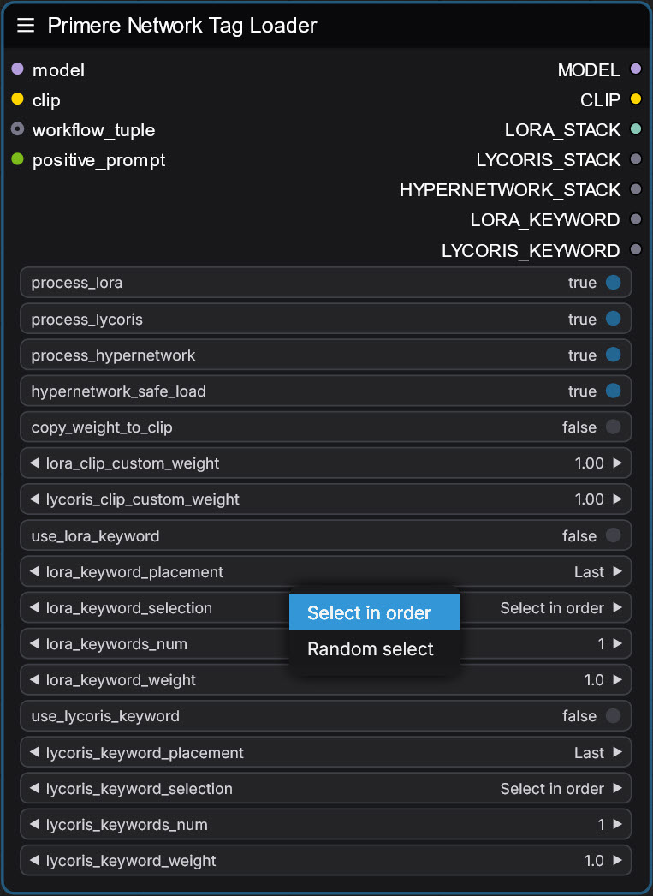

This node manages additional networks such as Lora, Lycoris, and hypernetworks from prompt in A1111 style like: `<lora:Pencil_Sketch:0.8>`. These networks add flexibility in image generation by modifying model behavior and prompts. Below are the settings available for this node:

- `model`: Connect the model input
- `clip`: Connect the CLIP input
- `workflow_tuple`: Connect workflow data
- `positive_prompt`: Connect the prompt

#### Settings:

- `process_lora`: Enable processing of Loras
- `process_lycoris`: Enable processing of Lycoris
- `process_hypernetwork`: Enable processing of Hypernetworks
- `hypernetwork_safe_load`: Enable safe loading of Hypernetworks to prevent conflicts
- `copy_weight_to_clip`: If enabled, copies the Model weight to the CLIP too (on all networks)
- `lora_clip_custom_weight`: Different weight for Lora networks to the CLIP model
- `lycoris_clip_custom_weight`: Different weight for Lycoris networks on the CLIP
- `use_lora_keyword`: Enable to use Lora-specific keywords in prompts
- `lora_keyword_placement`: Placement of the Lora keyword in the prompt (e.g., Last, First)
- `lora_keyword_selection`: Method for selecting Lora keywords if more than one available (e.g., Select in order, random, etc...).
- `lora_keywords_num`: Number of Lora keywords to include to prompt
- `lora_keyword_weight`: Set the weight of Lora keywords in the prompt
- `use_lycoris_keyword`: Enable to use Lycoris-specific keywords in prompts
- `lycoris_keyword_placement`: Placement of the Lycoris keyword in the prompt (e.g., Last, First)
- `lycoris_keyword_selection`: Method for selecting Lycoris keywords (e.g., Select in order, randomize, etc...).
- `lycoris_keywords_num`: Number of Lycoris keywords to include to the prompt
- `lycoris_keyword_weight`: Set the weight of Lycoris keywords in the prompt

### Benefits:

- `Enhanced Control`: Allows fine-tuning of model behavior using additional networks
- `Prompt Customization`: Adjusts prompts dynamically using Lora and Lycoris keywords for more refined image generation
- `Network Compatibility`: Supports multiple network types, providing flexibility in mixing styles and behaviors
- `Workflow Integration`: Seamlessly integrates with existing models and workflows in ComfyUI for consistent results

<hr>

# <ins>Primere Embedding Handler:</ins>

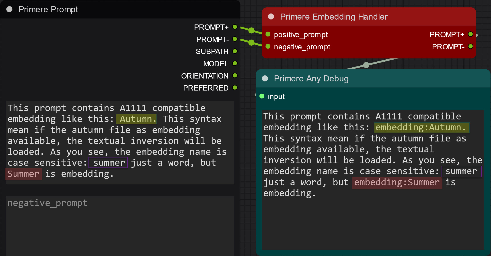

A ComfyUI node that automatically converts Automatic1111-style textual inversion embedding syntax to ComfyUI-compatible format.

### Description:

This node allows you to use Automatic1111-style embedding syntax in your prompts while working in ComfyUI. It automatically detects embedding keywords and converts them to the proper ComfyUI format.

### How It Works:

#### Input Format (Automatic1111 style):
- Simple keywords like `Autumn` or `Summer`
- No special prefix needed
- Must match exactly with embedding filename (case-sensitive) without extension

#### Output Format (ComfyUI style):
- Converted to `embedding:Autumn` or `embedding:Summer`
- Properly formatted for ComfyUI processing
- Only converts if matching embedding file exists

### Example:

Input prompt:
```
This prompt contains Autumn. The embedding name is case sensitive: summer just a word, but Summer is embedding.
```

Output prompt:
```
This prompt contains embedding:Autumn. The embedding name is case sensitive: summer just a word, but embedding:Summer is embedding.
```

### Features:

- Seamless conversion between Automatic1111 and ComfyUI embedding formats
- Case-sensitive matching to prevent unwanted conversions
- Only converts existing embeddings
- Works with both positive and negative prompts
- Real-time conversion during workflow execution

### Benefits:

- Use Automatic1111 prompts directly in ComfyUI without manual conversion
- Maintain compatibility with existing prompt collections
- Reduce errors from incorrect embedding syntax
- Save time on prompt formatting

<hr>