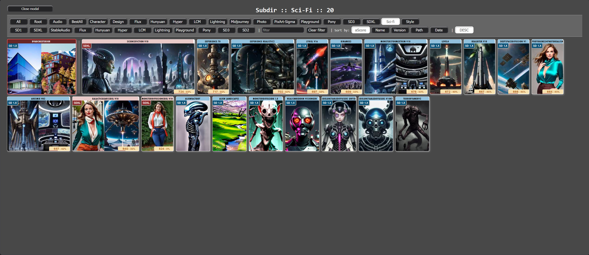
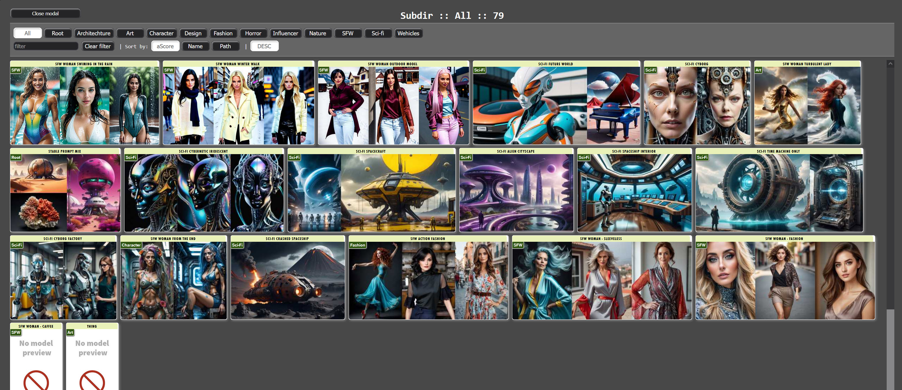

# <ins>Visual Checkpoint Selector:</ins>

The Visual Checkpoint Selector helps you choose and manage AI models (checkpoints) in your workflow with a visual (or legacy list) interface.

### Basic Usage:
Select your AI model from the `base_model` dropdown list, which shows all installed models on your system.

### Visual Selection Mode:
Toggle `show_modal` to ON to open a visual gallery of preview images for each model. This makes it easier to choose the right model by seeing example outputs.

### Preview Settings:
- Select `preview_path`:
  - `Primere legacy` - uses custom path for preview images
  - `Model path` - uses preview images from your original model folder

- `show_hidden` controls visibility of hidden files/folders (those starting with a dot)

Visual `checkpoint` selection, automatized filtering by subdirectories (first row of buttons) and versions (second row of buttons):

### Random Model Feature:
Turn on `random_model` to automatically select random models from the current folder. For example, if you've selected checkpoint from "Photo" folder, it will randomly pick from any model in that folder. This is useful for batch processing too.

### Aesthetic Score percent display:
- `aescore_percent_min`: Because the preview images show aesthetic scores if saved and measured, this value or less mean 0% 
- `aescore_percent_max`: Because the preview images show aesthetic scores if saved and measured, this value or more mean 100%

These scores help sorting models based on their quality ratings.

**When all data available, thse badges will visible in the preview:**

- **Top left:** model concept (Flux, SD1, SD2, SDXL, etc...)
- **Top right:** if symlinked, what type of diffuser linked
- **Botom:** the average aesthetic score. Have to use aesthetic scorer node before store this data for checkpoints and saved prompts. The number is the average, but the percent depending on the checkpoint selector settings, where the `aescore_percent_min` and lower value mean 0%, `aescore_percent_max` and higher mean 100%.

# <ins>Resolution Selector:</ins>

This node helps you set the perfect image dimensions for your generations with preset ratios or custom settings.

### Basic Resolution Selection:
- Choose from predefined aspect ratios in the `ratio` dropdown (Photo, Portrait, Old TV, HD, HD+, Square, etc.)
- Use `resolution` mode:
 * "Auto" - automatically sets base resolution based on your selected model. If the model version available this settings useful.
 * "Manual" - lets you input custom dimensions bases using:
   - `sd1_res`: Base resolution for SD1 models (768 default)
   - `sdxl_res`: Base resolution for SDXL models (1024 default)
   - `turbo_res`: Base resolution for Turbo models (512 default)

### Image Orientation:
- Set `orientation` to Horizontal or Vertical
- Enable `rnd_orientation` to randomly switch between orientations. This function useful for batch generation.
- `round_to_standard` re-count dimensions to "standard" of selected AI models

### Custom Ratio Settings:
Enable `calculate_by_custom` to use your own aspect ratios (example: 1.6:2.8):
- `custom_side_a`: First side ratio (e.g., 1.60)
- `custom_side_b`: Second side ratio (e.g., 2.80)

Note: Aspect ratios can be customized by editing the external .toml configuration file from path: `Toml/resolution_ratios.toml`

# <ins>Primere Prompt:</ins>

The Prompt node provides advanced prompt control with organization features and special settings.

### Prompt Inputs:
- `positive_prompt`: Enter your main prompt describing what you want to create
- `negative_prompt`: Enter elements you want to avoid in the generation

### Organization Features:
- `subpath`: Save your generated images into themed folders (e.g., "CutePets", "Sci-Fi, etc...")
- `model`: Choose a specialized model for specific types of images (e.g., interior, exterior, etc...). This is standard model list.

### Orientation Control:
Choose how to handle image orientation:
- `None`: Use default orientation from `Resolution Selector` node
- `Random`: Randomly switch between **horizontal** and **vertical**. This function useful for batch generation.
- `Horizontal`: Force **horizontal** composition
- `Vertical`: Force **vertical** composition

The orientation setting helps compose your image properly for your selected subject matter.

# <ins>Prompt Switch:</ins>

A control node that lets you quickly switch between different prompt sources in your workflow, including `Style Selector` nodes.

### How It Works:
- Connect multiple prompt sources to this node (any different sources), but the connection and unconnection queue is important. If failed, just reload the browser.
- Use the `select` input to choose which prompt source to use (1-any)
- The selected prompt source becomes active, while others remain inactive

### Usage Example:
If you have different prompts for:
- Portrait shots
- Landscape scenes
- Character designs

You can connect all of them to the Prompt Switch and easily toggle between them using the selector, without needing to reconnect nodes or modify your workflow.

# <ins>Visual Style Selector:</ins>

A powerful tool that lets you save and load complete prompt configurations using a visual interface or simple list.

### Basic Usage:
- Choose from saved styles using the `styles` dropdown
- Toggle `show_modal` to switch between:
 * List view: Simple dropdown of style names
 * Visual view: Preview images of each style's output

Visual `saved prompt` selection `(csv source)`, automatized filtering by categories:

### Style Components:
Each saved style can include:
- Name of saved prompt
- Positive and negative prompts
- Specific orientation
- Custom save folder (subpath)
- Model preference

### Control Options:
- `use_subpath`: Apply the style's saved folder path
- `use_model`: Use the style's recommended/preferred model
- `use_orientation`: Apply the style's preferred orientation
- `show_hidden`: Show/hide styles names or path contains word `nsfw`
- `random_prompt`: Randomly select prompt from available styles from same subpath as selected

### Quality sorting:
- `aescore_percent_min`: Because the preview images show aesthetic scores if saved and measured, this value or less mean 0% 
- `aescore_percent_max`: Because the preview images show aesthetic scores if saved and measured, this value or more mean 100% 

Note: Styles are stored in an external .csv file that can be easily edited and shared. Rename `stylecsv/styles.example.csv` to `stylecsv/styles.csv` and use your own prompt collection.