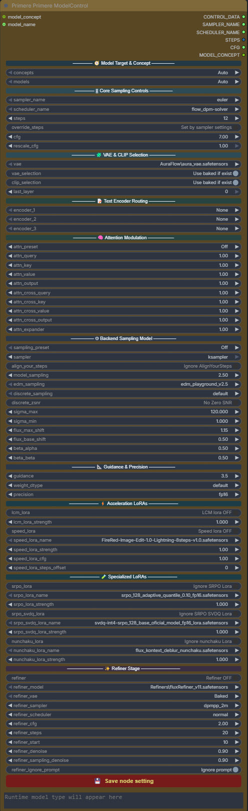
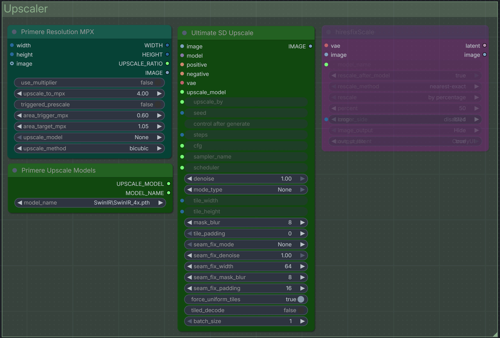
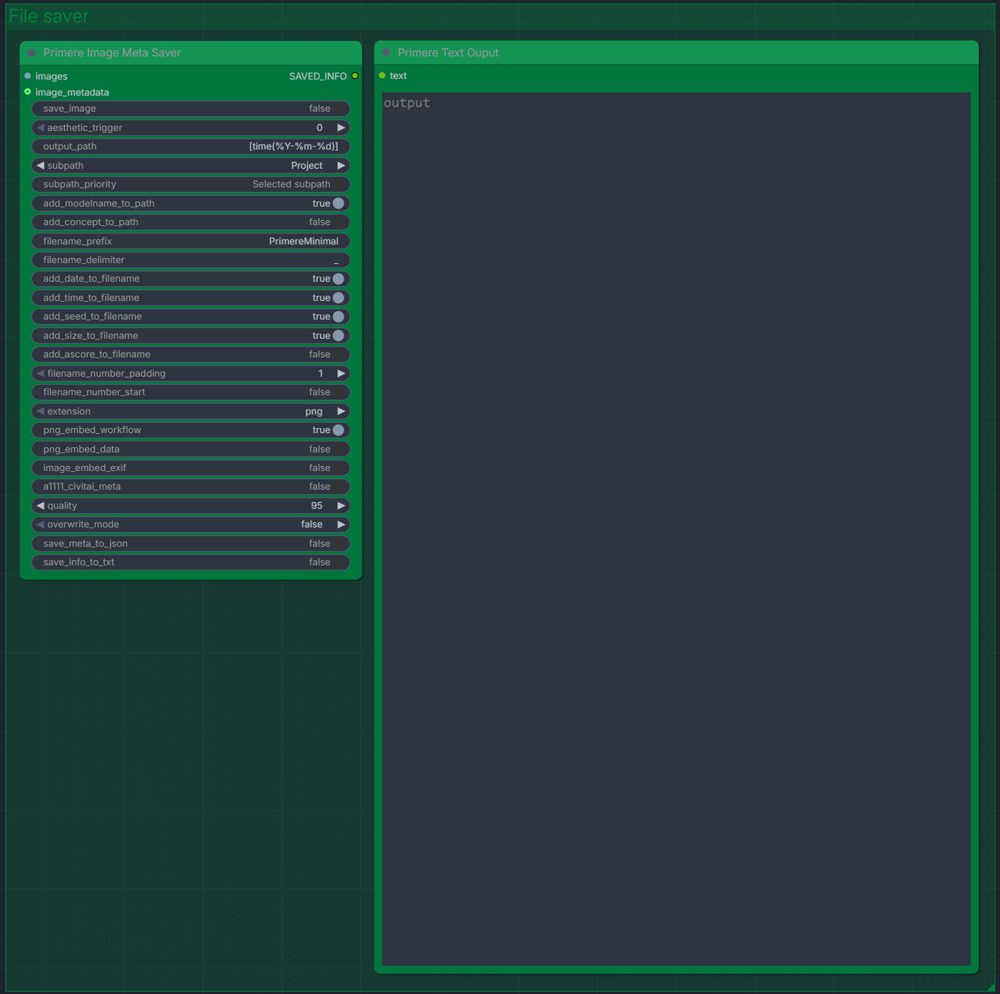
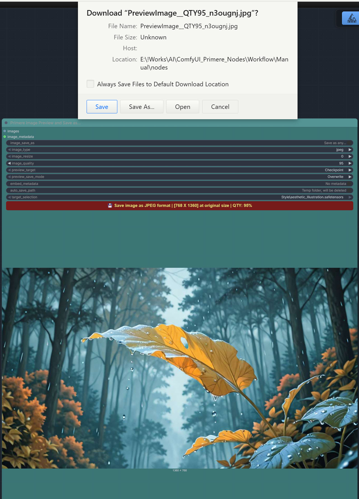
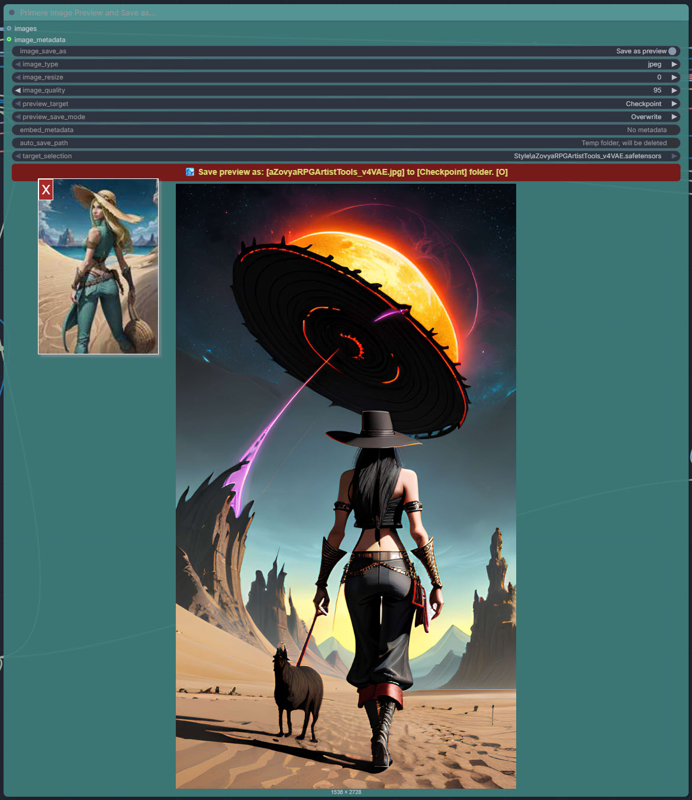

# Minimal Workflow - Node Groups Manual

<hr>

## Dashboard Group

The Dashboard consolidates model loading, seed control, and resolution settings in a unified interface. This group handles all baseline generation parameters before prompt encoding.


<hr>

### Visual Checkpoint Selector:

**Purpose:** Select and load AI model checkpoints with visual preview interface, automatic directory filtering, and aesthetic quality scoring.

#### Primary Settings:

| Setting | Purpose |
|---------|---------|
| `base_model` | Select checkpoint from dropdown or visual gallery |
| `show_modal` | Toggle visual gallery preview mode ON/OFF |
| `preview_path` | Choose preview image source: "Primiere legacy" or "Model path" |
| `show_hidden` | Show/hide hidden files and folders (dot-prefixed) |
| `random_model` | Automatically select random checkpoint from current folder |

#### Aesthetic Scoring Display on visual previews:

| Setting | Purpose |
|---------|---------|
| `aescore_percent_min` | Lower bound for quality scaling (maps to 0%) |
| `aescore_percent_max` | Upper bound for quality scaling (maps to 100%) |

### The visual preview modal:


#### Interface Layout:

**Row 1 - Directory Structure:** Filter checkpoints by folder organization `(e.g., Root, Flux, SD1, SDXL, Photo, Design, Character, Style, etc.)`. Buttons represent your checkpoint folder hierarchy for quick categorization.

**Row 2 - Model Types:** Filter by supported model concept `(SD1, SD2, SDXL, Flux, Hunyuan, LCM, Lightning, Playground, Pony, SD3, Turbo, StableCascade, KwaiKolors, PixartSigma, SANA, Illustrious, Nunchaku, OwnGen, Wan2V, Wan1Edit, AuraFlow, Chroma, Waning, HiDream, Mochi, Cosmos, Flux2, LTXV, Z-Image)`.

**Row 3 - Controls:** Filter text search, clear filter, sort options `(aScore, Name, Version, Path, Date, Symlink, STime)`, and sort direction.

#### Preview badges show:


- **Top left:** Model concept (Flux, SD1, SDXL, etc.)
- **Top right:** Symlink type if applicable
- **Bottom:** Average aesthetic score as percentage (based on min/max range)

**Note:** Aesthetic scores require pre-computed data from aesthetic scorer node stored with checkpoint.

---

### Checkpoint Loader

Automatically loads selected checkpoint, VAE, and CLIP model based on Visual Checkpoint Selector choice and automatically detected model concept. This node controlled by the data tuple on the external `control_data` input. Outputs:
- `loaded_model`: Model tensor
- `loaded_clip`: CLIP encoder
- `loaded_vae`: VAE decoder
- `control_data`: Model metadata and version info

**No manual configuration required** — uses cached settings of saved model concept json.

**Integration Note:** This node's `control_data` output feeds to **Primiere Model Control** node, which reads the model metadata and automatically configures all downstream sampling/CFG/VAE/CLIP settings per model type. Model Control is the central hub that orchestrates the entire workflow.

---

### Primiere Model Control

**Purpose:** Central hub that controls ALL generation settings (sampling, CFG, steps, VAE, CLIP, encoders, LoRAs, refiners, etc.) per model type or individual checkpoint. Auto-saves/loads settings to/from JSON config files for reproducibility and system-wide automation.



#### Core Concept:

This node is the **system backbone** that automates workflow adaptation based on selected model. Instead of manually tweaking 50+ parameters, Model Control:

1. **Reads selected model** from Checkpoint Selector or model name input
2. **Loads saved settings** for that model type/name from JSON config
3. **Outputs control_data tuple** containing all settings to downstream nodes
4. **Allows testing & saving** new settings for specific models
5. **Reverts to "Auto" mode** for external control via workflow inputs

#### Dual Operation Modes:

---

#### Mode 1: "Auto" (Automated via Workflow Inputs)

When `concepts` and `models` both set to "Auto":
- Reads `model_concept` from Checkpoint Loader `CONTROL_DATA`
- Reads `model_name` from Checkpoint Selector
- **Automatically loads** all saved settings for this model from JSON
- All sampler, `CFG`, `VAE`, encoder settings auto-applied downstream
- Workflow fully automated — just select checkpoint, everything else adjusts

**Use case:** Production workflows where model selection drives all parameters.

---

#### Mode 2: Manual Testing & Saving

When you set `concepts` or `models` to specific values (not `Auto`):
- **Override** auto-loaded settings with manual values
- Test different configurations for a checkpoint
- Click `Save node setting` button to persist settings to JSON
- Next time "Auto" is selected, these new settings load automatically

**Use case:** Tuning optimal parameters for a new checkpoint, then saving for future use.

---

#### Model Selection:

| Input | Purpose |
|-------|---------|
| `model_concept` | Auto-detected from Checkpoint Loader, or manually override `(SD1, SD2, SDXL, Flux, etc.)` |
| `model_name` | Auto-detected checkpoint name, or manually select from dropdown |
| `concepts` | Set to `Auto` for auto-control, or choose specific concept to test |
| `models` | Set to `Auto` for auto-control, or choose specific model to test |

---

#### Sampling Control:

| Setting | Purpose |
|---------|---------|
| `sampler_name` | Sampling algorithm: `euler, dpmpp_2m, dpmpp_sde`, etc. (all KSampler samplers) |
| `scheduler_name` | Noise schedule: `karras, normal, exponential`, etc. (all KSampler + KwaiKolors + SANA schedulers) |
| `steps` | Number of diffusion steps (1-1000, default 12) |
| `override_steps` | "Set by sampler settings" (OFF) reads from sampler config, `Set by model filename` (ON) extracts steps from checkpoint name |
| `cfg` | Classifier-free guidance scale (0.1-100, default 7.0) |
| `rescale_cfg` | CFG rescaling for improved quality (0.0-1.0, default 1.0) |

---

#### VAE & CLIP Selection:

| Setting | Purpose |
|---------|---------|
| `vae` | VAE model selection from available models |
| `vae_selection` | "Use baked if exist" (ON) = prefer `VAE` baked into checkpoint, `Always use custom` (OFF) = use selected VAE |
| `clip_selection` | "Use baked if exist" (ON) = prefer `CLIP` in checkpoint, `Always use custom` (OFF) = use selected CLIP |
| `last_layer` | CLIP layer to use (-24 to 0, default 0 = all layers) |

---

#### Multi-Encoder Configuration (Advanced):

Support for models with multiple text encoders `(SDXL, SD3, Flux, Hunyuan, etc.)`:

| Setting | Purpose |
|---------|---------|
| `encoder_1` | Primary text encoder (None or specific encoder) |
| `encoder_2` | Secondary text encoder (None or specific encoder) |
| `encoder_3` | Tertiary text encoder (None or specific encoder) |

Each encoder can be: None, custom text encoder, `CLIP`, `UNET`, or path reference.

---

#### Attention Control (Advanced):

Fine-tune attention mechanisms for quality/style adjustment:

| Setting | Purpose |
|---------|---------|
| `attn_preset` | Quick preset: Custom, Off, or saved presets from `ATTN_PRESETS` |
| `attn_query` | Query attention weight (0.80-1.20, default 1.00) |
| `attn_key` | Key attention weight (0.80-1.20, default 1.00) |
| `attn_value` | Value attention weight (0.80-1.20, default 1.00) |
| `attn_output` | Output attention weight (0.80-1.20, default 1.00) |
| `attn_cross_query` | Cross-attention query (0.80-1.20, default 1.0) |
| `attn_cross_key` | Cross-attention key (0.80-1.20, default 1.0) |
| `attn_cross_value` | Cross-attention value (0.80-1.20, default 1.0) |
| `attn_cross_output` | Cross-attention output (0.80-1.20, default 1.0) |
| `attn_expander` | Attention expansion factor (0.10-3.00, default 1.00) |

---

#### Sampling Mode Selection:

| Setting | Purpose |
|---------|---------|
| `sampler` | "ksampler" (standard) or "custom_advanced" (advanced sampling modes) |
| `align_your_steps` | Use AlignYourSteps optimization (ON/OFF, default OFF) |

---

#### Sampling Parameters (Model-Specific):

**EDM Sampling (Playground, etc.):**

| Setting | Purpose |
|---------|---------|
| `model_sampling` | Sampling scale (0.0-10.0, default 2.5) |
| `edm_sampling` | EDM variant: edm_playground_v2.5, `v_prediction, edm, eps, cosmos_rflow` |

**Discrete Sampling (SD1/SDXL/SD3):**

| Setting | Purpose |
|---------|---------|
| `discrete_sampling` | `default, eps, v_prediction`, or `x0` |
| `discrete_zsnr` | `Zero SNR` mode (ON/OFF, default OFF) |

**Sigma Control:**

| Setting | Purpose |
|---------|---------|
| `sigma_max` | Maximum sigma value (1-200, default 120) |
| `sigma_min` | Minimum sigma value (0.001-100, default 1) |

**Flux-Specific:**

| Setting | Purpose |
|---------|---------|
| `flux_max_shift` | Max shift for `Flux` sampling (0.0-100.0, default 1.15) |
| `flux_base_shift` | Base shift for `Flux` (0.0-100.0, default 0.5) |

**Beta Parameters:**

| Setting | Purpose |
|---------|---------|
| `beta_alpha` | Beta alpha for noise schedule (0.0-50.0, default 0.6) |
| `beta_beta` | Beta beta for noise schedule (0.0-50.0, default 0.6) |

---

#### Model Precision & Guidance:

| Setting | Purpose |
|---------|---------|
| `guidance` | Global guidance scale (0.0-100.0, default 3.5) |
| `weight_dtype` | Weight data type: `None, Auto, default, fp16, bf16, fp32, fp8` |
| `precision` | Model precision: `None, fp32, fp16, quant8, quant4` |

---

#### Speed LoRAs (Pre-built for fast generation):

**LCM LoRA:**

| Setting | Purpose |
|---------|---------|
| `lcm_lora` | Enable `LCM` (Latent Consistency Model) LoRA (ON/OFF, default OFF) |
| `lcm_lora_strength` | `LCM` strength (-20.0 to 20.0, default 1.0) |

**Speed LoRAs (Lightning, Hyper, Turbo):**

| Setting | Purpose |
|---------|---------|
| `speed_lora` | Enable speed LoRA (ON/OFF, default OFF) |
| `speed_lora_name` | Choose: `Lightning, Hyper, Turbo` variant |
| `speed_lora_strength` | Strength (-20.0 to 20.0, default 1.0) |
| `speed_lora_cfg` | CFG adjustment for speed LoRA (0.1-100, default 1.0) |
| `speed_lora_steps_offset` | Step offset (-5 to 5, default 0) |

**SRPO LoRA (Quality enhancement):**

| Setting | Purpose |
|---------|---------|
| `srpo_lora` | Enable `SRPO` quality LoRA (ON/OFF, default OFF) |
| `srpo_lora_name` | Select `SRPO` variant |
| `srpo_lora_strength` | Strength (-20.0 to 20.0, default 1.0) |

**SRPO SVDQ LoRA:**

| Setting | Purpose |
|---------|---------|
| `srpo_svdq_lora` | Enable `SRPO SVDQ` LoRA (ON/OFF, default OFF) |
| `srpo_svdq_lora_name` | Select `SRPO SVDQ` variant |
| `srpo_svdq_lora_strength` | Strength (-20.0 to 20.0, default 1.0) |

**Nunchaku LoRA:**

| Setting | Purpose |
|---------|---------|
| `nunchaku_lora` | Enable `Nunchaku` LoRA (ON/OFF, default OFF) |
| `nunchaku_lora_name` | Select `Nunchaku` variant |
| `nunchaku_lora_strength` | Strength (-20.0 to 20.0, default 1.0) |

---

#### Refiner Stage (Two-Stage Generation):

| Setting | Purpose |
|---------|---------|
| `refiner` | Enable refiner model for second generation stage (ON/OFF, default OFF) |
| `refiner_model` | Refiner checkpoint (e.g., RealESRGAN Refiner, etc.) |
| `refiner_sampler` | Refiner sampling algorithm |
| `refiner_scheduler` | Refiner noise schedule |
| `refiner_cfg` | Refiner `CFG` scale (0.1-100, default 2.0) |
| `refiner_steps` | Refiner `steps` (10-30, default 22) |
| `refiner_start` | When to start refiner stage (1-1000, default 12) |
| `refiner_denoise` | Refiner `denoise strength` (0.0-1.0, default 0.9) |
| `refiner_sampling_denoise` | Refiner `sampling denoise` (0.0-1.0, default 0.9) |
| `refiner_ignore_prompt` | `Ignore prompt` (ON) = skip prompt for refiner, `Send prompt to refiner` (OFF) = use original prompt |

---

#### Outputs:

| Output | Purpose |
|--------|---------|
| `CONTROL_DATA` | Main output: tuple containing all settings (sent to other nodes) |
| `SAMPLER_NAME` | Selected sampler algorithm |
| `SCHEDULER_NAME` | Selected noise schedule |
| `STEPS` | Number of steps |
| `CFG` | CFG scale value |
| `MODEL_CONCEPT` | Detected/selected model concept `(SD1, Flux, etc.)` |

---

#### Workflow Integration:

**Control Flow:**
1. Visual Checkpoint Selector → `model_concept` + `model_name` inputs (auto mode)
2. Model Control reads saved JSON settings for this model
3. Model Control outputs `CONTROL_DATA` tuple
4. Downstream nodes (Sampler, Encoder, etc.) read `CONTROL_DATA` for all their settings
5. No manual sampler/CFG/VAE tuning needed — fully automated

**Customization & Persistence:**
1. Set `concepts` or `models` to specific values (override `Auto`)
2. Adjust any settings manually
3. Click `Save node setting` button
4. Settings stored to JSON per model concept/name
5. Switch back to `Auto` mode
6. Next time this model selected, custom settings auto-load

---

#### Example Workflows:

**Production (Fully Automated):**
```
concepts: Auto
models: Auto
refiner: ON (if supporting model)
speed_lora: OFF
```
→ Select checkpoint in Visual Selector, everything else auto-configures

**Testing New model concept:**
```
concepts: Flux (manual)
models: Auto
sampler_name: euler
steps: 25
cfg: 7.5
refiner: OFF
speed_lora: ON (test with Lightning)
```
→ Test and save settings for model concept, then switch back `concepts` to "Auto"

**Testing New Checkpoint:**
```
concepts:Auto
models: [any existing checkpoint name]
sampler_name: euler
steps: 25
cfg: 7.5
refiner: OFF
speed_lora: ON (test with Lightning)
```
→ Test and save settings for individual model only, then switch back `models` to "Auto"

**Fast Generation (Speed LoRA):**
```
speed_lora: ON
speed_lora_name: Lightning-SD15-Steps (example)
speed_lora_strength: 1.0
steps: 8
cfg: 3.5
```
→ 4-8 step generation with quality preservation

---

<hr>

### Fast Seed Control

`Why fast? Because no fron-tend for seed generation, only for result display. For large queue settings much faster than anything else.` 

| Setting | Purpose |
|---------|---------|
| `seed_setup` | "Random" = new seed each run, "Custom" = use fixed value |
| `custom_seed` | Fixed seed value when `seed_setup` = "Custom" |
| `random_seed` | Read-only output showing last generated seed |

---

### Resolution Selector

**Purpose:** Define output image dimensions with preset aspect ratios or custom settings.

#### Basic Selection:

| Setting | Options                                        | Purpose |
|---------|------------------------------------------------|---------|
| `ratio` | Photo, Portrait, Square, HD, HD+, Old TV, etc. | Predefined aspect ratios |
| `resolution` | Auto / Manual                                  | "Auto" = model-based defaults, "Manual" = custom base resolution |

#### Model-Based Auto Resolution:

When `resolution` = "Auto":
- resolution automatically set by the internal settings for actual selected model concept.

#### Manual Resolution:

When `resolution` = "Manual", manually specify base dimensions per model:
- set the target resolution in megapixels on `manual_res` combo. This will overwrite the automatic value.

#### Orientation Control:

| Setting | Purpose |
|---------|---------|
| `orientation` | Horizontal or Vertical composition |
| `rnd_orientation` | Randomly alternate between orientations (useful for batch generation) |
| `round_to_standard` | Force dimensions to model-native standards |

#### Custom Aspect Ratios:

Enable `calculate_by_custom` to define custom ratios (e.g., 1.6:2.8):
- `custom_side_a`: First ratio component (e.g., 1.60)
- `custom_side_b`: Second ratio component (e.g., 2.80)

**Note:** Preset ratios editable in `Toml/resolution_ratios.toml`

<hr>

## Prompt Input Group

The Prompt Input Group handles manual prompt entry, saving, and visual selection of pre-built or saved prompts. This group provides flexible workflows for both real-time prompt writing and reusable prompt library management.


<hr>

### Primiere Prompt (Manual Input)

**Purpose:** Write positive and negative prompts directly with organization metadata, then save to external CSV file for later reuse.

#### Inputs:

| Input | Purpose |
|-------|---------|
| `PROMPT+` | Positive prompt text area (multiline) |
| `PROMPT-` | Negative prompt text area (multiline) |
| `SUBPATH` | Folder organization category for saved images |
| `MODEL` | Preferred checkpoint for this prompt |
| `ORIENTATION` | Preferred image orientation (None/Horizontal/Vertical/Random) |

#### Outputs:

| Output | Purpose                                                 |
|--------|---------------------------------------------------------|
| `PROMPT+` | Positive prompt text                                    |
| `PROMPT-` | Negative prompt text                                    |
| `SUBPATH` | Image save category                                     |
| `MODEL` | Preferred model                                         |
| `ORIENTATION` | Preferred orientation                                   |
| `PREFERRED` | Aggregation of model, subpath + orientation preferences |

#### Save to External CSV:

Click "Save prompt to file..." button to open the prompt saver dialog. This saves your manually crafted prompt to an external CSV file for reuse via Visual Style Selector or Visual Prompt CSV nodes.


**Dialog Fields:**
- **Prompt name:** Create new or overwrite existing saved prompt from list
- **Prompt category (subpath):** Assign category/folder (e.g., "SeasonBackground", "Architecture", "Nature")
- **Positive prompt:** Auto-populated from input, editable
- **Negative prompt:** Auto-populated from input, editable
- **Preferred Model:** Read-only, set from Primiere Prompt input node
- **Preferred Orientation:** Read-only, set from Primiere Prompt input node

**Workflow Benefit:** Save a well-crafted prompt once, then load it instantly across projects via Visual Style Selector or Visual Prompt CSV nodes without retyping.

**Backup Note:** Keep backup of `custom_nodes/ComfyUI_Primere_Nodes/stylecsv/styles.csv` before bulk changes.

---

### Visual Style Selector

**Purpose:** Select and load pre-saved prompts with visual gallery preview and category filtering.


#### Settings:

| Setting | Options | Purpose |
|---------|---------|---------|
| `styles` | Dropdown | Choose saved prompt from list |
| `show_modal` | ON/OFF | Toggle between dropdown list and visual gallery preview |
| `show_hidden` | ON/OFF | Show/hide items with "nsfw" in name or path |
| `use_subpath` | ON/OFF | Apply the saved prompt's folder category to output |
| `use_model` | ON/OFF | Apply the saved prompt's preferred checkpoint |
| `use_orientation` | ON/OFF | Apply the saved prompt's preferred orientation |
| `random_prompt` | ON/OFF | Randomly select from same category as currently selected prompt |
| `aescore_percent_min` | Integer | Lower quality threshold (maps to 0%) for preview sorting |
| `aescore_percent_max` | Integer | Upper quality threshold (maps to 100%) for preview sorting |

#### Modal Interface:

**Row 1 - Category Buttons:** Filter by saved prompt categories `(Architecture, Art, Character, Design, Edit, Horror, Influencer, Nature, Photography, Sci-Fi, Vehicles, Others)`

**Row 2 - Controls:** Text filter, clear filter, sort options `(aScore, Name, Path)` and sort direction `(Acending, Descending)`.

**Gallery:** Preview images of each saved prompt with average value of aesthetic scores calculated from historic generations.

**CSV Source:** Rename `stylecsv/styles.example.csv` to `stylecsv/styles.csv` and populate with your own prompts. Format: `columns for name, positive, negative, category (subpath), preferred model, preferred orientation`.

---

### Visual Prompt CSV (Auto-Organized)

**Purpose:** Load saved prompts with automatic category organization and visual preview. Same functionality as Visual Style Selector but with pre-organized category dropdowns.

#### Settings:

Same as Visual Style Selector `(show_modal, show_hidden, use_subpath, use_model, use_orientation, random_prompt, aescore thresholds)`.

#### Workflow:

1. Select category from dropdown (e.g., "Architecture", "Nature")
2. Choose specific prompt from that category
3. All metadata `(prompt text, model, orientation)` loads automatically

**Primary Difference from Style Selector:** Categories automatically organized from CSV folder structure, useful for large prompt libraries.

---

### Primiere Prompt Switch

**Purpose:** Dynamically select between multiple prompt sources in a single node.

#### Functionality:

- Connect multiple prompt source nodes `(Primiere Prompt, Visual Style Selector, Visual Prompt CSV, or compatible nodes)`
- Use `select` input to choose active prompt (1, 2, 3, etc.)
- Only the selected prompt flows downstream; others inactive

**Use Case:** Test multiple prompt variants without reconnecting nodes. Connect 3-5 different prompt sets and toggle between them with a single numerical selector.

#### Outputs:

| Output | Purpose |
|--------|---------|
| `PROMPT+` | Active positive prompt from selected source |
| `PROMPT-` | Active negative prompt from selected source |
| `SUBPATH` | Active subpath from selected source |
| `MODEL` | Active model from selected source |
| `ORIENTATION` | Active orientation from selected source |
| `PREFERRED` | Aggregated preferences from selected source |

---

### Primiere Dynamic

**Purpose:** Support dynamic prompt syntax with random selection.

#### Inputs:

| Input | Purpose |
|-------|---------|
| `dyn_prompt` | Prompt string with dynamic template syntax |
| `seed` | Seed for reproducible randomization |

**Syntax:** Use bracket notation for random selection: `{option1|option2|option3}`

**Output:** `PROMPT` — resolved prompt with one random option selected per bracket.

**Manual:** [https://github.com/adieyal/sd-dynamic-prompts/blob/main/docs/SYNTAX.md#basic-syntax](https://github.com/adieyal/sd-dynamic-prompts/blob/main/docs/SYNTAX.md#basic-syntax)

---

### Primiere Embedding Handler

**Purpose:** Auto-convert Automatic1111-style embedding syntax to ComfyUI format.

#### Conversion:

- **Input:** `Autumn` (plain word matching embedding filename, case-sensitive)
- **Output:** `embedding:Autumn` (ComfyUI-compatible format)


**Requirement:** Embedding file must exist with exact name match.

#### Inputs:

| Input | Purpose |
|-------|---------|
| `positive_prompt` | Positive prompt with potential embedding keywords |
| `negative_prompt` | Negative prompt with potential embedding keywords |

#### Outputs:

| Output | Purpose |
|--------|---------|
| `positive_prompt` | Converted positive prompt with embedding: prefixes |
| `negative_prompt` | Converted negative prompt with embedding: prefixes |

---

<hr>

## Encoder, Sampler, Decoder Group

The Encoder, Sampler, Decoder group handles prompt encoding to latent space, noise generation, sampling/diffusion, latent-to-image conversion, and quality scoring. This is the core generation pipeline.


<hr>

### Primiere Noise Latent

**Purpose:** Generate random latent noise tensor as initialization for diffusion process.

#### Inputs:

| Input | Purpose |
|-------|---------|
| `width` | Image width in pixels |
| `height` | Image height in pixels |
| `noise_seed` | Seed for reproducible noise generation |
| `optional_vae` | VAE for noise scaling (optional) |

#### Settings:

| Setting | Purpose                                            |
|---------|----------------------------------------------------|
| `rand_noise_type` | Randomize noise type per generation (ON/OFF)       |
| `noise_type` | Noise distribution: white, gaussian, etc.          |
| `rand_alpha_exponent` | Randomize alpha exponent per generation (ON/OFF)   |
| `alpha_exponent` | Alpha blending exponent (default 1.000)            |
| `alpha_exp_rand_min` | Minimum random alpha exponent (default 0.500)      |
| `alpha_exp_rand_max` | Maximum random alpha exponent (default 1.500)      |
| `rand_modulator` | Randomize modulation per generation (ON/OFF)       |
| `modulator` | Noise modulation factor (default 1.00)             |
| `modulator_rand_min` | Minimum random modulation (default 0.80)           |
| `modulator_rand_max` | Maximum random modulation (default 1.40)           |
| `rand_device` | Randomize device (GPU/CPU) per generation (ON/OFF) |
| `device` | Compute device: cpu, cuda                          |
| `expand_random_limits` | Expand limits beyond defaults (ON/OFF)             |

#### Outputs:

| Output | Purpose |
|--------|---------|
| `LATENTS` | Generated latent noise tensor |
| `PREVIEWS` | Preview images of noise pattern |
| `CONTROL_DATA` | Metadata and generation settings |

---

### Primiere Prompt Encoder

**Purpose:** Encode positive and negative prompts into CLIP embeddings for guidance during sampling.

**Key Note:** All encoding parameters (token normalization, weight interpretation, style handling, etc.) are controlled by **Primiere Model Control** node. The encoder automatically reads from `control_data` tuple to apply model-specific encoding strategies without manual adjustment.

#### Inputs:

| Input | Purpose |
|-------|---------|
| `clip` | CLIP model from Checkpoint Loader |
| `positive_prompt` | Positive prompt text to encode |
| `negative_prompt` | Negative prompt text to encode |
| `enhanced_prompt` | Optional enhanced/refined positive prompt |
| `edit_image_list` | Optional image list for editing mode |
| `edit_vae` | Optional VAE for image editing |

#### Settings:

| Setting | Purpose |
|---------|---------|
| `negative_strength` | Strength multiplier for negative guidance (default 1.20) |
| `use_int_style` | Use internal style preprocessing (ON/OFF) |
| `int_style_pos` | Positive internal style application (None, custom, etc.) |
| `int_style_pos_strength` | Strength of positive style (default 1.00) |
| `int_style_neg` | Negative internal style (None, custom, etc.) |
| `int_style_neg_strength` | Strength of negative style (default 1.00) |
| `adv_encode` | Advanced encoding mode (ON/OFF) |
| `token_normalization` | Token normalization method: mean, max, etc. |
| `weight_interpretation` | Weight interpretation: comfy++, A1111, etc. |
| `enhanced_prompt_usage` | How to use enhanced prompt: T5-XXL, append, etc. |
| `enhanced_prompt_strength` | Strength of enhanced prompt (default 1.00) |
| `opt_pos_strength` | Optimization strength for positive (default 1.00) |
| `opt_neg_strength` | Optimization strength for negative (default 1.00) |
| `style_handling` | How to handle style injection: Style-prompt merge, etc. |
| `style_position` | Where to inject style: Style to end of prompt, etc. |
| `style_swap` | Swap style to T5/L vs prompt to default clip (ON/OFF) |
| `style_pos_strength` | Style positive strength (default 1.00) |
| `style_neg_strength` | Style negative strength (default 1.00) |
| `L_strength` | L-strength modifier (default 1.00) |

#### Outputs:

| Output | Purpose |
|--------|---------|
| `COND+` | Positive CLIP conditioning |
| `COND-` | Negative CLIP conditioning |
| `PROMPT+` | Positive prompt text (pass-through) |
| `PROMPT-` | Negative prompt text (pass-through) |
| `T5XXL_PROMPT` | T5-XXL specific encoding |
| `PROMPT_L` | L-layer specific encoding |
| `PROMPT_L` | Additional L-layer variants (model-dependent) |
| `CONTROL_DATA` | Encoding metadata |

---

### Primiere KSampler

**Purpose:** Execute diffusion sampling process to generate latent representations from noise.

**Key Note:** Sampler settings (algorithm, scheduler, steps, CFG) are controlled by **Primiere Model Control** node via `CONTROL_DATA` output. The sampler automatically applies model-appropriate settings without manual configuration of each parameter.

#### Inputs:

| Input | Purpose |
|-------|---------|
| `model` | Diffusion model from Checkpoint Loader |
| `seed` | Seed for sampling reproducibility |
| `steps` | Number of sampling steps (higher = more quality, slower) |
| `cfg` | Classifier-free guidance scale (higher = stronger prompt adherence) |
| `sampler_name` | Sampling algorithm: euler, dpmpp, etc. |
| `scheduler_name` | Noise schedule: karras, exponential, etc. |
| `positive` | Positive CLIP conditioning from Encoder |
| `negative` | Negative CLIP conditioning from Encoder |
| `latent_image` | Starting latent tensor from Noise Latent |

#### Settings:

| Setting | Purpose |
|---------|---------|
| `denoise` | Denoising strength: 0.0-1.0 (1.0 = full generation, 0.0 = no change) |
| `variation_extender` | Enable variation/consistency extender (default 0.00) |
| `variation_batch_step` | Batch step for variation (default 0.00) |
| `variation_level` | Variation quality level: Maximize, Normal, etc. |
| `device` | Compute device: DEFAULT (uses model device) |

#### Outputs:

| Output | Purpose |
|--------|---------|
| `LATENT` | Generated latent tensor |
| `CONTROL_DATA` | Sampling metadata |

---

### Primiere Aesthetic Scorer

**Purpose:** Calculate aesthetic quality score for generated images and optionally store for checkpoint/prompt metadata.

#### Inputs:

| Input | Purpose |
|-------|---------|
| `image` | Image tensor to score |
| `control_data` | Optional metadata tuple from workflow |

#### Settings:

| Setting | Purpose |
|---------|---------|
| `get_aesthetic_score` | Calculate and return score (ON/OFF) |
| `add_to_checkpoint` | Store score with checkpoint metadata (ON/OFF) |
| `add_to_saved_prompt` | Store score with saved prompt (ON/OFF) |

#### Outputs:

| Output | Purpose |
|--------|---------|
| `SCORE` | Aesthetic score value (0.0-10.0 or normalized) |

**Benefit:** Pre-compute quality metrics during generation for later filtering and sorting in Visual Checkpoint Selector and Visual Style Selector modals.

---

<hr>

## Network Tag Handler Group

The Network Tag Handler group manages network injection (LoRA, LyCoris, Hypernetwork, Embedding) from A1111-style prompt syntax. This group cleans incompatible tags and injects appropriate networks based on model architecture.


<hr>

### Primiere Network Tag Cleaner

**Purpose:** Remove incompatible network tags from prompts based on model architecture to prevent errors and ensure workflow compatibility.

#### Inputs:

| Input | Purpose |
|-------|---------|
| `model_version` | Current model concept (auto-detected from checkpoint) |
| `positive_prompt` | Positive prompt text potentially containing network tags |
| `negative_prompt` | Negative prompt text potentially containing network tags |

#### Cleaning Modes:

**Auto Cleaner Mode:**
- `auto_remover`: Enable automatic removal based on detected model concept
- When ON: Automatically removes all incompatible network tags for the selected model concept
- Only keeps tags compatible with current checkpoint architecture

**Manual Cleaner Mode:**
- `auto_remover`: OFF
- Manually enable/disable per network type: embedding, LoRA, LyCoris, Hypernetwork
- Architecture-specific toggles for each model concept:

| Setting | Purpose |
|---------|---------|
| `remove_embedding` | Remove embedding tags (ON/OFF) |
| `remove_lora` | Remove LoRA tags (ON/OFF) |
| `remove_lycoris` | Remove LyCoris tags (ON/OFF) |
| `remove_hypernetwork` | Remove Hypernetwork tags (ON/OFF) |
| `remove_from_sd1` | Remove SD1-specific tags (ON/OFF) |
| `remove_from_sd2` | Remove SD2-specific tags (ON/OFF) |
| `remove_from_sdxl` | Remove SDXL-specific tags (ON/OFF) |
| `remove_from_illustrious` | Remove Illustrious-specific tags (ON/OFF) |
| `remove_from_sd3` | Remove SD3-specific tags (ON/OFF) |
| `remove_from_stablecascade` | Remove Stable Cascade-specific tags (ON/OFF) |
| `remove_from_chroma` | Remove Chroma-specific tags (ON/OFF) |
| `remove_from_z_image` | Remove Z-Image-specific tags (ON/OFF) |
| `remove_from_turbo` | Remove Turbo-specific tags (ON/OFF) |
| `remove_from_flux` | Remove Flux-specific tags (ON/OFF) |
| `remove_from_nunchaku` | Remove Nunchaku-specific tags (ON/OFF) |
| `remove_from_qwengen` | Remove QwenGen-specific tags (ON/OFF) |
| `remove_from_qwenedit` | Remove QwenEdit-specific tags (ON/OFF) |
| `remove_from_wanimg` | Remove WanImg-specific tags (ON/OFF) |
| `remove_from_kwaikolors` | Remove KwaiKolors-specific tags (ON/OFF) |
| `remove_from_hunyuan` | Remove Hunyuan-specific tags (ON/OFF) |
| `remove_from_playground` | Remove Playground-specific tags (ON/OFF) |
| `remove_from_pony` | Remove Pony-specific tags (ON/OFF) |
| `remove_from_lcm` | Remove LCM-specific tags (ON/OFF) |
| `remove_from_lightning` | Remove Lightning-specific tags (ON/OFF) |
| `remove_from_hyper` | Remove Hyper-specific tags (ON/OFF) |
| `remove_from_pixartsigma` | Remove PixArt-Sigma-specific tags (ON/OFF) |
| `remove_from_sana1024` | Remove SANA1024-specific tags (ON/OFF) |
| `remove_from_sana512` | Remove SANA512-specific tags (ON/OFF) |
| `remove_from_auraflow` | Remove AuraFlow-specific tags (ON/OFF) |
| `remove_from_hidream` | Remove HiDream-specific tags (ON/OFF) |

**Note:** Architecture-specific toggles automatically update when supported model concepts change system-wide.

#### Outputs:

| Output | Purpose |
|--------|---------|
| `PROMPT+` | Cleaned positive prompt |
| `PROMPT-` | Cleaned negative prompt |

#### Use Cases:

**Auto Mode (Recommended for general use):**
- Workflow automatically adapts to selected checkpoint
- Prevents errors from incompatible network types
- No manual intervention needed

**Manual Mode (For specific needs):**
- Keep SDXL LoRAs while removing others
- Selectively remove certain network types
- Fine-grain control over tag cleanup

---

### Primiere Network Tag Loader

**Purpose:** Process A1111-style network tags from prompt and inject appropriate networks `(LoRA, LyCoris, Hypernetwork)` into model and `CLIP` with customizable weights and keywords.

#### Inputs:

| Input | Purpose |
|-------|---------|
| `model` | Diffusion model from Checkpoint Loader |
| `clip` | CLIP model from Checkpoint Loader |
| `positive_prompt` | Positive prompt containing network tags in A1111 format (e.g., `<lora:filename:weight>`) |
| `control_data` | Optional metadata tuple from workflow |

#### Network Processing Settings:

| Setting | Purpose |
|---------|---------|
| `process_lora` | Enable LoRA injection from prompt (ON/OFF) |
| `process_lycoris` | Enable LyCoris injection from prompt (ON/OFF) |
| `process_hypernetwork` | Enable Hypernetwork injection from prompt (ON/OFF) |
| `hypernetwork_safe_load` | Safe loading mode for hypernetworks to prevent conflicts (ON/OFF) |

#### Weight Configuration:

| Setting | Purpose |
|---------|---------|
| `copy_weight_to_clip` | Apply model weight to CLIP model as well (ON/OFF) |
| `lora_clip_custom_weight` | Custom weight multiplier for LoRA on CLIP (default 1.00) |
| `lycoris_clip_custom_weight` | Custom weight multiplier for LyCoris on CLIP (default 1.00) |

#### LoRA Keyword Injection:

| Setting | Purpose |
|---------|---------|
| `use_lora_keyword` | Extract and inject LoRA-specific keywords into prompt (ON/OFF) |
| `lora_keyword_placement` | Where to place LoRA keyword: First, Last, etc. |
| `lora_keyword_selection` | Selection method: Select in order, Random, etc. |
| `lora_keywords_num` | Number of LoRA keywords to include (default 1) |
| `lora_keyword_weight` | Weight multiplier for LoRA keywords (default 1.0) |

#### LyCoris Keyword Injection:

| Setting | Purpose |
|---------|---------|
| `use_lycoris_keyword` | Extract and inject LyCoris-specific keywords into prompt (ON/OFF) |
| `lycoris_keyword_placement` | Where to place LyCoris keyword: First, Last, etc. |
| `lycoris_keyword_selection` | Selection method: Select in order, Random, etc. |
| `lycoris_keywords_num` | Number of LyCoris keywords to include (default 1) |
| `lycoris_keyword_weight` | Weight multiplier for LyCoris keywords (default 1.0) |

#### Outputs:

| Output | Purpose |
|--------|---------|
| `MODEL` | Model with injected networks |
| `CLIP` | CLIP with injected networks (if applicable) |
| `LORA_STACK` | Stack of applied LoRAs |
| `LYCORIS_STACK` | Stack of applied LyCoris |
| `HYPERNETWORK_STACK` | Stack of applied hypernetworks |
| `LORA_KEYWORD` | Extracted LoRA keywords used |
| `LYCORIS_KEYWORD` | Extracted LyCoris keywords used |

#### A1111 Syntax Support:

Network tags in prompts use A1111 format:
- `<lora:filename:weight>` — applies LoRA with specified weight
- `<lycoris:filename:weight>` — applies LyCoris with specified weight
- `<hypernet:filename:weight>` — applies Hypernetwork with specified weight
- `embedding:name` or just `name` — textual inversion embedding (converted by Embedding Handler)

Example prompt: `beautiful portrait, <lora:detail-enhancer:0.8>, <lycoris:style-modifier:0.6>, professional lighting`

---

### Primiere Model Keyword

**Purpose:** Automatically inject model-specific keywords into prompt based on selected checkpoint to optimize generation quality for that model.

#### Inputs:

| Input | Purpose |
|-------|---------|
| `model_name` | Checkpoint name (auto-detected from checkpoint loader) |

#### Settings:

| Setting | Purpose |
|---------|---------|
| `use_model_keyword` | Enable automatic model keyword injection (ON/OFF) |
| `model_keyword_placement` | Where to inject keyword: First, Last. |
| `model_keywords_num` | Number of model keywords to include (default 1) |
| `model_keyword_weight` | Weight multiplier for model keywords (default 1.4) |
| `select_keyword` | Manually choose specific keyword if multiple available (None to auto-select) |

#### Outputs:

| Output | Purpose |
|--------|---------|
| `MODEL_KEYWORD` | Extracted keyword(s) for this model |

#### Benefits:

- Automatically tunes prompts for specific model architectures
- Improves generation quality without manual keyword research
- Weight adjustment allows fine-tuning keyword influence

---

<hr>

## Upscaler Group

The Upscaler group increases image resolution intelligently using pre-trained upscaler models. This group handles calculation of target megapixels, upscale method selection, and model loading.



<hr>

### Primiere Resolution MPX

**Purpose:** Calculate upscaling dimensions based on target megapixels (area), with optional pre-scaling triggers and image interpolation.

#### Inputs:

| Input | Purpose |
|-------|---------|
| `width` | Current image width in pixels (from Resolution Selector) |
| `height` | Current image height in pixels (from Resolution Selector) |

#### Settings:

| Setting | Purpose |
|---------|---------|
| `use_multiplier` | Enable megapixel-based calculation (ON/OFF, default ON) |
| `upscale_to_mpx` | Target resolution in megapixels (0.01 - 48.00, default 12.00) |
| `triggered_prescale` | Enable area-based pre-scaling trigger (ON/OFF, default OFF) |
| `area_trigger_mpx` | If current area below this MPX, trigger prescale (0.01 - max, default 0.60) |
| `area_target_mpx` | Target MPX if prescale triggered (0.25 - max, default 1.05) |
| `upscale_model` | Upscaler model to apply (None, or specific upscaler name, default None) |
| `upscale_method` | Image interpolation method: nearest-exact, bilinear, area, bicubic, lanczos (default bicubic) |

#### Outputs:

| Output | Purpose |
|--------|---------|
| `WIDTH` | Calculated upscaled width in pixels |
| `HEIGHT` | Calculated upscaled height in pixels |
| `UPSCALE_RATIO` | Calculated upscaling ratio (multiplier) |
| `IMAGE` | Interpolated image (if image input provided) |

#### Workflow:

1. **Calculate target dimensions:** Input width/height → calculate to reach `upscale_to_mpx`
2. **Pre-scale trigger (optional):** If current area < `area_trigger_mpx`, pre-scale to `area_target_mpx` first
3. **Interpolation:** Apply `upscale_method` to image (if provided)
4. **Output:** New width, height, ratio ready for upscaler node

#### Example Calculation:

- Input: 512×512 (0.26 MPX) with `upscale_to_mpx=12.00`
- Output: ~2448×2448 (5.98 MPX actual, closest to 12.00 respecting aspect ratio)
- Ratio: ~4.78x

---

### Primiere Upscale Models

**Purpose:** Load and select upscaler model from filesystem.

#### Inputs:

| Input | Purpose |
|-------|---------|
| `model_name` | Upscaler model filename from `upscale_models` folder |

#### Outputs:

| Output | Purpose |
|--------|---------|
| `UPSCALE_MODEL` | Loaded upscaler model tensor |
| `MODEL_NAME` | Selected model filename |

**Supported Models:** Any upscaler in ComfyUI `models/upscale_models/` folder (e.g., RealESRGAN, SwinIR, etc.)

---

<hr>

## File Saver Group

The File Saver group saves generated images to disk with flexible metadata, naming conventions, and format options.



<hr>

### Primiere Image Meta Saver

**Purpose:** Save images with customizable filename, path, metadata embedding, and aesthetic score filtering.

#### Inputs:

| Input | Purpose |
|-------|---------|
| `images` | Image tensor to save (required) |
| `image_metadata` | Optional metadata tuple from workflow (e.g., from Aesthetic Scorer) |

#### Save Control:

| Setting | Purpose |
|---------|---------|
| `save_image` | Enable/disable image saving (ON/OFF, default ON) |
| `aesthetic_trigger` | Minimum aesthetic score threshold (0-1000, default 0). Only save if image score ≥ this value. Set 0 to save all. |

#### Path Configuration:

| Setting | Purpose |
|---------|---------|
| `output_path` | Base output directory path template. Use `[time(%Y-%m-%d)]` for date folders, `[time(%H:%M:%S)]` for time, etc. |
| `subpath` | Category subfolder: None, Dev, Test, Serie, Production, Preview, NewModel, Project, Portfolio, Civitai, Behance, Facebook, Instagram, Character, Style, Product, Fun, SFW, NSFW (default "Project") |
| `subpath_priority` | Use subpath as primary folder structure: "Preferred" (ON) or "Selected subpath" (OFF) |
| `add_modelname_to_path` | Append checkpoint name to path (ON/OFF, default OFF) |
| `add_concept_to_path` | Append model concept (SD1, Flux, etc.) to path (ON/OFF, default OFF) |

#### Filename Configuration:

| Setting | Purpose |
|---------|---------|
| `filename_prefix` | Prefix for all filenames (default "ComfyUI", e.g., "PrimereMinimal") |
| `filename_delimiter` | Character between filename components (default "_") |
| `filename_number_padding` | Zero-padding for sequence number (1-9 digits, default 2 = "01", "02"...) |
| `filename_number_start` | Start numbering from 0 instead of 1 (ON/OFF, default OFF) |

#### Filename Components (Optional):

| Setting | Purpose |
|---------|---------|
| `add_date_to_filename` | Append generation date (ON/OFF, default ON) |
| `add_time_to_filename` | Append generation time (ON/OFF, default ON) |
| `add_seed_to_filename` | Append seed value (ON/OFF, default ON) |
| `add_size_to_filename` | Append image dimensions WxH (ON/OFF, default ON) |
| `add_ascore_to_filename` | Append aesthetic score (ON/OFF, default ON) |

**Example filename with all components:**
`PrimereMinimal_20250320_143022_42195_1024x768_685.png`

#### Format & Encoding:

| Setting | Purpose |
|---------|---------|
| `extension` | File format: png, jpeg, jpg, gif, tiff, webp (default jpg) |
| `quality` | JPEG/WebP quality 1-100 (default 95) |
| `png_embed_workflow` | Embed ComfyUI workflow in PNG metadata (ON/OFF, default OFF) |
| `png_embed_data` | Embed generation data in PNG (ON/OFF, default OFF) |
| `image_embed_exif` | Embed EXIF data in image (ON/OFF, default OFF) |
| `a1111_civitai_meta` | Add A1111/Civitai metadata format (ON/OFF, default OFF) |

#### Metadata & Overwrite:

| Setting | Purpose |
|---------|---------|
| `save_meta_to_json` | Save generation metadata to separate .json file (ON/OFF, default OFF) |
| `save_info_to_txt` | Save generation info to separate .txt file (ON/OFF, default OFF) |
| `overwrite_mode` | "false" = never overwrite, "prefix_as_filename" = allow overwrite if prefix matches (default "false") |

#### Outputs:

| Output | Purpose |
|--------|---------|
| `SAVED_INFO` | String with path and metadata of saved image(s) |

#### Workflow Benefits:

**Aesthetic Filtering:**
- Set `aesthetic_trigger` to save only high-quality images (e.g., ≥600 for scores from Aesthetic Scorer)
- Perfect for portfolio building

**Organized File Structure:**
- Automatic date/time subfolder creation
- Category-based organization via `subpath`
- Model/concept tracking in path

**Filename Tracking:**
- Automatically track seed, size, quality score
- Never lose generation parameters
- Easy batch identification with prefixes

#### Example Workflows:

**Portfolio Output (quality-filtered):**
```
aesthetic_trigger: 600
subpath: Portfolio
add_date_to_filename: ON
add_ascore_to_filename: ON
extension: png
```
Result: Only images with score ≥600 saved as `Portfolio/2025-03-20/Primiere_20250320_143022_42195_1024x768_685.png`

**Development/Testing (all outputs):**
```
aesthetic_trigger: 0
subpath: Dev
add_time_to_filename: ON
add_seed_to_filename: ON
extension: jpg
quality: 85
```
Result: All images saved with seed tracking for reproducibility

---

### Primiere Text Output

**Purpose:** Display generation metadata and file save path information as text output.

#### Inputs:

| Input | Purpose |
|-------|---------|
| `text` | Any text or metadata string to display |

#### Outputs:

| Output | Purpose |
|--------|---------|
| `output` | Text pass-through for display |

**Functionality:** Shows saving path, metadata, and generation info without saving to disk. Useful for preview/verification before committing files.

---

### Primiere Image Preview and Save As

**Purpose:** Manual image saving with two modes: save-as dialog for any format/resolution, or save preview images for checkpoint/prompt selectors. Includes preview comparison feature.

#### Inputs:

| Input | Purpose |
|-------|---------|
| `images` | Image tensor to save |
| `image_metadata` | Optional metadata tuple from workflow |

#### Save Mode Selection:

| Setting | Purpose |
|---------|---------|
| `image_save_as` | Toggle between two modes: "Save as preview" (ON) or "Save as any..." (OFF) |

---

#### Mode 1: "Save as any..." (Standard Save Dialog)

When `image_save_as` = OFF (default), opens standard system file save dialog for one-time image export.

##### Settings:

| Setting | Purpose                                                                                |
|---------|----------------------------------------------------------------------------------------|
| `image_type` | File format: jpeg, png, webp                                                           |
| `image_resize` | Optional resize dimension (0 = no resize, max 8192px)                                  |
| `image_quality` | Quality setting 10-100, step 5 (default 95)                                            |
| `embed_metadata` | Embed image metadata in file (ON/OFF, default OFF)                                     |
| `auto_save_path` | Temporary location: "Comfy output folder" (ON) or "Temp folder, will be deleted" (OFF) |

##### Workflow:
1. Click "Save image as JPEG format..." button
2. Standard OS file save dialog opens
3. Choose location and filename
4. Image saved at selected resolution/format/quality



---

#### Mode 2: "Save as preview" (Visual Selector Preview)

When `image_save_as` = ON, saves preview image for use in Visual Checkpoint Selector or Visual Style Selector modals.

##### Settings:

| Setting | Purpose |
|---------|---------|
| `preview_target` | What to create preview for: Checkpoint, CSV Prompt, LoRA, LyCoris, Hypernetwork, Embedding |
| `preview_save_mode` | How to save: Overwrite (replace existing), Keep (append new), Join horizontal, Join vertical |

##### Preview Save Modes:

| Mode | Purpose                                                                    |
|------|----------------------------------------------------------------------------|
| **Overwrite** | Replace existing preview with new image (1 preview per target)             |
| **Keep** | Keep the existing preview, don't replace with loaded new. Security reason. |
| **Join horizontal** | Stack previews side-by-side for comparison                                 |
| **Join vertical** | Stack previews vertically for comparison                                   |

##### Workflow:
1. Set `preview_target` to desired model/prompt type
2. Click save button
3. Preview automatically saved to correct modal folder
4. Next time Visual Checkpoint/Style Selector opens, new preview visible



---

#### Preview Comparison Feature:

**Hover over save button left edge** to temporarily display the currently saved preview image for this target.

**Benefit:** Compare old vs. new preview before confirming save, verify visual consistency without leaving workflow.

---

#### Use Cases:

**Mode 1: Testing & One-off Exports**
```
image_save_as: OFF
image_type: png
auto_save_path: ON (output folder)
```
→ Save promising generation to disk without modal setup

**Mode 2: Building Checkpoint Preview Library**
```
image_save_as: ON
preview_target: Checkpoint
preview_save_mode: Overwrite

```
→ Create one key preview per checkpoint for Visual Selector modal

**Mode 2: Building Style Library with Comparisons**
```
image_save_as: ON
preview_target: CSV Prompt
preview_save_mode: Join horizontal

```
→ Stack variations side-by-side for prompt style comparison

---

<hr>
