# Primere nodes for ComfyUI
## Workflow comparison table

- Normal Sampler (SD, SDXL): euler/karras, 20 steps, CFG: 8
- LCM Sampler (SD, SDXL): lcm/sgm_uniform, 8 steps, CFG: 1.18
- Turbo Sampler: euler_anchestral, 4 steps, CFG: 1
- SD model: Photon V1
- SDXL model: batchCOREALISMXL v40
- Turbo model: sd_xl_turbo 1.0 (Stability)
- GPU: RTX 3060 12GB, 32GB RAM, GIGABYTE B760 with 12th Gen Intel(R) Core(TM) i5-12400F 3GHz, WD Blue m.2 SSD. (RTX 4090 / 16 running about half time).
- SD resolution: 768
- SDXL resolution: 1024
- Turbo resolution: 512
- Lightning resolution: 1024
- Cascade resolution: 1024
- Running time measurement: 2nd run after new model load. First run win model load depending the speed ofyour SSD
- Upscaler: Ultimate SD upscaler. 4x for SD (768 x 4), 3.2x for SDXL (1024 x 3.2), 4x for Turbo (512 x 4). Always used and measured when available in the workflow
- Custom VAE always used (and loaded) if exist in workflow
- Refiners/detailers: face, hand, eye, mouth. always used if available in workflow
- Networks support Lora, Lycoris, Embedding and Hypernetworks for SD and SDXL
- All example images raw, no postprocesed, if upscaler or refiner/detailer available in workflow, then used and added to running time
- Click to image preview to visit original output size

<table>
    <tr>
        <th nowrap rowspan="3">Workflow name</th>
        <th nowrap rowspan="3">Normal SD / SDXL</th>
        <th nowrap rowspan="3">Dynamic prompt</th>
        <th nowrap rowspan="3">L.C.M. SD / SDXL</th>
        <th nowrap rowspan="3">Turbo</th>
        <th nowrap rowspan="3">Cascade</th>
        <th nowrap rowspan="3">Lightning 1,2,4,8 steps</th>
        <th nowrap rowspan="3">Upscale to ~6mpx</th>
        <th nowrap rowspan="3">Image save</th>
        <th nowrap rowspan="3">Refiners 4 refiners</th>
        <th nowrap rowspan="3">Recycler</th>
        <th nowrap rowspan="3">Styles</th>
        <th nowrap rowspan="3">Networks</th>
        <th nowrap rowspan="3">Custom VAE</th>
        <th nowrap rowspan="3">RTX 3060/12</th>
        <th nowrap rowspan="3">SD (768) Photon_V1</th>
        <th nowrap rowspan="3">SDXL (1024) batchCOREALISMXL</th>
        <th nowrap rowspan="3">SD LCM (768) Photon_V1</th>
        <th nowrap rowspan="3">SDXL LCM (1024) batchCOREALISMXL</th>
        <th nowrap rowspan="3">Turbo (512) sd_xl_turbo_1.0</th>
        <th nowrap rowspan="3">Cascade (1024)</th>
        <th nowrap colspan="16">Lightning (1024)</th>
    </tr>
    <tr>
        <th nowrap colspan="5">SAFETENSOR</th>
        <th nowrap colspan="4">LORA + batchCOREALISMXL_v40</th>
        <th nowrap colspan="5">UNET</th>
        <th nowrap colspan="2">Custom</th>
    </tr>
    <tr>
        <th nowrap>Step 1</th>
        <th nowrap>Step 2</th>
        <th nowrap>Step 4</th>
        <th nowrap>Step 8</th>
        <th nowrap>Custom</th>
        <th nowrap>Step 2</th>
        <th nowrap>Step 4</th>
        <th nowrap>Step 8</th>
        <th nowrap>Custom</th>
        <th nowrap>Step 1</th>
        <th nowrap>Step 2</th>
        <th nowrap>Step 4</th>
        <th nowrap>Step 8</th>
        <th nowrap>Custom</th>
        <th nowrap>Step 8</th>
        <th nowrap>Step 6</th>
    </tr>
    <tr>
        <td>Minimal</td>
        <td></td>
        <td></td>
        <td></td>
        <td></td>
        <td></td>
        <td></td>
        <td></td>
        <td></td>
        <td></td>
        <td></td>
        <td></td>
        <td></td>
        <td></td>
        <td nowrap>SD: 7 sec SDXL: 35 sec</td>
        <td><a href="../readme_images/example-minimal-sd-raw.jpg">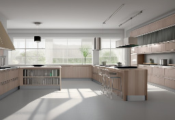</a></td>
        <td></td>
        <td></td>
        <td></td>
        <td></td>
        <td></td>
        <td></td>
        <td></td>
        <td></td>
        <td></td>
        <td></td>
        <td></td>
        <td></td>
        <td></td>
        <td></td>
        <td></td>
        <td></td>
        <td></td>
        <td></td>
        <td></td>
        <td></td>
        <td></td>
    </tr>
    <tr>
        <td>Basic</td>
        <td></td>
        <td></td>
        <td></td>
        <td></td>
        <td></td>
        <td></td>
        <td></td>
        <td></td>
        <td></td>
        <td></td>
        <td></td>
        <td></td>
        <td></td>
        <td nowrap>SD: 8 sec SD LCM: 6 sec SDXL: 36 sec SDXL LCM: 21 sec Turbo: 21 sec Cascade: 52 sec Lightning (Lora 8): 18 sec</td>
        <td><a href="../readme_images/example-basic-sd-raw.jpg">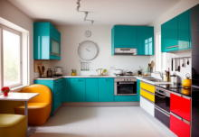</a></td>
        <td></td>
        <td></td>
        <td></td>
        <td></td>
        <td></td>
        <td></td>
        <td></td>
        <td></td>
        <td></td>
        <td></td>
        <td></td>
        <td></td>
        <td></td>
        <td></td>
        <td></td>
        <td></td>
        <td></td>
        <td></td>
        <td></td>
        <td></td>
        <td></td>
    </tr>
    <tr>
        <td>Advanced</td>
        <td></td>
        <td></td>
        <td></td>
        <td></td>
        <td></td>
        <td></td>
        <td></td>
        <td></td>
        <td></td>
        <td></td>
        <td></td>
        <td></td>
        <td></td>
        <td nowrap><u>Upscaled:</u> SD: 40 sec SD LCM: 39 sec SDXL: 67 sec SDXL LCM: 52 sec Turbo: 46 sec</td>
        <td></td>
        <td><a href="../readme_images/example-advanced-sdxl-raw.jpg">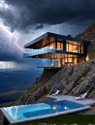</a></td>
        <td><a href="../readme_images/example-advanced-sdlcm-raw.jpg">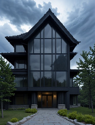</a></td>
        <td><a href="../readme_images/example-advanced-sdxllcm-raw.jpg">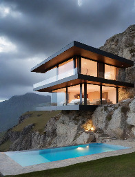</a></td>
        <td></td>
        <td><a href="../readme_images/example-advanced-cascade-raw.jpg">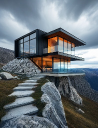</a></td>
        <td></td>
        <td></td>
        <td></td>
        <td></td>
        <td></td>
        <td><a href="../readme_images/example-advanced-lightning-lora-2-raw.jpg">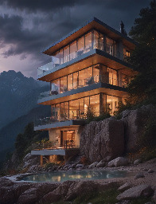</a></td>
        <td></td>
        <td><a href="../readme_images/example-advanced-lightning-lora-8-raw.jpg">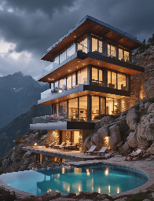</a></td>
        <td><a href="../readme_images/example-advanced-lightning-lora-6-raw.jpg">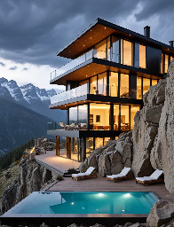</a></td>
        <td><a href="../readme_images/example-advanced-lightning-unet-1-raw.jpg">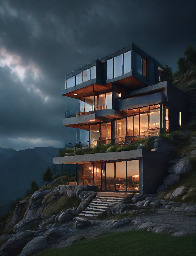</a></td>
        <td></td>
        <td><a href="../readme_images/example-advanced-lightning-unet-4-raw.jpg">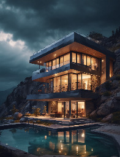</a></td>
        <td></td>
        <td></td>
        <td><a href="../readme_images/example-advanced-lightning-custom-8-raw.jpg">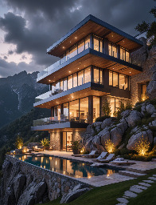</a></td>
        <td></td>
    </tr>
    <tr>
        <td>Full</td>
        <td></td>
        <td></td>
        <td></td>
        <td></td>
        <td></td>
        <td></td>
        <td></td>
        <td></td>
        <td></td>
        <td></td>
        <td></td>
        <td></td>
        <td></td>
        <td nowrap><u>Upscaled: 6 mpx</u> SD: 70 sec SD LCM: 43 sec SDXL: 215 sec SDXL LCM: 120 sec Turbo: 103 sec</td>
        <td></td>
        <td></td>
        <td></td>
        <td></td>
        <td><a href="../readme_images/example-latest-turbo-raw.jpg">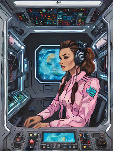</a></td>
        <td>soon</td>
        <td>soon</td>
        <td>soon</td>
        <td>soon</td>
        <td>soon</td>
        <td>soon</td>
        <td>soon</td>
        <td>soon</td>
        <td>soon</td>
        <td>soon</td>
        <td>soon</td>
        <td>soon</td>
        <td>soon</td>
        <td>soon</td>
        <td>soon</td>
        <td>soon</td>
        <td>soon</td>
    </tr>
</table>