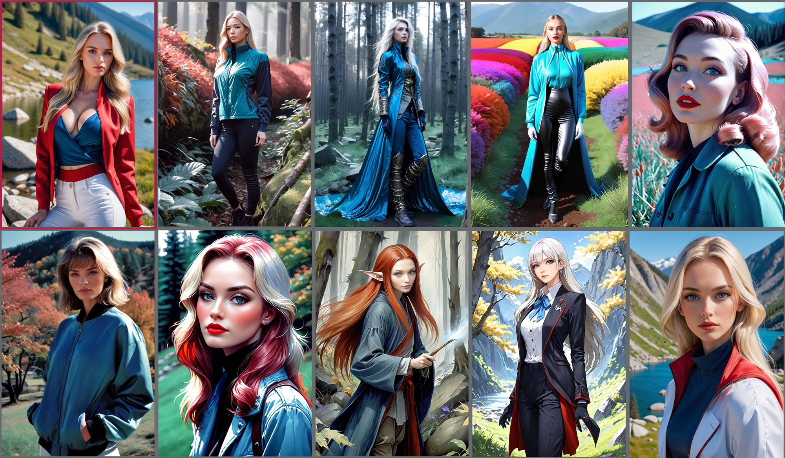
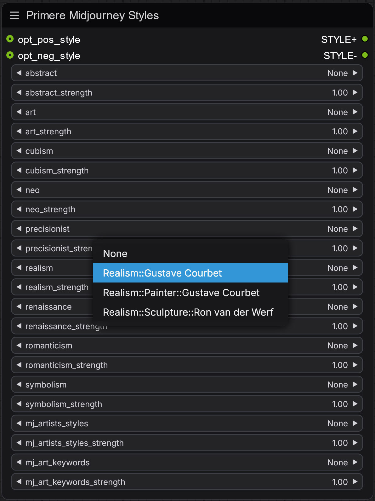
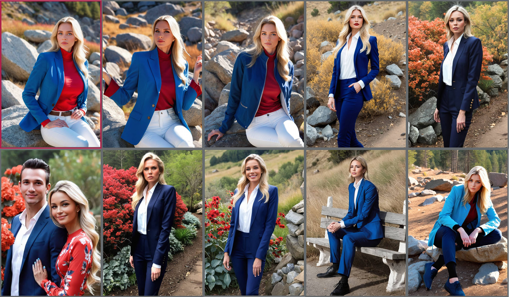
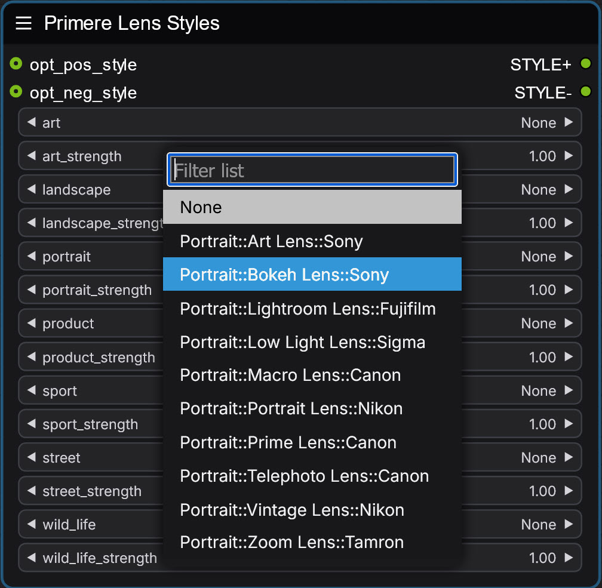

# <ins>Several style nodes:</ins>

### Style pile:

A node that enhances your prompts by adding predefined artistic styles and attributes with fine-grained control over their influence.

#### Description:

This node allows you to enrich your prompts with various artistic styles, concepts, and attributes. You can stack multiple style elements while controlling their individual strengths, making it easy to create complex, nuanced prompts without manual typing.

#### Features:

- Add multiple style elements to positive and negative prompts
- Fine-tune the strength of each style component
- Categories include:
- Art Types (3d-rendering, digital-artwork, drawing, painting, photo, vector-art)
- Concepts 
- Artists
- Art Movements
- Colors
- Directions
- Moods

#### Style Controls:

Each category includes:
- Main selector for choosing style elements
- Strength slider (0.00-1.00) to control influence

#### Benefits:

- Create consistent style presets
- Quickly experiment with different artistic styles
- Fine-tune style influence without prompt editing
- Stack multiple styles with precise control
- Separate positive and negative style applications

Example montage. The first pic made without style addition, all pics generated same seed and settings:

### Midjourney styles:

A specialized node that brings Midjourney-inspired artistic styles and aesthetics to ComfyUI workflows, allowing fine-grained control over multiple art movements and styles.

#### Description:

This node enhances your prompts with carefully curated artistic styles inspired by Midjourney's signature aesthetics. It offers granular control over various art movements and styles, each with adjustable strength parameters.

#### Special Features:

- mj_artists_styles: Curated artist-specific styles
- mj_art_keywords: Special Midjourney-compatible keywords
- Hierarchical style options (e.g., Realism::Gustave Courbet)
- Individual strength controls (0.00-1.00) for each style

#### Benefits:

- Create Midjourney-like aesthetics in ComfyUI
- Mix multiple art movements with precise control
- Apply artist-specific styles
- Fine-tune style intensity
- Separate positive and negative style applications

#### Example Applications:

As shown in the example images:
1. Precision-focused elephant portrait with strong lines and detailed textures
2. Renaissance-style medieval scene with classical composition
3. Blend of realism and romanticism in character portraits

Example montage. The first pic made without style addition, all pics generated same seed and settings:

#### Usage Tips:

1. Select primary art movement (e.g., Realism)
2. Choose specific artist or sub-style
3. Adjust strength for desired intensity
4. Stack multiple styles for complex effects
5. Use keywords for additional refinement

### Emotion styles:

A sophisticated node that infuses emotional layers into your images by adding carefully calibrated emotional qualities to prompts.

#### Description:

This specialized node enables the addition of complex emotional states and moods to your generations. It offers fine-tuned control over various emotions, from basic feelings to nuanced psychological states, particularly focusing on subtle variations of melancholic moods.

#### Core Emotions:

- Love: Romantic and affectionate qualities
- Joy: Happiness and positive expressions
- Surprise: Unexpected and wonder-filled moments
- Anger: Intensity and passion
- Sadness: Subtle expressions of sorrow
- Fear: Tension and apprehension

#### Melancholic Variations:

Refined control over melancholic moods including:
- Melancholia: Classical melancholic expression
- Saudade: Portuguese concept of longing
- Grief: Deep emotional response
- Han: Korean concept of collective sorrow
- Hiraeth: Welsh nostalgia for home
- Mono no aware: Japanese awareness of impermanence
- Nostalgia: Bittersweet remembrance
- Sehnsucht: German romantic yearning
- Good old days: Reminiscent mood

#### Benefits:

- Add emotional depth to portraits
- Create mood-specific variations of the same image
- Control the intensity of emotional expression
- Layer multiple emotions for complex feelings
- Separate positive and negative emotional qualities

#### Example Applications:

As shown in the example portraits:
1. Neutral baseline portrait
2. Joy and warmth expression
3. Subtle melancholic undertones
4. Contemplative mood variation

Example montage. The first pic made without style addition, all pics generated same seed and settings:

One more montage of Emotion style node:

#### Usage Tips:

1. Select primary emotion
2. Choose specific variation if available
3. Adjust strength (0.00-1.00) for intensity
4. Layer multiple emotions for complexity
5. Use with portrait-focused generations

### Camera lens styles:

A custom node that enhances prompts with detailed camera lens characteristics for improved image generation results.

#### Features:

- Categorized lens presets by photography type
- Detailed lens descriptions and technical specifications included to prompt 
- Adjustable strength parameters
- Manufacturer-specific presets

#### Usage:

1. Add "Primere Lens Styles" node to workflow
2. Connect `opt_pos_style` for positive prompts
3. Connect `opt_neg_style` for negative prompts 
4. Select lens category
5. Adjust strength (0.0-1.0)
6. Choose specific lens preset

### Categories:

#### Art:
- Circular Fisheye
- Special Effects
- Tilt-Shift

#### Landscape: 
- Wide Angle
- Ultra-Wide
- Panoramic

#### Portrait:
- Art Lens (Sony)
- Bokeh Lens (Sony) 
- Lightroom Lens (Fujifilm)
- Low Light Lens (Sigma)
- Macro Lens (Canon)
- Portrait Lens (Nikon)
- Prime Lens (Canon)
- Telephoto Lens (Canon)
- Vintage Lens (Nikon)
- Zoom Lens (Tamron)

#### Additional Categories (with seevral lens type):
- Product
- Sport
- Street
- Wildlife

Example montage. The first pic made without style addition, all pics generated same seed and settings:

Example images demonstrate:
- Bokeh effects
- Background compression
- Detail retention
- Subject isolation
- Color rendition